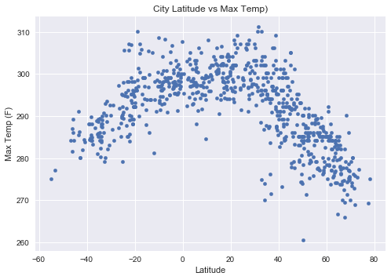
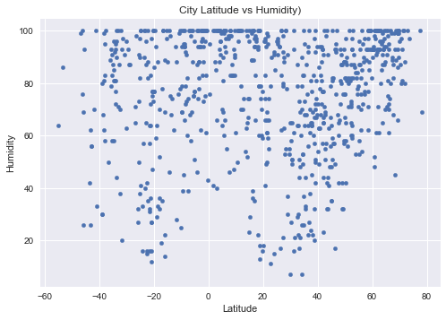
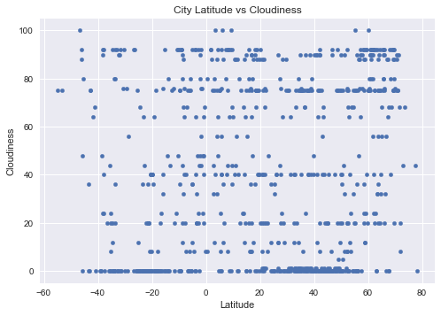
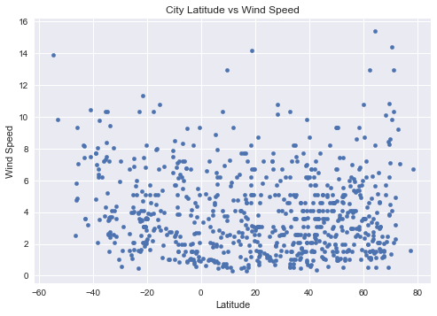

# WeatherPy


```python
# Dependencies
import requests as req
import json
import matplotlib.pyplot as plt
import numpy as np
import pandas as pd
import seaborn as sns
from citipy import citipy
import time
```


```python
# Google API Key
gkey = "6531fb771bd4c6120244bdacb4b0a890"
```


```python
# Create random numbers for latitudes
latitude = np.random.uniform(low = -90, high = 90,size = 2000)
# latitude

# Create random numbers for longitudes
longitude = np.random.uniform(low = -180, high = 180,size = 2000)
# longitude

# Zip longitude and latidude arrays to get the coordinates
coordinates = list(zip(latitude, longitude))
# coordinates
```

# Generate Cities List


```python
# Create an empty list of world cities and repective countries
WorldCities = []
Countries = []

# Find the nearest city corresponding to the above coordinates
for coordinate_pair in coordinates:
    lat, lon = coordinate_pair
    name = citipy.nearest_city(lat, lon).city_name
    country_code = citipy.nearest_city(lat, lon).country_code
    WorldCities.append(name)
    Countries.append(country_code)
WorldCities_data = pd.DataFrame({"City":WorldCities, "Country":Countries})  

# Drop any duplicate values
WorldCities_data = WorldCities_data.drop_duplicates('City')

# Visualize the data frame
WorldCities_data.head()
```


<div>
<style>
    .dataframe thead tr:only-child th {
        text-align: right;
    }

    .dataframe thead th {
        text-align: left;
    }

    .dataframe tbody tr th {
        vertical-align: top;
    }
</style>
<table border="1" class="dataframe">
  <thead>
    <tr style="text-align: right;">
      <th></th>
      <th>City</th>
      <th>Country</th>
    </tr>
  </thead>
  <tbody>
    <tr>
      <th>0</th>
      <td>saint-augustin</td>
      <td>ca</td>
    </tr>
    <tr>
      <th>1</th>
      <td>mataura</td>
      <td>pf</td>
    </tr>
    <tr>
      <th>2</th>
      <td>nantucket</td>
      <td>us</td>
    </tr>
    <tr>
      <th>3</th>
      <td>ushuaia</td>
      <td>ar</td>
    </tr>
    <tr>
      <th>4</th>
      <td>beringovskiy</td>
      <td>ru</td>
    </tr>
  </tbody>
</table>
</div>


```python
# Add columns to the data frame
WorldCities_data["Lat"] = ""
WorldCities_data["Lon"] = ""
WorldCities_data["Date"] = ""
WorldCities_data["Humidity"] = ""
WorldCities_data["Max Temp"] = ""
WorldCities_data["Wind Speed"] = ""
WorldCities_data["Cloudiness"] = ""

# Visualize the data frame
WorldCities_data.head()
```


<div>
<style>
    .dataframe thead tr:only-child th {
        text-align: right;
    }

    .dataframe thead th {
        text-align: left;
    }

    .dataframe tbody tr th {
        vertical-align: top;
    }
</style>
<table border="1" class="dataframe">
  <thead>
    <tr style="text-align: right;">
      <th></th>
      <th>City</th>
      <th>Country</th>
      <th>Lat</th>
      <th>Lon</th>
      <th>Date</th>
      <th>Humidity</th>
      <th>Max Temp</th>
      <th>Wind Speed</th>
      <th>Cloudiness</th>
    </tr>
  </thead>
  <tbody>
    <tr>
      <th>0</th>
      <td>saint-augustin</td>
      <td>ca</td>
      <td></td>
      <td></td>
      <td></td>
      <td></td>
      <td></td>
      <td></td>
      <td></td>
    </tr>
    <tr>
      <th>1</th>
      <td>mataura</td>
      <td>pf</td>
      <td></td>
      <td></td>
      <td></td>
      <td></td>
      <td></td>
      <td></td>
      <td></td>
    </tr>
    <tr>
      <th>2</th>
      <td>nantucket</td>
      <td>us</td>
      <td></td>
      <td></td>
      <td></td>
      <td></td>
      <td></td>
      <td></td>
      <td></td>
    </tr>
    <tr>
      <th>3</th>
      <td>ushuaia</td>
      <td>ar</td>
      <td></td>
      <td></td>
      <td></td>
      <td></td>
      <td></td>
      <td></td>
      <td></td>
    </tr>
    <tr>
      <th>4</th>
      <td>beringovskiy</td>
      <td>ru</td>
      <td></td>
      <td></td>
      <td></td>
      <td></td>
      <td></td>
      <td></td>
      <td></td>
    </tr>
  </tbody>
</table>
</div>


# Perform API Calls


```python
# Set the initial row count to zero
row_count = 0

print("**********************")
print("BEGINNING DATA RETRIEVAL")
print("**********************")

# Loop through the cities and perform API Calls
for index, row in WorldCities_data.iterrows():
    target_url = "http://api.openweathermap.org/data/2.5/weather?q=%s&appid=%s" %(row["City"], gkey)
    response = req.get(target_url).json()
    print("----------------------")
    print("Now retrieving city #%s: %s" % (row_count + 1, WorldCities_data.loc[index]["City"]))
    print(target_url)
    row_count += 1
    
    try:     
        WorldCities_data.set_value(index, "Lat", response["coord"]["lat"])
        WorldCities_data.set_value(index, "Lon", response["coord"]["lon"])
        WorldCities_data.set_value(index, "Date", response["dt"])
        WorldCities_data.set_value(index, "Humidity", response["main"]["humidity"])
        WorldCities_data.set_value(index, "Max Temp", response["main"]["temp_max"])
        WorldCities_data.set_value(index, "Wind Speed", response["wind"]["speed"])
        WorldCities_data.set_value(index, "Cloudiness", response["clouds"]["all"])
           
    except:
        print("Missing details... skip.")
        
    if row_count % 50 == 0:
        print("**********************")
        print("PAUSE FOR 30 SECONDS")
        print("**********************")
        time.sleep(30)
        
print("**********************")
print("DATA RETRIEVAL COMPLETE")
print("**********************")


```

    **********************
    BEGINNING DATA RETRIEVAL
    **********************
    ----------------------
    Now retrieving city #1: saint-augustin
    http://api.openweathermap.org/data/2.5/weather?q=saint-augustin&appid=6531fb771bd4c6120244bdacb4b0a890
    ----------------------
    Now retrieving city #2: mataura
    http://api.openweathermap.org/data/2.5/weather?q=mataura&appid=6531fb771bd4c6120244bdacb4b0a890
    ----------------------
    Now retrieving city #3: nantucket
    http://api.openweathermap.org/data/2.5/weather?q=nantucket&appid=6531fb771bd4c6120244bdacb4b0a890
    ----------------------
    Now retrieving city #4: ushuaia
    http://api.openweathermap.org/data/2.5/weather?q=ushuaia&appid=6531fb771bd4c6120244bdacb4b0a890
    ----------------------
    Now retrieving city #5: beringovskiy
    http://api.openweathermap.org/data/2.5/weather?q=beringovskiy&appid=6531fb771bd4c6120244bdacb4b0a890
    ----------------------
    Now retrieving city #6: cape town
    http://api.openweathermap.org/data/2.5/weather?q=cape town&appid=6531fb771bd4c6120244bdacb4b0a890
    ----------------------
    Now retrieving city #7: saint-philippe
    http://api.openweathermap.org/data/2.5/weather?q=saint-philippe&appid=6531fb771bd4c6120244bdacb4b0a890
    ----------------------
    Now retrieving city #8: rikitea
    http://api.openweathermap.org/data/2.5/weather?q=rikitea&appid=6531fb771bd4c6120244bdacb4b0a890
    ----------------------
    Now retrieving city #9: hilo
    http://api.openweathermap.org/data/2.5/weather?q=hilo&appid=6531fb771bd4c6120244bdacb4b0a890
    ----------------------
    Now retrieving city #10: cidreira
    http://api.openweathermap.org/data/2.5/weather?q=cidreira&appid=6531fb771bd4c6120244bdacb4b0a890
    ----------------------
    Now retrieving city #11: codrington
    http://api.openweathermap.org/data/2.5/weather?q=codrington&appid=6531fb771bd4c6120244bdacb4b0a890
    ----------------------
    Now retrieving city #12: comodoro rivadavia
    http://api.openweathermap.org/data/2.5/weather?q=comodoro rivadavia&appid=6531fb771bd4c6120244bdacb4b0a890
    ----------------------
    Now retrieving city #13: beloha
    http://api.openweathermap.org/data/2.5/weather?q=beloha&appid=6531fb771bd4c6120244bdacb4b0a890
    ----------------------
    Now retrieving city #14: atuona
    http://api.openweathermap.org/data/2.5/weather?q=atuona&appid=6531fb771bd4c6120244bdacb4b0a890
    ----------------------
    Now retrieving city #15: albany
    http://api.openweathermap.org/data/2.5/weather?q=albany&appid=6531fb771bd4c6120244bdacb4b0a890
    ----------------------
    Now retrieving city #16: kaitangata
    http://api.openweathermap.org/data/2.5/weather?q=kaitangata&appid=6531fb771bd4c6120244bdacb4b0a890
    ----------------------
    Now retrieving city #17: srednekolymsk
    http://api.openweathermap.org/data/2.5/weather?q=srednekolymsk&appid=6531fb771bd4c6120244bdacb4b0a890
    ----------------------
    Now retrieving city #18: sao joao da barra
    http://api.openweathermap.org/data/2.5/weather?q=sao joao da barra&appid=6531fb771bd4c6120244bdacb4b0a890
    ----------------------
    Now retrieving city #19: syrskoye
    http://api.openweathermap.org/data/2.5/weather?q=syrskoye&appid=6531fb771bd4c6120244bdacb4b0a890
    ----------------------
    Now retrieving city #20: punta arenas
    http://api.openweathermap.org/data/2.5/weather?q=punta arenas&appid=6531fb771bd4c6120244bdacb4b0a890
    ----------------------
    Now retrieving city #21: port lincoln
    http://api.openweathermap.org/data/2.5/weather?q=port lincoln&appid=6531fb771bd4c6120244bdacb4b0a890
    ----------------------
    Now retrieving city #22: khonuu
    http://api.openweathermap.org/data/2.5/weather?q=khonuu&appid=6531fb771bd4c6120244bdacb4b0a890
    ----------------------
    Now retrieving city #23: buloh kasap
    http://api.openweathermap.org/data/2.5/weather?q=buloh kasap&appid=6531fb771bd4c6120244bdacb4b0a890
    ----------------------
    Now retrieving city #24: culebra
    http://api.openweathermap.org/data/2.5/weather?q=culebra&appid=6531fb771bd4c6120244bdacb4b0a890
    ----------------------
    Now retrieving city #25: barrow
    http://api.openweathermap.org/data/2.5/weather?q=barrow&appid=6531fb771bd4c6120244bdacb4b0a890
    ----------------------
    Now retrieving city #26: narsaq
    http://api.openweathermap.org/data/2.5/weather?q=narsaq&appid=6531fb771bd4c6120244bdacb4b0a890
    ----------------------
    Now retrieving city #27: banda aceh
    http://api.openweathermap.org/data/2.5/weather?q=banda aceh&appid=6531fb771bd4c6120244bdacb4b0a890
    ----------------------
    Now retrieving city #28: marzuq
    http://api.openweathermap.org/data/2.5/weather?q=marzuq&appid=6531fb771bd4c6120244bdacb4b0a890
    ----------------------
    Now retrieving city #29: sistranda
    http://api.openweathermap.org/data/2.5/weather?q=sistranda&appid=6531fb771bd4c6120244bdacb4b0a890
    ----------------------
    Now retrieving city #30: busselton
    http://api.openweathermap.org/data/2.5/weather?q=busselton&appid=6531fb771bd4c6120244bdacb4b0a890
    ----------------------
    Now retrieving city #31: georgetown
    http://api.openweathermap.org/data/2.5/weather?q=georgetown&appid=6531fb771bd4c6120244bdacb4b0a890
    ----------------------
    Now retrieving city #32: puerto ayora
    http://api.openweathermap.org/data/2.5/weather?q=puerto ayora&appid=6531fb771bd4c6120244bdacb4b0a890
    ----------------------
    Now retrieving city #33: qaanaaq
    http://api.openweathermap.org/data/2.5/weather?q=qaanaaq&appid=6531fb771bd4c6120244bdacb4b0a890
    ----------------------
    Now retrieving city #34: saldanha
    http://api.openweathermap.org/data/2.5/weather?q=saldanha&appid=6531fb771bd4c6120244bdacb4b0a890
    ----------------------
    Now retrieving city #35: nusaybin
    http://api.openweathermap.org/data/2.5/weather?q=nusaybin&appid=6531fb771bd4c6120244bdacb4b0a890
    ----------------------
    Now retrieving city #36: leningradskiy
    http://api.openweathermap.org/data/2.5/weather?q=leningradskiy&appid=6531fb771bd4c6120244bdacb4b0a890
    ----------------------
    Now retrieving city #37: ladario
    http://api.openweathermap.org/data/2.5/weather?q=ladario&appid=6531fb771bd4c6120244bdacb4b0a890
    ----------------------
    Now retrieving city #38: goya
    http://api.openweathermap.org/data/2.5/weather?q=goya&appid=6531fb771bd4c6120244bdacb4b0a890
    ----------------------
    Now retrieving city #39: satitoa
    http://api.openweathermap.org/data/2.5/weather?q=satitoa&appid=6531fb771bd4c6120244bdacb4b0a890
    ----------------------
    Now retrieving city #40: illoqqortoormiut
    http://api.openweathermap.org/data/2.5/weather?q=illoqqortoormiut&appid=6531fb771bd4c6120244bdacb4b0a890
    ----------------------
    Now retrieving city #41: chernolesskoye
    http://api.openweathermap.org/data/2.5/weather?q=chernolesskoye&appid=6531fb771bd4c6120244bdacb4b0a890
    ----------------------
    Now retrieving city #42: tenango
    http://api.openweathermap.org/data/2.5/weather?q=tenango&appid=6531fb771bd4c6120244bdacb4b0a890
    ----------------------
    Now retrieving city #43: airai
    http://api.openweathermap.org/data/2.5/weather?q=airai&appid=6531fb771bd4c6120244bdacb4b0a890
    ----------------------
    Now retrieving city #44: hobart
    http://api.openweathermap.org/data/2.5/weather?q=hobart&appid=6531fb771bd4c6120244bdacb4b0a890
    ----------------------
    Now retrieving city #45: gwadar
    http://api.openweathermap.org/data/2.5/weather?q=gwadar&appid=6531fb771bd4c6120244bdacb4b0a890
    ----------------------
    Now retrieving city #46: new norfolk
    http://api.openweathermap.org/data/2.5/weather?q=new norfolk&appid=6531fb771bd4c6120244bdacb4b0a890
    ----------------------
    Now retrieving city #47: tsihombe
    http://api.openweathermap.org/data/2.5/weather?q=tsihombe&appid=6531fb771bd4c6120244bdacb4b0a890
    ----------------------
    Now retrieving city #48: mendahara
    http://api.openweathermap.org/data/2.5/weather?q=mendahara&appid=6531fb771bd4c6120244bdacb4b0a890
    ----------------------
    Now retrieving city #49: kapaa
    http://api.openweathermap.org/data/2.5/weather?q=kapaa&appid=6531fb771bd4c6120244bdacb4b0a890
    ----------------------
    Now retrieving city #50: moranbah
    http://api.openweathermap.org/data/2.5/weather?q=moranbah&appid=6531fb771bd4c6120244bdacb4b0a890
    **********************
    PAUSE FOR 30 SECONDS
    **********************
    ----------------------
    Now retrieving city #51: dingle
    http://api.openweathermap.org/data/2.5/weather?q=dingle&appid=6531fb771bd4c6120244bdacb4b0a890
    ----------------------
    Now retrieving city #52: karratha
    http://api.openweathermap.org/data/2.5/weather?q=karratha&appid=6531fb771bd4c6120244bdacb4b0a890
    ----------------------
    Now retrieving city #53: kodiak
    http://api.openweathermap.org/data/2.5/weather?q=kodiak&appid=6531fb771bd4c6120244bdacb4b0a890
    ----------------------
    Now retrieving city #54: kall
    http://api.openweathermap.org/data/2.5/weather?q=kall&appid=6531fb771bd4c6120244bdacb4b0a890
    ----------------------
    Now retrieving city #55: yellowknife
    http://api.openweathermap.org/data/2.5/weather?q=yellowknife&appid=6531fb771bd4c6120244bdacb4b0a890
    ----------------------
    Now retrieving city #56: meadow lake
    http://api.openweathermap.org/data/2.5/weather?q=meadow lake&appid=6531fb771bd4c6120244bdacb4b0a890
    ----------------------
    Now retrieving city #57: port elizabeth
    http://api.openweathermap.org/data/2.5/weather?q=port elizabeth&appid=6531fb771bd4c6120244bdacb4b0a890
    ----------------------
    Now retrieving city #58: la libertad
    http://api.openweathermap.org/data/2.5/weather?q=la libertad&appid=6531fb771bd4c6120244bdacb4b0a890
    ----------------------
    Now retrieving city #59: jamestown
    http://api.openweathermap.org/data/2.5/weather?q=jamestown&appid=6531fb771bd4c6120244bdacb4b0a890
    ----------------------
    Now retrieving city #60: burnie
    http://api.openweathermap.org/data/2.5/weather?q=burnie&appid=6531fb771bd4c6120244bdacb4b0a890
    ----------------------
    Now retrieving city #61: texarkana
    http://api.openweathermap.org/data/2.5/weather?q=texarkana&appid=6531fb771bd4c6120244bdacb4b0a890
    ----------------------
    Now retrieving city #62: hasaki
    http://api.openweathermap.org/data/2.5/weather?q=hasaki&appid=6531fb771bd4c6120244bdacb4b0a890
    ----------------------
    Now retrieving city #63: sao jose da coroa grande
    http://api.openweathermap.org/data/2.5/weather?q=sao jose da coroa grande&appid=6531fb771bd4c6120244bdacb4b0a890
    ----------------------
    Now retrieving city #64: roma
    http://api.openweathermap.org/data/2.5/weather?q=roma&appid=6531fb771bd4c6120244bdacb4b0a890
    ----------------------
    Now retrieving city #65: san patricio
    http://api.openweathermap.org/data/2.5/weather?q=san patricio&appid=6531fb771bd4c6120244bdacb4b0a890
    ----------------------
    Now retrieving city #66: tabarqah
    http://api.openweathermap.org/data/2.5/weather?q=tabarqah&appid=6531fb771bd4c6120244bdacb4b0a890
    ----------------------
    Now retrieving city #67: totness
    http://api.openweathermap.org/data/2.5/weather?q=totness&appid=6531fb771bd4c6120244bdacb4b0a890
    ----------------------
    Now retrieving city #68: sillod
    http://api.openweathermap.org/data/2.5/weather?q=sillod&appid=6531fb771bd4c6120244bdacb4b0a890
    ----------------------
    Now retrieving city #69: taolanaro
    http://api.openweathermap.org/data/2.5/weather?q=taolanaro&appid=6531fb771bd4c6120244bdacb4b0a890
    ----------------------
    Now retrieving city #70: aykhal
    http://api.openweathermap.org/data/2.5/weather?q=aykhal&appid=6531fb771bd4c6120244bdacb4b0a890
    ----------------------
    Now retrieving city #71: hermanus
    http://api.openweathermap.org/data/2.5/weather?q=hermanus&appid=6531fb771bd4c6120244bdacb4b0a890
    ----------------------
    Now retrieving city #72: malanje
    http://api.openweathermap.org/data/2.5/weather?q=malanje&appid=6531fb771bd4c6120244bdacb4b0a890
    ----------------------
    Now retrieving city #73: avera
    http://api.openweathermap.org/data/2.5/weather?q=avera&appid=6531fb771bd4c6120244bdacb4b0a890
    ----------------------
    Now retrieving city #74: dikson
    http://api.openweathermap.org/data/2.5/weather?q=dikson&appid=6531fb771bd4c6120244bdacb4b0a890
    ----------------------
    Now retrieving city #75: kahului
    http://api.openweathermap.org/data/2.5/weather?q=kahului&appid=6531fb771bd4c6120244bdacb4b0a890
    ----------------------
    Now retrieving city #76: belaya gora
    http://api.openweathermap.org/data/2.5/weather?q=belaya gora&appid=6531fb771bd4c6120244bdacb4b0a890
    ----------------------
    Now retrieving city #77: vardo
    http://api.openweathermap.org/data/2.5/weather?q=vardo&appid=6531fb771bd4c6120244bdacb4b0a890
    ----------------------
    Now retrieving city #78: tasiilaq
    http://api.openweathermap.org/data/2.5/weather?q=tasiilaq&appid=6531fb771bd4c6120244bdacb4b0a890
    ----------------------
    Now retrieving city #79: upernavik
    http://api.openweathermap.org/data/2.5/weather?q=upernavik&appid=6531fb771bd4c6120244bdacb4b0a890
    ----------------------
    Now retrieving city #80: longyearbyen
    http://api.openweathermap.org/data/2.5/weather?q=longyearbyen&appid=6531fb771bd4c6120244bdacb4b0a890
    ----------------------
    Now retrieving city #81: sitka
    http://api.openweathermap.org/data/2.5/weather?q=sitka&appid=6531fb771bd4c6120244bdacb4b0a890
    ----------------------
    Now retrieving city #82: znamenskoye
    http://api.openweathermap.org/data/2.5/weather?q=znamenskoye&appid=6531fb771bd4c6120244bdacb4b0a890
    ----------------------
    Now retrieving city #83: bengkulu
    http://api.openweathermap.org/data/2.5/weather?q=bengkulu&appid=6531fb771bd4c6120244bdacb4b0a890
    ----------------------
    Now retrieving city #84: aleksandrov gay
    http://api.openweathermap.org/data/2.5/weather?q=aleksandrov gay&appid=6531fb771bd4c6120244bdacb4b0a890
    ----------------------
    Now retrieving city #85: brae
    http://api.openweathermap.org/data/2.5/weather?q=brae&appid=6531fb771bd4c6120244bdacb4b0a890
    ----------------------
    Now retrieving city #86: locri
    http://api.openweathermap.org/data/2.5/weather?q=locri&appid=6531fb771bd4c6120244bdacb4b0a890
    ----------------------
    Now retrieving city #87: great malvern
    http://api.openweathermap.org/data/2.5/weather?q=great malvern&appid=6531fb771bd4c6120244bdacb4b0a890
    ----------------------
    Now retrieving city #88: clyde river
    http://api.openweathermap.org/data/2.5/weather?q=clyde river&appid=6531fb771bd4c6120244bdacb4b0a890
    ----------------------
    Now retrieving city #89: klamath falls
    http://api.openweathermap.org/data/2.5/weather?q=klamath falls&appid=6531fb771bd4c6120244bdacb4b0a890
    ----------------------
    Now retrieving city #90: cherskiy
    http://api.openweathermap.org/data/2.5/weather?q=cherskiy&appid=6531fb771bd4c6120244bdacb4b0a890
    ----------------------
    Now retrieving city #91: yulara
    http://api.openweathermap.org/data/2.5/weather?q=yulara&appid=6531fb771bd4c6120244bdacb4b0a890
    ----------------------
    Now retrieving city #92: carnarvon
    http://api.openweathermap.org/data/2.5/weather?q=carnarvon&appid=6531fb771bd4c6120244bdacb4b0a890
    ----------------------
    Now retrieving city #93: lompoc
    http://api.openweathermap.org/data/2.5/weather?q=lompoc&appid=6531fb771bd4c6120244bdacb4b0a890
    ----------------------
    Now retrieving city #94: naze
    http://api.openweathermap.org/data/2.5/weather?q=naze&appid=6531fb771bd4c6120244bdacb4b0a890
    ----------------------
    Now retrieving city #95: morondava
    http://api.openweathermap.org/data/2.5/weather?q=morondava&appid=6531fb771bd4c6120244bdacb4b0a890
    ----------------------
    Now retrieving city #96: mys shmidta
    http://api.openweathermap.org/data/2.5/weather?q=mys shmidta&appid=6531fb771bd4c6120244bdacb4b0a890
    ----------------------
    Now retrieving city #97: turukhansk
    http://api.openweathermap.org/data/2.5/weather?q=turukhansk&appid=6531fb771bd4c6120244bdacb4b0a890
    ----------------------
    Now retrieving city #98: avarua
    http://api.openweathermap.org/data/2.5/weather?q=avarua&appid=6531fb771bd4c6120244bdacb4b0a890
    ----------------------
    Now retrieving city #99: kavaratti
    http://api.openweathermap.org/data/2.5/weather?q=kavaratti&appid=6531fb771bd4c6120244bdacb4b0a890
    ----------------------
    Now retrieving city #100: tharrawaddy
    http://api.openweathermap.org/data/2.5/weather?q=tharrawaddy&appid=6531fb771bd4c6120244bdacb4b0a890
    **********************
    PAUSE FOR 30 SECONDS
    **********************
    ----------------------
    Now retrieving city #101: wajir
    http://api.openweathermap.org/data/2.5/weather?q=wajir&appid=6531fb771bd4c6120244bdacb4b0a890
    ----------------------
    Now retrieving city #102: hukuntsi
    http://api.openweathermap.org/data/2.5/weather?q=hukuntsi&appid=6531fb771bd4c6120244bdacb4b0a890
    ----------------------
    Now retrieving city #103: saint george
    http://api.openweathermap.org/data/2.5/weather?q=saint george&appid=6531fb771bd4c6120244bdacb4b0a890
    ----------------------
    Now retrieving city #104: biak
    http://api.openweathermap.org/data/2.5/weather?q=biak&appid=6531fb771bd4c6120244bdacb4b0a890
    ----------------------
    Now retrieving city #105: komsomolskiy
    http://api.openweathermap.org/data/2.5/weather?q=komsomolskiy&appid=6531fb771bd4c6120244bdacb4b0a890
    ----------------------
    Now retrieving city #106: nemuro
    http://api.openweathermap.org/data/2.5/weather?q=nemuro&appid=6531fb771bd4c6120244bdacb4b0a890
    ----------------------
    Now retrieving city #107: trelew
    http://api.openweathermap.org/data/2.5/weather?q=trelew&appid=6531fb771bd4c6120244bdacb4b0a890
    ----------------------
    Now retrieving city #108: payo
    http://api.openweathermap.org/data/2.5/weather?q=payo&appid=6531fb771bd4c6120244bdacb4b0a890
    ----------------------
    Now retrieving city #109: lebu
    http://api.openweathermap.org/data/2.5/weather?q=lebu&appid=6531fb771bd4c6120244bdacb4b0a890
    ----------------------
    Now retrieving city #110: sambava
    http://api.openweathermap.org/data/2.5/weather?q=sambava&appid=6531fb771bd4c6120244bdacb4b0a890
    ----------------------
    Now retrieving city #111: chuy
    http://api.openweathermap.org/data/2.5/weather?q=chuy&appid=6531fb771bd4c6120244bdacb4b0a890
    ----------------------
    Now retrieving city #112: lilongwe
    http://api.openweathermap.org/data/2.5/weather?q=lilongwe&appid=6531fb771bd4c6120244bdacb4b0a890
    ----------------------
    Now retrieving city #113: provideniya
    http://api.openweathermap.org/data/2.5/weather?q=provideniya&appid=6531fb771bd4c6120244bdacb4b0a890
    ----------------------
    Now retrieving city #114: axim
    http://api.openweathermap.org/data/2.5/weather?q=axim&appid=6531fb771bd4c6120244bdacb4b0a890
    ----------------------
    Now retrieving city #115: achikulak
    http://api.openweathermap.org/data/2.5/weather?q=achikulak&appid=6531fb771bd4c6120244bdacb4b0a890
    ----------------------
    Now retrieving city #116: bluff
    http://api.openweathermap.org/data/2.5/weather?q=bluff&appid=6531fb771bd4c6120244bdacb4b0a890
    ----------------------
    Now retrieving city #117: agadez
    http://api.openweathermap.org/data/2.5/weather?q=agadez&appid=6531fb771bd4c6120244bdacb4b0a890
    ----------------------
    Now retrieving city #118: ust-kamchatsk
    http://api.openweathermap.org/data/2.5/weather?q=ust-kamchatsk&appid=6531fb771bd4c6120244bdacb4b0a890
    ----------------------
    Now retrieving city #119: santa maria da boa vista
    http://api.openweathermap.org/data/2.5/weather?q=santa maria da boa vista&appid=6531fb771bd4c6120244bdacb4b0a890
    ----------------------
    Now retrieving city #120: conselheiro pena
    http://api.openweathermap.org/data/2.5/weather?q=conselheiro pena&appid=6531fb771bd4c6120244bdacb4b0a890
    ----------------------
    Now retrieving city #121: necochea
    http://api.openweathermap.org/data/2.5/weather?q=necochea&appid=6531fb771bd4c6120244bdacb4b0a890
    ----------------------
    Now retrieving city #122: luderitz
    http://api.openweathermap.org/data/2.5/weather?q=luderitz&appid=6531fb771bd4c6120244bdacb4b0a890
    ----------------------
    Now retrieving city #123: neiafu
    http://api.openweathermap.org/data/2.5/weather?q=neiafu&appid=6531fb771bd4c6120244bdacb4b0a890
    ----------------------
    Now retrieving city #124: abastumani
    http://api.openweathermap.org/data/2.5/weather?q=abastumani&appid=6531fb771bd4c6120244bdacb4b0a890
    ----------------------
    Now retrieving city #125: laguna
    http://api.openweathermap.org/data/2.5/weather?q=laguna&appid=6531fb771bd4c6120244bdacb4b0a890
    ----------------------
    Now retrieving city #126: lakes entrance
    http://api.openweathermap.org/data/2.5/weather?q=lakes entrance&appid=6531fb771bd4c6120244bdacb4b0a890
    ----------------------
    Now retrieving city #127: vaini
    http://api.openweathermap.org/data/2.5/weather?q=vaini&appid=6531fb771bd4c6120244bdacb4b0a890
    ----------------------
    Now retrieving city #128: chokurdakh
    http://api.openweathermap.org/data/2.5/weather?q=chokurdakh&appid=6531fb771bd4c6120244bdacb4b0a890
    ----------------------
    Now retrieving city #129: palabuhanratu
    http://api.openweathermap.org/data/2.5/weather?q=palabuhanratu&appid=6531fb771bd4c6120244bdacb4b0a890
    ----------------------
    Now retrieving city #130: rio grande
    http://api.openweathermap.org/data/2.5/weather?q=rio grande&appid=6531fb771bd4c6120244bdacb4b0a890
    ----------------------
    Now retrieving city #131: belushya guba
    http://api.openweathermap.org/data/2.5/weather?q=belushya guba&appid=6531fb771bd4c6120244bdacb4b0a890
    ----------------------
    Now retrieving city #132: saint-louis
    http://api.openweathermap.org/data/2.5/weather?q=saint-louis&appid=6531fb771bd4c6120244bdacb4b0a890
    ----------------------
    Now retrieving city #133: sorland
    http://api.openweathermap.org/data/2.5/weather?q=sorland&appid=6531fb771bd4c6120244bdacb4b0a890
    ----------------------
    Now retrieving city #134: tuktoyaktuk
    http://api.openweathermap.org/data/2.5/weather?q=tuktoyaktuk&appid=6531fb771bd4c6120244bdacb4b0a890
    ----------------------
    Now retrieving city #135: arouca
    http://api.openweathermap.org/data/2.5/weather?q=arouca&appid=6531fb771bd4c6120244bdacb4b0a890
    ----------------------
    Now retrieving city #136: kavieng
    http://api.openweathermap.org/data/2.5/weather?q=kavieng&appid=6531fb771bd4c6120244bdacb4b0a890
    ----------------------
    Now retrieving city #137: souillac
    http://api.openweathermap.org/data/2.5/weather?q=souillac&appid=6531fb771bd4c6120244bdacb4b0a890
    ----------------------
    Now retrieving city #138: svetlyy
    http://api.openweathermap.org/data/2.5/weather?q=svetlyy&appid=6531fb771bd4c6120244bdacb4b0a890
    ----------------------
    Now retrieving city #139: bredasdorp
    http://api.openweathermap.org/data/2.5/weather?q=bredasdorp&appid=6531fb771bd4c6120244bdacb4b0a890
    ----------------------
    Now retrieving city #140: kijang
    http://api.openweathermap.org/data/2.5/weather?q=kijang&appid=6531fb771bd4c6120244bdacb4b0a890
    ----------------------
    Now retrieving city #141: yataity
    http://api.openweathermap.org/data/2.5/weather?q=yataity&appid=6531fb771bd4c6120244bdacb4b0a890
    ----------------------
    Now retrieving city #142: yerbogachen
    http://api.openweathermap.org/data/2.5/weather?q=yerbogachen&appid=6531fb771bd4c6120244bdacb4b0a890
    ----------------------
    Now retrieving city #143: doume
    http://api.openweathermap.org/data/2.5/weather?q=doume&appid=6531fb771bd4c6120244bdacb4b0a890
    ----------------------
    Now retrieving city #144: omboue
    http://api.openweathermap.org/data/2.5/weather?q=omboue&appid=6531fb771bd4c6120244bdacb4b0a890
    ----------------------
    Now retrieving city #145: bambous virieux
    http://api.openweathermap.org/data/2.5/weather?q=bambous virieux&appid=6531fb771bd4c6120244bdacb4b0a890
    ----------------------
    Now retrieving city #146: kysyl-syr
    http://api.openweathermap.org/data/2.5/weather?q=kysyl-syr&appid=6531fb771bd4c6120244bdacb4b0a890
    ----------------------
    Now retrieving city #147: pokanayevka
    http://api.openweathermap.org/data/2.5/weather?q=pokanayevka&appid=6531fb771bd4c6120244bdacb4b0a890
    ----------------------
    Now retrieving city #148: balkhash
    http://api.openweathermap.org/data/2.5/weather?q=balkhash&appid=6531fb771bd4c6120244bdacb4b0a890
    ----------------------
    Now retrieving city #149: khatanga
    http://api.openweathermap.org/data/2.5/weather?q=khatanga&appid=6531fb771bd4c6120244bdacb4b0a890
    ----------------------
    Now retrieving city #150: zyryanovsk
    http://api.openweathermap.org/data/2.5/weather?q=zyryanovsk&appid=6531fb771bd4c6120244bdacb4b0a890
    **********************
    PAUSE FOR 30 SECONDS
    **********************
    ----------------------
    Now retrieving city #151: carutapera
    http://api.openweathermap.org/data/2.5/weather?q=carutapera&appid=6531fb771bd4c6120244bdacb4b0a890
    ----------------------
    Now retrieving city #152: mar del plata
    http://api.openweathermap.org/data/2.5/weather?q=mar del plata&appid=6531fb771bd4c6120244bdacb4b0a890
    ----------------------
    Now retrieving city #153: piatra olt
    http://api.openweathermap.org/data/2.5/weather?q=piatra olt&appid=6531fb771bd4c6120244bdacb4b0a890
    ----------------------
    Now retrieving city #154: camacha
    http://api.openweathermap.org/data/2.5/weather?q=camacha&appid=6531fb771bd4c6120244bdacb4b0a890
    ----------------------
    Now retrieving city #155: khandyga
    http://api.openweathermap.org/data/2.5/weather?q=khandyga&appid=6531fb771bd4c6120244bdacb4b0a890
    ----------------------
    Now retrieving city #156: merauke
    http://api.openweathermap.org/data/2.5/weather?q=merauke&appid=6531fb771bd4c6120244bdacb4b0a890
    ----------------------
    Now retrieving city #157: half moon bay
    http://api.openweathermap.org/data/2.5/weather?q=half moon bay&appid=6531fb771bd4c6120244bdacb4b0a890
    ----------------------
    Now retrieving city #158: torbay
    http://api.openweathermap.org/data/2.5/weather?q=torbay&appid=6531fb771bd4c6120244bdacb4b0a890
    ----------------------
    Now retrieving city #159: thompson
    http://api.openweathermap.org/data/2.5/weather?q=thompson&appid=6531fb771bd4c6120244bdacb4b0a890
    ----------------------
    Now retrieving city #160: nouadhibou
    http://api.openweathermap.org/data/2.5/weather?q=nouadhibou&appid=6531fb771bd4c6120244bdacb4b0a890
    ----------------------
    Now retrieving city #161: saint anthony
    http://api.openweathermap.org/data/2.5/weather?q=saint anthony&appid=6531fb771bd4c6120244bdacb4b0a890
    ----------------------
    Now retrieving city #162: kruisfontein
    http://api.openweathermap.org/data/2.5/weather?q=kruisfontein&appid=6531fb771bd4c6120244bdacb4b0a890
    ----------------------
    Now retrieving city #163: vangaindrano
    http://api.openweathermap.org/data/2.5/weather?q=vangaindrano&appid=6531fb771bd4c6120244bdacb4b0a890
    ----------------------
    Now retrieving city #164: port augusta
    http://api.openweathermap.org/data/2.5/weather?q=port augusta&appid=6531fb771bd4c6120244bdacb4b0a890
    ----------------------
    Now retrieving city #165: sentyabrskiy
    http://api.openweathermap.org/data/2.5/weather?q=sentyabrskiy&appid=6531fb771bd4c6120244bdacb4b0a890
    ----------------------
    Now retrieving city #166: mouzakion
    http://api.openweathermap.org/data/2.5/weather?q=mouzakion&appid=6531fb771bd4c6120244bdacb4b0a890
    ----------------------
    Now retrieving city #167: ponta delgada
    http://api.openweathermap.org/data/2.5/weather?q=ponta delgada&appid=6531fb771bd4c6120244bdacb4b0a890
    ----------------------
    Now retrieving city #168: trinidad
    http://api.openweathermap.org/data/2.5/weather?q=trinidad&appid=6531fb771bd4c6120244bdacb4b0a890
    ----------------------
    Now retrieving city #169: grand river south east
    http://api.openweathermap.org/data/2.5/weather?q=grand river south east&appid=6531fb771bd4c6120244bdacb4b0a890
    ----------------------
    Now retrieving city #170: boguchany
    http://api.openweathermap.org/data/2.5/weather?q=boguchany&appid=6531fb771bd4c6120244bdacb4b0a890
    ----------------------
    Now retrieving city #171: tuatapere
    http://api.openweathermap.org/data/2.5/weather?q=tuatapere&appid=6531fb771bd4c6120244bdacb4b0a890
    ----------------------
    Now retrieving city #172: rungata
    http://api.openweathermap.org/data/2.5/weather?q=rungata&appid=6531fb771bd4c6120244bdacb4b0a890
    ----------------------
    Now retrieving city #173: lorengau
    http://api.openweathermap.org/data/2.5/weather?q=lorengau&appid=6531fb771bd4c6120244bdacb4b0a890
    ----------------------
    Now retrieving city #174: la ronge
    http://api.openweathermap.org/data/2.5/weather?q=la ronge&appid=6531fb771bd4c6120244bdacb4b0a890
    ----------------------
    Now retrieving city #175: oistins
    http://api.openweathermap.org/data/2.5/weather?q=oistins&appid=6531fb771bd4c6120244bdacb4b0a890
    ----------------------
    Now retrieving city #176: chernyshevskiy
    http://api.openweathermap.org/data/2.5/weather?q=chernyshevskiy&appid=6531fb771bd4c6120244bdacb4b0a890
    ----------------------
    Now retrieving city #177: houma
    http://api.openweathermap.org/data/2.5/weather?q=houma&appid=6531fb771bd4c6120244bdacb4b0a890
    ----------------------
    Now retrieving city #178: guerrero negro
    http://api.openweathermap.org/data/2.5/weather?q=guerrero negro&appid=6531fb771bd4c6120244bdacb4b0a890
    ----------------------
    Now retrieving city #179: carbondale
    http://api.openweathermap.org/data/2.5/weather?q=carbondale&appid=6531fb771bd4c6120244bdacb4b0a890
    ----------------------
    Now retrieving city #180: verkhnyaya inta
    http://api.openweathermap.org/data/2.5/weather?q=verkhnyaya inta&appid=6531fb771bd4c6120244bdacb4b0a890
    ----------------------
    Now retrieving city #181: abha
    http://api.openweathermap.org/data/2.5/weather?q=abha&appid=6531fb771bd4c6120244bdacb4b0a890
    ----------------------
    Now retrieving city #182: izacic
    http://api.openweathermap.org/data/2.5/weather?q=izacic&appid=6531fb771bd4c6120244bdacb4b0a890
    ----------------------
    Now retrieving city #183: shizunai
    http://api.openweathermap.org/data/2.5/weather?q=shizunai&appid=6531fb771bd4c6120244bdacb4b0a890
    ----------------------
    Now retrieving city #184: novo aripuana
    http://api.openweathermap.org/data/2.5/weather?q=novo aripuana&appid=6531fb771bd4c6120244bdacb4b0a890
    ----------------------
    Now retrieving city #185: eyemouth
    http://api.openweathermap.org/data/2.5/weather?q=eyemouth&appid=6531fb771bd4c6120244bdacb4b0a890
    ----------------------
    Now retrieving city #186: ahipara
    http://api.openweathermap.org/data/2.5/weather?q=ahipara&appid=6531fb771bd4c6120244bdacb4b0a890
    ----------------------
    Now retrieving city #187: bodden town
    http://api.openweathermap.org/data/2.5/weather?q=bodden town&appid=6531fb771bd4c6120244bdacb4b0a890
    ----------------------
    Now retrieving city #188: tiksi
    http://api.openweathermap.org/data/2.5/weather?q=tiksi&appid=6531fb771bd4c6120244bdacb4b0a890
    ----------------------
    Now retrieving city #189: hualmay
    http://api.openweathermap.org/data/2.5/weather?q=hualmay&appid=6531fb771bd4c6120244bdacb4b0a890
    ----------------------
    Now retrieving city #190: ossora
    http://api.openweathermap.org/data/2.5/weather?q=ossora&appid=6531fb771bd4c6120244bdacb4b0a890
    ----------------------
    Now retrieving city #191: kirkuk
    http://api.openweathermap.org/data/2.5/weather?q=kirkuk&appid=6531fb771bd4c6120244bdacb4b0a890
    ----------------------
    Now retrieving city #192: olafsvik
    http://api.openweathermap.org/data/2.5/weather?q=olafsvik&appid=6531fb771bd4c6120244bdacb4b0a890
    ----------------------
    Now retrieving city #193: katsuura
    http://api.openweathermap.org/data/2.5/weather?q=katsuura&appid=6531fb771bd4c6120244bdacb4b0a890
    ----------------------
    Now retrieving city #194: nguiu
    http://api.openweathermap.org/data/2.5/weather?q=nguiu&appid=6531fb771bd4c6120244bdacb4b0a890
    ----------------------
    Now retrieving city #195: mosetse
    http://api.openweathermap.org/data/2.5/weather?q=mosetse&appid=6531fb771bd4c6120244bdacb4b0a890
    ----------------------
    Now retrieving city #196: diamantino
    http://api.openweathermap.org/data/2.5/weather?q=diamantino&appid=6531fb771bd4c6120244bdacb4b0a890
    ----------------------
    Now retrieving city #197: east london
    http://api.openweathermap.org/data/2.5/weather?q=east london&appid=6531fb771bd4c6120244bdacb4b0a890
    ----------------------
    Now retrieving city #198: aswan
    http://api.openweathermap.org/data/2.5/weather?q=aswan&appid=6531fb771bd4c6120244bdacb4b0a890
    ----------------------
    Now retrieving city #199: nikolskoye
    http://api.openweathermap.org/data/2.5/weather?q=nikolskoye&appid=6531fb771bd4c6120244bdacb4b0a890
    ----------------------
    Now retrieving city #200: severo-yeniseyskiy
    http://api.openweathermap.org/data/2.5/weather?q=severo-yeniseyskiy&appid=6531fb771bd4c6120244bdacb4b0a890
    **********************
    PAUSE FOR 30 SECONDS
    **********************
    ----------------------
    Now retrieving city #201: higuey
    http://api.openweathermap.org/data/2.5/weather?q=higuey&appid=6531fb771bd4c6120244bdacb4b0a890
    ----------------------
    Now retrieving city #202: rocha
    http://api.openweathermap.org/data/2.5/weather?q=rocha&appid=6531fb771bd4c6120244bdacb4b0a890
    ----------------------
    Now retrieving city #203: morki
    http://api.openweathermap.org/data/2.5/weather?q=morki&appid=6531fb771bd4c6120244bdacb4b0a890
    ----------------------
    Now retrieving city #204: pevek
    http://api.openweathermap.org/data/2.5/weather?q=pevek&appid=6531fb771bd4c6120244bdacb4b0a890
    ----------------------
    Now retrieving city #205: labuhan
    http://api.openweathermap.org/data/2.5/weather?q=labuhan&appid=6531fb771bd4c6120244bdacb4b0a890
    ----------------------
    Now retrieving city #206: castro
    http://api.openweathermap.org/data/2.5/weather?q=castro&appid=6531fb771bd4c6120244bdacb4b0a890
    ----------------------
    Now retrieving city #207: katol
    http://api.openweathermap.org/data/2.5/weather?q=katol&appid=6531fb771bd4c6120244bdacb4b0a890
    ----------------------
    Now retrieving city #208: ruteng
    http://api.openweathermap.org/data/2.5/weather?q=ruteng&appid=6531fb771bd4c6120244bdacb4b0a890
    ----------------------
    Now retrieving city #209: champerico
    http://api.openweathermap.org/data/2.5/weather?q=champerico&appid=6531fb771bd4c6120244bdacb4b0a890
    ----------------------
    Now retrieving city #210: manicore
    http://api.openweathermap.org/data/2.5/weather?q=manicore&appid=6531fb771bd4c6120244bdacb4b0a890
    ----------------------
    Now retrieving city #211: manhumirim
    http://api.openweathermap.org/data/2.5/weather?q=manhumirim&appid=6531fb771bd4c6120244bdacb4b0a890
    ----------------------
    Now retrieving city #212: toliary
    http://api.openweathermap.org/data/2.5/weather?q=toliary&appid=6531fb771bd4c6120244bdacb4b0a890
    ----------------------
    Now retrieving city #213: itaituba
    http://api.openweathermap.org/data/2.5/weather?q=itaituba&appid=6531fb771bd4c6120244bdacb4b0a890
    ----------------------
    Now retrieving city #214: abapo
    http://api.openweathermap.org/data/2.5/weather?q=abapo&appid=6531fb771bd4c6120244bdacb4b0a890
    ----------------------
    Now retrieving city #215: meulaboh
    http://api.openweathermap.org/data/2.5/weather?q=meulaboh&appid=6531fb771bd4c6120244bdacb4b0a890
    ----------------------
    Now retrieving city #216: farmington
    http://api.openweathermap.org/data/2.5/weather?q=farmington&appid=6531fb771bd4c6120244bdacb4b0a890
    ----------------------
    Now retrieving city #217: mao
    http://api.openweathermap.org/data/2.5/weather?q=mao&appid=6531fb771bd4c6120244bdacb4b0a890
    ----------------------
    Now retrieving city #218: belmonte
    http://api.openweathermap.org/data/2.5/weather?q=belmonte&appid=6531fb771bd4c6120244bdacb4b0a890
    ----------------------
    Now retrieving city #219: boa vista
    http://api.openweathermap.org/data/2.5/weather?q=boa vista&appid=6531fb771bd4c6120244bdacb4b0a890
    ----------------------
    Now retrieving city #220: acapulco
    http://api.openweathermap.org/data/2.5/weather?q=acapulco&appid=6531fb771bd4c6120244bdacb4b0a890
    ----------------------
    Now retrieving city #221: chute-aux-outardes
    http://api.openweathermap.org/data/2.5/weather?q=chute-aux-outardes&appid=6531fb771bd4c6120244bdacb4b0a890
    ----------------------
    Now retrieving city #222: qaqortoq
    http://api.openweathermap.org/data/2.5/weather?q=qaqortoq&appid=6531fb771bd4c6120244bdacb4b0a890
    ----------------------
    Now retrieving city #223: oga
    http://api.openweathermap.org/data/2.5/weather?q=oga&appid=6531fb771bd4c6120244bdacb4b0a890
    ----------------------
    Now retrieving city #224: lamar
    http://api.openweathermap.org/data/2.5/weather?q=lamar&appid=6531fb771bd4c6120244bdacb4b0a890
    ----------------------
    Now retrieving city #225: leshukonskoye
    http://api.openweathermap.org/data/2.5/weather?q=leshukonskoye&appid=6531fb771bd4c6120244bdacb4b0a890
    ----------------------
    Now retrieving city #226: tuyen quang
    http://api.openweathermap.org/data/2.5/weather?q=tuyen quang&appid=6531fb771bd4c6120244bdacb4b0a890
    ----------------------
    Now retrieving city #227: panjakent
    http://api.openweathermap.org/data/2.5/weather?q=panjakent&appid=6531fb771bd4c6120244bdacb4b0a890
    ----------------------
    Now retrieving city #228: ribeira grande
    http://api.openweathermap.org/data/2.5/weather?q=ribeira grande&appid=6531fb771bd4c6120244bdacb4b0a890
    ----------------------
    Now retrieving city #229: dzhusaly
    http://api.openweathermap.org/data/2.5/weather?q=dzhusaly&appid=6531fb771bd4c6120244bdacb4b0a890
    ----------------------
    Now retrieving city #230: jalu
    http://api.openweathermap.org/data/2.5/weather?q=jalu&appid=6531fb771bd4c6120244bdacb4b0a890
    ----------------------
    Now retrieving city #231: besikduzu
    http://api.openweathermap.org/data/2.5/weather?q=besikduzu&appid=6531fb771bd4c6120244bdacb4b0a890
    ----------------------
    Now retrieving city #232: portalegre
    http://api.openweathermap.org/data/2.5/weather?q=portalegre&appid=6531fb771bd4c6120244bdacb4b0a890
    ----------------------
    Now retrieving city #233: bukama
    http://api.openweathermap.org/data/2.5/weather?q=bukama&appid=6531fb771bd4c6120244bdacb4b0a890
    ----------------------
    Now retrieving city #234: kayerkan
    http://api.openweathermap.org/data/2.5/weather?q=kayerkan&appid=6531fb771bd4c6120244bdacb4b0a890
    ----------------------
    Now retrieving city #235: mushie
    http://api.openweathermap.org/data/2.5/weather?q=mushie&appid=6531fb771bd4c6120244bdacb4b0a890
    ----------------------
    Now retrieving city #236: port-gentil
    http://api.openweathermap.org/data/2.5/weather?q=port-gentil&appid=6531fb771bd4c6120244bdacb4b0a890
    ----------------------
    Now retrieving city #237: vaitupu
    http://api.openweathermap.org/data/2.5/weather?q=vaitupu&appid=6531fb771bd4c6120244bdacb4b0a890
    ----------------------
    Now retrieving city #238: maniitsoq
    http://api.openweathermap.org/data/2.5/weather?q=maniitsoq&appid=6531fb771bd4c6120244bdacb4b0a890
    ----------------------
    Now retrieving city #239: koster
    http://api.openweathermap.org/data/2.5/weather?q=koster&appid=6531fb771bd4c6120244bdacb4b0a890
    ----------------------
    Now retrieving city #240: ambon
    http://api.openweathermap.org/data/2.5/weather?q=ambon&appid=6531fb771bd4c6120244bdacb4b0a890
    ----------------------
    Now retrieving city #241: nanortalik
    http://api.openweathermap.org/data/2.5/weather?q=nanortalik&appid=6531fb771bd4c6120244bdacb4b0a890
    ----------------------
    Now retrieving city #242: nome
    http://api.openweathermap.org/data/2.5/weather?q=nome&appid=6531fb771bd4c6120244bdacb4b0a890
    ----------------------
    Now retrieving city #243: gao
    http://api.openweathermap.org/data/2.5/weather?q=gao&appid=6531fb771bd4c6120244bdacb4b0a890
    ----------------------
    Now retrieving city #244: singkang
    http://api.openweathermap.org/data/2.5/weather?q=singkang&appid=6531fb771bd4c6120244bdacb4b0a890
    ----------------------
    Now retrieving city #245: san vicente
    http://api.openweathermap.org/data/2.5/weather?q=san vicente&appid=6531fb771bd4c6120244bdacb4b0a890
    ----------------------
    Now retrieving city #246: isangel
    http://api.openweathermap.org/data/2.5/weather?q=isangel&appid=6531fb771bd4c6120244bdacb4b0a890
    ----------------------
    Now retrieving city #247: sulam
    http://api.openweathermap.org/data/2.5/weather?q=sulam&appid=6531fb771bd4c6120244bdacb4b0a890
    ----------------------
    Now retrieving city #248: plouzane
    http://api.openweathermap.org/data/2.5/weather?q=plouzane&appid=6531fb771bd4c6120244bdacb4b0a890
    ----------------------
    Now retrieving city #249: poitiers
    http://api.openweathermap.org/data/2.5/weather?q=poitiers&appid=6531fb771bd4c6120244bdacb4b0a890
    ----------------------
    Now retrieving city #250: stornoway
    http://api.openweathermap.org/data/2.5/weather?q=stornoway&appid=6531fb771bd4c6120244bdacb4b0a890
    **********************
    PAUSE FOR 30 SECONDS
    **********************
    ----------------------
    Now retrieving city #251: birecik
    http://api.openweathermap.org/data/2.5/weather?q=birecik&appid=6531fb771bd4c6120244bdacb4b0a890
    ----------------------
    Now retrieving city #252: isla vista
    http://api.openweathermap.org/data/2.5/weather?q=isla vista&appid=6531fb771bd4c6120244bdacb4b0a890
    ----------------------
    Now retrieving city #253: talcahuano
    http://api.openweathermap.org/data/2.5/weather?q=talcahuano&appid=6531fb771bd4c6120244bdacb4b0a890
    ----------------------
    Now retrieving city #254: xinzhi
    http://api.openweathermap.org/data/2.5/weather?q=xinzhi&appid=6531fb771bd4c6120244bdacb4b0a890
    ----------------------
    Now retrieving city #255: norman wells
    http://api.openweathermap.org/data/2.5/weather?q=norman wells&appid=6531fb771bd4c6120244bdacb4b0a890
    ----------------------
    Now retrieving city #256: lannion
    http://api.openweathermap.org/data/2.5/weather?q=lannion&appid=6531fb771bd4c6120244bdacb4b0a890
    ----------------------
    Now retrieving city #257: ilulissat
    http://api.openweathermap.org/data/2.5/weather?q=ilulissat&appid=6531fb771bd4c6120244bdacb4b0a890
    ----------------------
    Now retrieving city #258: waingapu
    http://api.openweathermap.org/data/2.5/weather?q=waingapu&appid=6531fb771bd4c6120244bdacb4b0a890
    ----------------------
    Now retrieving city #259: esperance
    http://api.openweathermap.org/data/2.5/weather?q=esperance&appid=6531fb771bd4c6120244bdacb4b0a890
    ----------------------
    Now retrieving city #260: yirol
    http://api.openweathermap.org/data/2.5/weather?q=yirol&appid=6531fb771bd4c6120244bdacb4b0a890
    ----------------------
    Now retrieving city #261: malakal
    http://api.openweathermap.org/data/2.5/weather?q=malakal&appid=6531fb771bd4c6120244bdacb4b0a890
    ----------------------
    Now retrieving city #262: bulgan
    http://api.openweathermap.org/data/2.5/weather?q=bulgan&appid=6531fb771bd4c6120244bdacb4b0a890
    ----------------------
    Now retrieving city #263: tupaciguara
    http://api.openweathermap.org/data/2.5/weather?q=tupaciguara&appid=6531fb771bd4c6120244bdacb4b0a890
    ----------------------
    Now retrieving city #264: dehloran
    http://api.openweathermap.org/data/2.5/weather?q=dehloran&appid=6531fb771bd4c6120244bdacb4b0a890
    ----------------------
    Now retrieving city #265: tecoanapa
    http://api.openweathermap.org/data/2.5/weather?q=tecoanapa&appid=6531fb771bd4c6120244bdacb4b0a890
    ----------------------
    Now retrieving city #266: pangkalanbuun
    http://api.openweathermap.org/data/2.5/weather?q=pangkalanbuun&appid=6531fb771bd4c6120244bdacb4b0a890
    ----------------------
    Now retrieving city #267: ust-kuyga
    http://api.openweathermap.org/data/2.5/weather?q=ust-kuyga&appid=6531fb771bd4c6120244bdacb4b0a890
    ----------------------
    Now retrieving city #268: hauge
    http://api.openweathermap.org/data/2.5/weather?q=hauge&appid=6531fb771bd4c6120244bdacb4b0a890
    ----------------------
    Now retrieving city #269: pryazha
    http://api.openweathermap.org/data/2.5/weather?q=pryazha&appid=6531fb771bd4c6120244bdacb4b0a890
    ----------------------
    Now retrieving city #270: mugur-aksy
    http://api.openweathermap.org/data/2.5/weather?q=mugur-aksy&appid=6531fb771bd4c6120244bdacb4b0a890
    ----------------------
    Now retrieving city #271: arraial do cabo
    http://api.openweathermap.org/data/2.5/weather?q=arraial do cabo&appid=6531fb771bd4c6120244bdacb4b0a890
    ----------------------
    Now retrieving city #272: krasnoborsk
    http://api.openweathermap.org/data/2.5/weather?q=krasnoborsk&appid=6531fb771bd4c6120244bdacb4b0a890
    ----------------------
    Now retrieving city #273: eureka
    http://api.openweathermap.org/data/2.5/weather?q=eureka&appid=6531fb771bd4c6120244bdacb4b0a890
    ----------------------
    Now retrieving city #274: saint pete beach
    http://api.openweathermap.org/data/2.5/weather?q=saint pete beach&appid=6531fb771bd4c6120244bdacb4b0a890
    ----------------------
    Now retrieving city #275: mpanda
    http://api.openweathermap.org/data/2.5/weather?q=mpanda&appid=6531fb771bd4c6120244bdacb4b0a890
    ----------------------
    Now retrieving city #276: shimoda
    http://api.openweathermap.org/data/2.5/weather?q=shimoda&appid=6531fb771bd4c6120244bdacb4b0a890
    ----------------------
    Now retrieving city #277: smithers
    http://api.openweathermap.org/data/2.5/weather?q=smithers&appid=6531fb771bd4c6120244bdacb4b0a890
    ----------------------
    Now retrieving city #278: ponta do sol
    http://api.openweathermap.org/data/2.5/weather?q=ponta do sol&appid=6531fb771bd4c6120244bdacb4b0a890
    ----------------------
    Now retrieving city #279: egvekinot
    http://api.openweathermap.org/data/2.5/weather?q=egvekinot&appid=6531fb771bd4c6120244bdacb4b0a890
    ----------------------
    Now retrieving city #280: iqaluit
    http://api.openweathermap.org/data/2.5/weather?q=iqaluit&appid=6531fb771bd4c6120244bdacb4b0a890
    ----------------------
    Now retrieving city #281: marcona
    http://api.openweathermap.org/data/2.5/weather?q=marcona&appid=6531fb771bd4c6120244bdacb4b0a890
    ----------------------
    Now retrieving city #282: severo-kurilsk
    http://api.openweathermap.org/data/2.5/weather?q=severo-kurilsk&appid=6531fb771bd4c6120244bdacb4b0a890
    ----------------------
    Now retrieving city #283: kangaatsiaq
    http://api.openweathermap.org/data/2.5/weather?q=kangaatsiaq&appid=6531fb771bd4c6120244bdacb4b0a890
    ----------------------
    Now retrieving city #284: padilla
    http://api.openweathermap.org/data/2.5/weather?q=padilla&appid=6531fb771bd4c6120244bdacb4b0a890
    ----------------------
    Now retrieving city #285: dunedin
    http://api.openweathermap.org/data/2.5/weather?q=dunedin&appid=6531fb771bd4c6120244bdacb4b0a890
    ----------------------
    Now retrieving city #286: hithadhoo
    http://api.openweathermap.org/data/2.5/weather?q=hithadhoo&appid=6531fb771bd4c6120244bdacb4b0a890
    ----------------------
    Now retrieving city #287: san cristobal
    http://api.openweathermap.org/data/2.5/weather?q=san cristobal&appid=6531fb771bd4c6120244bdacb4b0a890
    ----------------------
    Now retrieving city #288: port alfred
    http://api.openweathermap.org/data/2.5/weather?q=port alfred&appid=6531fb771bd4c6120244bdacb4b0a890
    ----------------------
    Now retrieving city #289: raudeberg
    http://api.openweathermap.org/data/2.5/weather?q=raudeberg&appid=6531fb771bd4c6120244bdacb4b0a890
    ----------------------
    Now retrieving city #290: denpasar
    http://api.openweathermap.org/data/2.5/weather?q=denpasar&appid=6531fb771bd4c6120244bdacb4b0a890
    ----------------------
    Now retrieving city #291: mayo
    http://api.openweathermap.org/data/2.5/weather?q=mayo&appid=6531fb771bd4c6120244bdacb4b0a890
    ----------------------
    Now retrieving city #292: rapid valley
    http://api.openweathermap.org/data/2.5/weather?q=rapid valley&appid=6531fb771bd4c6120244bdacb4b0a890
    ----------------------
    Now retrieving city #293: voh
    http://api.openweathermap.org/data/2.5/weather?q=voh&appid=6531fb771bd4c6120244bdacb4b0a890
    ----------------------
    Now retrieving city #294: zhigansk
    http://api.openweathermap.org/data/2.5/weather?q=zhigansk&appid=6531fb771bd4c6120244bdacb4b0a890
    ----------------------
    Now retrieving city #295: yeysk
    http://api.openweathermap.org/data/2.5/weather?q=yeysk&appid=6531fb771bd4c6120244bdacb4b0a890
    ----------------------
    Now retrieving city #296: palana
    http://api.openweathermap.org/data/2.5/weather?q=palana&appid=6531fb771bd4c6120244bdacb4b0a890
    ----------------------
    Now retrieving city #297: pacific grove
    http://api.openweathermap.org/data/2.5/weather?q=pacific grove&appid=6531fb771bd4c6120244bdacb4b0a890
    ----------------------
    Now retrieving city #298: umzimvubu
    http://api.openweathermap.org/data/2.5/weather?q=umzimvubu&appid=6531fb771bd4c6120244bdacb4b0a890
    ----------------------
    Now retrieving city #299: ambilobe
    http://api.openweathermap.org/data/2.5/weather?q=ambilobe&appid=6531fb771bd4c6120244bdacb4b0a890
    ----------------------
    Now retrieving city #300: mehran
    http://api.openweathermap.org/data/2.5/weather?q=mehran&appid=6531fb771bd4c6120244bdacb4b0a890
    **********************
    PAUSE FOR 30 SECONDS
    **********************
    ----------------------
    Now retrieving city #301: kryve ozero
    http://api.openweathermap.org/data/2.5/weather?q=kryve ozero&appid=6531fb771bd4c6120244bdacb4b0a890
    ----------------------
    Now retrieving city #302: tomatlan
    http://api.openweathermap.org/data/2.5/weather?q=tomatlan&appid=6531fb771bd4c6120244bdacb4b0a890
    ----------------------
    Now retrieving city #303: kirakira
    http://api.openweathermap.org/data/2.5/weather?q=kirakira&appid=6531fb771bd4c6120244bdacb4b0a890
    ----------------------
    Now retrieving city #304: salinas
    http://api.openweathermap.org/data/2.5/weather?q=salinas&appid=6531fb771bd4c6120244bdacb4b0a890
    ----------------------
    Now retrieving city #305: sarakhs
    http://api.openweathermap.org/data/2.5/weather?q=sarakhs&appid=6531fb771bd4c6120244bdacb4b0a890
    ----------------------
    Now retrieving city #306: sikar
    http://api.openweathermap.org/data/2.5/weather?q=sikar&appid=6531fb771bd4c6120244bdacb4b0a890
    ----------------------
    Now retrieving city #307: caldwell
    http://api.openweathermap.org/data/2.5/weather?q=caldwell&appid=6531fb771bd4c6120244bdacb4b0a890
    ----------------------
    Now retrieving city #308: amderma
    http://api.openweathermap.org/data/2.5/weather?q=amderma&appid=6531fb771bd4c6120244bdacb4b0a890
    ----------------------
    Now retrieving city #309: russell
    http://api.openweathermap.org/data/2.5/weather?q=russell&appid=6531fb771bd4c6120244bdacb4b0a890
    ----------------------
    Now retrieving city #310: santa rosalia
    http://api.openweathermap.org/data/2.5/weather?q=santa rosalia&appid=6531fb771bd4c6120244bdacb4b0a890
    ----------------------
    Now retrieving city #311: san quintin
    http://api.openweathermap.org/data/2.5/weather?q=san quintin&appid=6531fb771bd4c6120244bdacb4b0a890
    ----------------------
    Now retrieving city #312: mahebourg
    http://api.openweathermap.org/data/2.5/weather?q=mahebourg&appid=6531fb771bd4c6120244bdacb4b0a890
    ----------------------
    Now retrieving city #313: ketchikan
    http://api.openweathermap.org/data/2.5/weather?q=ketchikan&appid=6531fb771bd4c6120244bdacb4b0a890
    ----------------------
    Now retrieving city #314: port macquarie
    http://api.openweathermap.org/data/2.5/weather?q=port macquarie&appid=6531fb771bd4c6120244bdacb4b0a890
    ----------------------
    Now retrieving city #315: nizhneyansk
    http://api.openweathermap.org/data/2.5/weather?q=nizhneyansk&appid=6531fb771bd4c6120244bdacb4b0a890
    ----------------------
    Now retrieving city #316: viedma
    http://api.openweathermap.org/data/2.5/weather?q=viedma&appid=6531fb771bd4c6120244bdacb4b0a890
    ----------------------
    Now retrieving city #317: mullovka
    http://api.openweathermap.org/data/2.5/weather?q=mullovka&appid=6531fb771bd4c6120244bdacb4b0a890
    ----------------------
    Now retrieving city #318: barabai
    http://api.openweathermap.org/data/2.5/weather?q=barabai&appid=6531fb771bd4c6120244bdacb4b0a890
    ----------------------
    Now retrieving city #319: aksarka
    http://api.openweathermap.org/data/2.5/weather?q=aksarka&appid=6531fb771bd4c6120244bdacb4b0a890
    ----------------------
    Now retrieving city #320: redmond
    http://api.openweathermap.org/data/2.5/weather?q=redmond&appid=6531fb771bd4c6120244bdacb4b0a890
    ----------------------
    Now retrieving city #321: wulanhaote
    http://api.openweathermap.org/data/2.5/weather?q=wulanhaote&appid=6531fb771bd4c6120244bdacb4b0a890
    ----------------------
    Now retrieving city #322: grand centre
    http://api.openweathermap.org/data/2.5/weather?q=grand centre&appid=6531fb771bd4c6120244bdacb4b0a890
    ----------------------
    Now retrieving city #323: klaksvik
    http://api.openweathermap.org/data/2.5/weather?q=klaksvik&appid=6531fb771bd4c6120244bdacb4b0a890
    ----------------------
    Now retrieving city #324: general roca
    http://api.openweathermap.org/data/2.5/weather?q=general roca&appid=6531fb771bd4c6120244bdacb4b0a890
    ----------------------
    Now retrieving city #325: khorixas
    http://api.openweathermap.org/data/2.5/weather?q=khorixas&appid=6531fb771bd4c6120244bdacb4b0a890
    ----------------------
    Now retrieving city #326: the valley
    http://api.openweathermap.org/data/2.5/weather?q=the valley&appid=6531fb771bd4c6120244bdacb4b0a890
    ----------------------
    Now retrieving city #327: haysville
    http://api.openweathermap.org/data/2.5/weather?q=haysville&appid=6531fb771bd4c6120244bdacb4b0a890
    ----------------------
    Now retrieving city #328: sibolga
    http://api.openweathermap.org/data/2.5/weather?q=sibolga&appid=6531fb771bd4c6120244bdacb4b0a890
    ----------------------
    Now retrieving city #329: sisimiut
    http://api.openweathermap.org/data/2.5/weather?q=sisimiut&appid=6531fb771bd4c6120244bdacb4b0a890
    ----------------------
    Now retrieving city #330: saskylakh
    http://api.openweathermap.org/data/2.5/weather?q=saskylakh&appid=6531fb771bd4c6120244bdacb4b0a890
    ----------------------
    Now retrieving city #331: talnakh
    http://api.openweathermap.org/data/2.5/weather?q=talnakh&appid=6531fb771bd4c6120244bdacb4b0a890
    ----------------------
    Now retrieving city #332: neuquen
    http://api.openweathermap.org/data/2.5/weather?q=neuquen&appid=6531fb771bd4c6120244bdacb4b0a890
    ----------------------
    Now retrieving city #333: borovoy
    http://api.openweathermap.org/data/2.5/weather?q=borovoy&appid=6531fb771bd4c6120244bdacb4b0a890
    ----------------------
    Now retrieving city #334: kampene
    http://api.openweathermap.org/data/2.5/weather?q=kampene&appid=6531fb771bd4c6120244bdacb4b0a890
    ----------------------
    Now retrieving city #335: shiyan
    http://api.openweathermap.org/data/2.5/weather?q=shiyan&appid=6531fb771bd4c6120244bdacb4b0a890
    ----------------------
    Now retrieving city #336: pilar
    http://api.openweathermap.org/data/2.5/weather?q=pilar&appid=6531fb771bd4c6120244bdacb4b0a890
    ----------------------
    Now retrieving city #337: lucapa
    http://api.openweathermap.org/data/2.5/weather?q=lucapa&appid=6531fb771bd4c6120244bdacb4b0a890
    ----------------------
    Now retrieving city #338: norsup
    http://api.openweathermap.org/data/2.5/weather?q=norsup&appid=6531fb771bd4c6120244bdacb4b0a890
    ----------------------
    Now retrieving city #339: geraldton
    http://api.openweathermap.org/data/2.5/weather?q=geraldton&appid=6531fb771bd4c6120244bdacb4b0a890
    ----------------------
    Now retrieving city #340: makakilo city
    http://api.openweathermap.org/data/2.5/weather?q=makakilo city&appid=6531fb771bd4c6120244bdacb4b0a890
    ----------------------
    Now retrieving city #341: srivardhan
    http://api.openweathermap.org/data/2.5/weather?q=srivardhan&appid=6531fb771bd4c6120244bdacb4b0a890
    ----------------------
    Now retrieving city #342: male
    http://api.openweathermap.org/data/2.5/weather?q=male&appid=6531fb771bd4c6120244bdacb4b0a890
    ----------------------
    Now retrieving city #343: alto araguaia
    http://api.openweathermap.org/data/2.5/weather?q=alto araguaia&appid=6531fb771bd4c6120244bdacb4b0a890
    ----------------------
    Now retrieving city #344: kachiry
    http://api.openweathermap.org/data/2.5/weather?q=kachiry&appid=6531fb771bd4c6120244bdacb4b0a890
    ----------------------
    Now retrieving city #345: butaritari
    http://api.openweathermap.org/data/2.5/weather?q=butaritari&appid=6531fb771bd4c6120244bdacb4b0a890
    ----------------------
    Now retrieving city #346: cayenne
    http://api.openweathermap.org/data/2.5/weather?q=cayenne&appid=6531fb771bd4c6120244bdacb4b0a890
    ----------------------
    Now retrieving city #347: fortuna
    http://api.openweathermap.org/data/2.5/weather?q=fortuna&appid=6531fb771bd4c6120244bdacb4b0a890
    ----------------------
    Now retrieving city #348: palotina
    http://api.openweathermap.org/data/2.5/weather?q=palotina&appid=6531fb771bd4c6120244bdacb4b0a890
    ----------------------
    Now retrieving city #349: namibe
    http://api.openweathermap.org/data/2.5/weather?q=namibe&appid=6531fb771bd4c6120244bdacb4b0a890
    ----------------------
    Now retrieving city #350: sosnovo-ozerskoye
    http://api.openweathermap.org/data/2.5/weather?q=sosnovo-ozerskoye&appid=6531fb771bd4c6120244bdacb4b0a890
    **********************
    PAUSE FOR 30 SECONDS
    **********************
    ----------------------
    Now retrieving city #351: alta floresta
    http://api.openweathermap.org/data/2.5/weather?q=alta floresta&appid=6531fb771bd4c6120244bdacb4b0a890
    ----------------------
    Now retrieving city #352: biltine
    http://api.openweathermap.org/data/2.5/weather?q=biltine&appid=6531fb771bd4c6120244bdacb4b0a890
    ----------------------
    Now retrieving city #353: auki
    http://api.openweathermap.org/data/2.5/weather?q=auki&appid=6531fb771bd4c6120244bdacb4b0a890
    ----------------------
    Now retrieving city #354: tommot
    http://api.openweathermap.org/data/2.5/weather?q=tommot&appid=6531fb771bd4c6120244bdacb4b0a890
    ----------------------
    Now retrieving city #355: bilma
    http://api.openweathermap.org/data/2.5/weather?q=bilma&appid=6531fb771bd4c6120244bdacb4b0a890
    ----------------------
    Now retrieving city #356: los llanos de aridane
    http://api.openweathermap.org/data/2.5/weather?q=los llanos de aridane&appid=6531fb771bd4c6120244bdacb4b0a890
    ----------------------
    Now retrieving city #357: samusu
    http://api.openweathermap.org/data/2.5/weather?q=samusu&appid=6531fb771bd4c6120244bdacb4b0a890
    ----------------------
    Now retrieving city #358: goderich
    http://api.openweathermap.org/data/2.5/weather?q=goderich&appid=6531fb771bd4c6120244bdacb4b0a890
    ----------------------
    Now retrieving city #359: langsa
    http://api.openweathermap.org/data/2.5/weather?q=langsa&appid=6531fb771bd4c6120244bdacb4b0a890
    ----------------------
    Now retrieving city #360: micheweni
    http://api.openweathermap.org/data/2.5/weather?q=micheweni&appid=6531fb771bd4c6120244bdacb4b0a890
    ----------------------
    Now retrieving city #361: chicama
    http://api.openweathermap.org/data/2.5/weather?q=chicama&appid=6531fb771bd4c6120244bdacb4b0a890
    ----------------------
    Now retrieving city #362: aksu
    http://api.openweathermap.org/data/2.5/weather?q=aksu&appid=6531fb771bd4c6120244bdacb4b0a890
    ----------------------
    Now retrieving city #363: constitucion
    http://api.openweathermap.org/data/2.5/weather?q=constitucion&appid=6531fb771bd4c6120244bdacb4b0a890
    ----------------------
    Now retrieving city #364: awjilah
    http://api.openweathermap.org/data/2.5/weather?q=awjilah&appid=6531fb771bd4c6120244bdacb4b0a890
    ----------------------
    Now retrieving city #365: walvis bay
    http://api.openweathermap.org/data/2.5/weather?q=walvis bay&appid=6531fb771bd4c6120244bdacb4b0a890
    ----------------------
    Now retrieving city #366: vila velha
    http://api.openweathermap.org/data/2.5/weather?q=vila velha&appid=6531fb771bd4c6120244bdacb4b0a890
    ----------------------
    Now retrieving city #367: jerico
    http://api.openweathermap.org/data/2.5/weather?q=jerico&appid=6531fb771bd4c6120244bdacb4b0a890
    ----------------------
    Now retrieving city #368: tual
    http://api.openweathermap.org/data/2.5/weather?q=tual&appid=6531fb771bd4c6120244bdacb4b0a890
    ----------------------
    Now retrieving city #369: vila franca do campo
    http://api.openweathermap.org/data/2.5/weather?q=vila franca do campo&appid=6531fb771bd4c6120244bdacb4b0a890
    ----------------------
    Now retrieving city #370: saleaula
    http://api.openweathermap.org/data/2.5/weather?q=saleaula&appid=6531fb771bd4c6120244bdacb4b0a890
    ----------------------
    Now retrieving city #371: bethel
    http://api.openweathermap.org/data/2.5/weather?q=bethel&appid=6531fb771bd4c6120244bdacb4b0a890
    ----------------------
    Now retrieving city #372: wenling
    http://api.openweathermap.org/data/2.5/weather?q=wenling&appid=6531fb771bd4c6120244bdacb4b0a890
    ----------------------
    Now retrieving city #373: ushtobe
    http://api.openweathermap.org/data/2.5/weather?q=ushtobe&appid=6531fb771bd4c6120244bdacb4b0a890
    ----------------------
    Now retrieving city #374: christchurch
    http://api.openweathermap.org/data/2.5/weather?q=christchurch&appid=6531fb771bd4c6120244bdacb4b0a890
    ----------------------
    Now retrieving city #375: faya
    http://api.openweathermap.org/data/2.5/weather?q=faya&appid=6531fb771bd4c6120244bdacb4b0a890
    ----------------------
    Now retrieving city #376: terrenate
    http://api.openweathermap.org/data/2.5/weather?q=terrenate&appid=6531fb771bd4c6120244bdacb4b0a890
    ----------------------
    Now retrieving city #377: pisco
    http://api.openweathermap.org/data/2.5/weather?q=pisco&appid=6531fb771bd4c6120244bdacb4b0a890
    ----------------------
    Now retrieving city #378: barawe
    http://api.openweathermap.org/data/2.5/weather?q=barawe&appid=6531fb771bd4c6120244bdacb4b0a890
    ----------------------
    Now retrieving city #379: slobodskoy
    http://api.openweathermap.org/data/2.5/weather?q=slobodskoy&appid=6531fb771bd4c6120244bdacb4b0a890
    ----------------------
    Now retrieving city #380: praya
    http://api.openweathermap.org/data/2.5/weather?q=praya&appid=6531fb771bd4c6120244bdacb4b0a890
    ----------------------
    Now retrieving city #381: cabo san lucas
    http://api.openweathermap.org/data/2.5/weather?q=cabo san lucas&appid=6531fb771bd4c6120244bdacb4b0a890
    ----------------------
    Now retrieving city #382: faanui
    http://api.openweathermap.org/data/2.5/weather?q=faanui&appid=6531fb771bd4c6120244bdacb4b0a890
    ----------------------
    Now retrieving city #383: middelburg
    http://api.openweathermap.org/data/2.5/weather?q=middelburg&appid=6531fb771bd4c6120244bdacb4b0a890
    ----------------------
    Now retrieving city #384: noumea
    http://api.openweathermap.org/data/2.5/weather?q=noumea&appid=6531fb771bd4c6120244bdacb4b0a890
    ----------------------
    Now retrieving city #385: ulladulla
    http://api.openweathermap.org/data/2.5/weather?q=ulladulla&appid=6531fb771bd4c6120244bdacb4b0a890
    ----------------------
    Now retrieving city #386: windhoek
    http://api.openweathermap.org/data/2.5/weather?q=windhoek&appid=6531fb771bd4c6120244bdacb4b0a890
    ----------------------
    Now retrieving city #387: ostrovnoy
    http://api.openweathermap.org/data/2.5/weather?q=ostrovnoy&appid=6531fb771bd4c6120244bdacb4b0a890
    ----------------------
    Now retrieving city #388: kamenka
    http://api.openweathermap.org/data/2.5/weather?q=kamenka&appid=6531fb771bd4c6120244bdacb4b0a890
    ----------------------
    Now retrieving city #389: portland
    http://api.openweathermap.org/data/2.5/weather?q=portland&appid=6531fb771bd4c6120244bdacb4b0a890
    ----------------------
    Now retrieving city #390: lagoa
    http://api.openweathermap.org/data/2.5/weather?q=lagoa&appid=6531fb771bd4c6120244bdacb4b0a890
    ----------------------
    Now retrieving city #391: zhitikara
    http://api.openweathermap.org/data/2.5/weather?q=zhitikara&appid=6531fb771bd4c6120244bdacb4b0a890
    ----------------------
    Now retrieving city #392: salalah
    http://api.openweathermap.org/data/2.5/weather?q=salalah&appid=6531fb771bd4c6120244bdacb4b0a890
    ----------------------
    Now retrieving city #393: chumikan
    http://api.openweathermap.org/data/2.5/weather?q=chumikan&appid=6531fb771bd4c6120244bdacb4b0a890
    ----------------------
    Now retrieving city #394: tulun
    http://api.openweathermap.org/data/2.5/weather?q=tulun&appid=6531fb771bd4c6120244bdacb4b0a890
    ----------------------
    Now retrieving city #395: abay
    http://api.openweathermap.org/data/2.5/weather?q=abay&appid=6531fb771bd4c6120244bdacb4b0a890
    ----------------------
    Now retrieving city #396: tsuruoka
    http://api.openweathermap.org/data/2.5/weather?q=tsuruoka&appid=6531fb771bd4c6120244bdacb4b0a890
    ----------------------
    Now retrieving city #397: tazovskiy
    http://api.openweathermap.org/data/2.5/weather?q=tazovskiy&appid=6531fb771bd4c6120244bdacb4b0a890
    ----------------------
    Now retrieving city #398: henties bay
    http://api.openweathermap.org/data/2.5/weather?q=henties bay&appid=6531fb771bd4c6120244bdacb4b0a890
    ----------------------
    Now retrieving city #399: marawi
    http://api.openweathermap.org/data/2.5/weather?q=marawi&appid=6531fb771bd4c6120244bdacb4b0a890
    ----------------------
    Now retrieving city #400: sakakah
    http://api.openweathermap.org/data/2.5/weather?q=sakakah&appid=6531fb771bd4c6120244bdacb4b0a890
    **********************
    PAUSE FOR 30 SECONDS
    **********************
    ----------------------
    Now retrieving city #401: svetlogorsk
    http://api.openweathermap.org/data/2.5/weather?q=svetlogorsk&appid=6531fb771bd4c6120244bdacb4b0a890
    ----------------------
    Now retrieving city #402: mount isa
    http://api.openweathermap.org/data/2.5/weather?q=mount isa&appid=6531fb771bd4c6120244bdacb4b0a890
    ----------------------
    Now retrieving city #403: barbastro
    http://api.openweathermap.org/data/2.5/weather?q=barbastro&appid=6531fb771bd4c6120244bdacb4b0a890
    ----------------------
    Now retrieving city #404: eskasem
    http://api.openweathermap.org/data/2.5/weather?q=eskasem&appid=6531fb771bd4c6120244bdacb4b0a890
    ----------------------
    Now retrieving city #405: mecca
    http://api.openweathermap.org/data/2.5/weather?q=mecca&appid=6531fb771bd4c6120244bdacb4b0a890
    ----------------------
    Now retrieving city #406: togur
    http://api.openweathermap.org/data/2.5/weather?q=togur&appid=6531fb771bd4c6120244bdacb4b0a890
    ----------------------
    Now retrieving city #407: conde
    http://api.openweathermap.org/data/2.5/weather?q=conde&appid=6531fb771bd4c6120244bdacb4b0a890
    ----------------------
    Now retrieving city #408: fairbanks
    http://api.openweathermap.org/data/2.5/weather?q=fairbanks&appid=6531fb771bd4c6120244bdacb4b0a890
    ----------------------
    Now retrieving city #409: north fort myers
    http://api.openweathermap.org/data/2.5/weather?q=north fort myers&appid=6531fb771bd4c6120244bdacb4b0a890
    ----------------------
    Now retrieving city #410: harsin
    http://api.openweathermap.org/data/2.5/weather?q=harsin&appid=6531fb771bd4c6120244bdacb4b0a890
    ----------------------
    Now retrieving city #411: karauzyak
    http://api.openweathermap.org/data/2.5/weather?q=karauzyak&appid=6531fb771bd4c6120244bdacb4b0a890
    ----------------------
    Now retrieving city #412: tocopilla
    http://api.openweathermap.org/data/2.5/weather?q=tocopilla&appid=6531fb771bd4c6120244bdacb4b0a890
    ----------------------
    Now retrieving city #413: mackay
    http://api.openweathermap.org/data/2.5/weather?q=mackay&appid=6531fb771bd4c6120244bdacb4b0a890
    ----------------------
    Now retrieving city #414: lagunas
    http://api.openweathermap.org/data/2.5/weather?q=lagunas&appid=6531fb771bd4c6120244bdacb4b0a890
    ----------------------
    Now retrieving city #415: moroni
    http://api.openweathermap.org/data/2.5/weather?q=moroni&appid=6531fb771bd4c6120244bdacb4b0a890
    ----------------------
    Now retrieving city #416: nishihara
    http://api.openweathermap.org/data/2.5/weather?q=nishihara&appid=6531fb771bd4c6120244bdacb4b0a890
    ----------------------
    Now retrieving city #417: hobyo
    http://api.openweathermap.org/data/2.5/weather?q=hobyo&appid=6531fb771bd4c6120244bdacb4b0a890
    ----------------------
    Now retrieving city #418: bababe
    http://api.openweathermap.org/data/2.5/weather?q=bababe&appid=6531fb771bd4c6120244bdacb4b0a890
    ----------------------
    Now retrieving city #419: zile
    http://api.openweathermap.org/data/2.5/weather?q=zile&appid=6531fb771bd4c6120244bdacb4b0a890
    ----------------------
    Now retrieving city #420: segezha
    http://api.openweathermap.org/data/2.5/weather?q=segezha&appid=6531fb771bd4c6120244bdacb4b0a890
    ----------------------
    Now retrieving city #421: phan thiet
    http://api.openweathermap.org/data/2.5/weather?q=phan thiet&appid=6531fb771bd4c6120244bdacb4b0a890
    ----------------------
    Now retrieving city #422: tiznit
    http://api.openweathermap.org/data/2.5/weather?q=tiznit&appid=6531fb771bd4c6120244bdacb4b0a890
    ----------------------
    Now retrieving city #423: grand gaube
    http://api.openweathermap.org/data/2.5/weather?q=grand gaube&appid=6531fb771bd4c6120244bdacb4b0a890
    ----------------------
    Now retrieving city #424: emirdag
    http://api.openweathermap.org/data/2.5/weather?q=emirdag&appid=6531fb771bd4c6120244bdacb4b0a890
    ----------------------
    Now retrieving city #425: san pietro in casale
    http://api.openweathermap.org/data/2.5/weather?q=san pietro in casale&appid=6531fb771bd4c6120244bdacb4b0a890
    ----------------------
    Now retrieving city #426: san policarpo
    http://api.openweathermap.org/data/2.5/weather?q=san policarpo&appid=6531fb771bd4c6120244bdacb4b0a890
    ----------------------
    Now retrieving city #427: baie-comeau
    http://api.openweathermap.org/data/2.5/weather?q=baie-comeau&appid=6531fb771bd4c6120244bdacb4b0a890
    ----------------------
    Now retrieving city #428: husavik
    http://api.openweathermap.org/data/2.5/weather?q=husavik&appid=6531fb771bd4c6120244bdacb4b0a890
    ----------------------
    Now retrieving city #429: poum
    http://api.openweathermap.org/data/2.5/weather?q=poum&appid=6531fb771bd4c6120244bdacb4b0a890
    ----------------------
    Now retrieving city #430: marsh harbour
    http://api.openweathermap.org/data/2.5/weather?q=marsh harbour&appid=6531fb771bd4c6120244bdacb4b0a890
    ----------------------
    Now retrieving city #431: san carlos
    http://api.openweathermap.org/data/2.5/weather?q=san carlos&appid=6531fb771bd4c6120244bdacb4b0a890
    ----------------------
    Now retrieving city #432: fort saint john
    http://api.openweathermap.org/data/2.5/weather?q=fort saint john&appid=6531fb771bd4c6120244bdacb4b0a890
    ----------------------
    Now retrieving city #433: tessalit
    http://api.openweathermap.org/data/2.5/weather?q=tessalit&appid=6531fb771bd4c6120244bdacb4b0a890
    ----------------------
    Now retrieving city #434: ixtapa
    http://api.openweathermap.org/data/2.5/weather?q=ixtapa&appid=6531fb771bd4c6120244bdacb4b0a890
    ----------------------
    Now retrieving city #435: narasapur
    http://api.openweathermap.org/data/2.5/weather?q=narasapur&appid=6531fb771bd4c6120244bdacb4b0a890
    ----------------------
    Now retrieving city #436: ohara
    http://api.openweathermap.org/data/2.5/weather?q=ohara&appid=6531fb771bd4c6120244bdacb4b0a890
    ----------------------
    Now retrieving city #437: pimentel
    http://api.openweathermap.org/data/2.5/weather?q=pimentel&appid=6531fb771bd4c6120244bdacb4b0a890
    ----------------------
    Now retrieving city #438: karkaralinsk
    http://api.openweathermap.org/data/2.5/weather?q=karkaralinsk&appid=6531fb771bd4c6120244bdacb4b0a890
    ----------------------
    Now retrieving city #439: madinat sittah uktubar
    http://api.openweathermap.org/data/2.5/weather?q=madinat sittah uktubar&appid=6531fb771bd4c6120244bdacb4b0a890
    ----------------------
    Now retrieving city #440: uruzgan
    http://api.openweathermap.org/data/2.5/weather?q=uruzgan&appid=6531fb771bd4c6120244bdacb4b0a890
    ----------------------
    Now retrieving city #441: barentsburg
    http://api.openweathermap.org/data/2.5/weather?q=barentsburg&appid=6531fb771bd4c6120244bdacb4b0a890
    ----------------------
    Now retrieving city #442: ivanteyevka
    http://api.openweathermap.org/data/2.5/weather?q=ivanteyevka&appid=6531fb771bd4c6120244bdacb4b0a890
    ----------------------
    Now retrieving city #443: kegayli
    http://api.openweathermap.org/data/2.5/weather?q=kegayli&appid=6531fb771bd4c6120244bdacb4b0a890
    ----------------------
    Now retrieving city #444: verkhnevilyuysk
    http://api.openweathermap.org/data/2.5/weather?q=verkhnevilyuysk&appid=6531fb771bd4c6120244bdacb4b0a890
    ----------------------
    Now retrieving city #445: lata
    http://api.openweathermap.org/data/2.5/weather?q=lata&appid=6531fb771bd4c6120244bdacb4b0a890
    ----------------------
    Now retrieving city #446: road town
    http://api.openweathermap.org/data/2.5/weather?q=road town&appid=6531fb771bd4c6120244bdacb4b0a890
    ----------------------
    Now retrieving city #447: kropotkin
    http://api.openweathermap.org/data/2.5/weather?q=kropotkin&appid=6531fb771bd4c6120244bdacb4b0a890
    ----------------------
    Now retrieving city #448: pecos
    http://api.openweathermap.org/data/2.5/weather?q=pecos&appid=6531fb771bd4c6120244bdacb4b0a890
    ----------------------
    Now retrieving city #449: feldkirchen an der donau
    http://api.openweathermap.org/data/2.5/weather?q=feldkirchen an der donau&appid=6531fb771bd4c6120244bdacb4b0a890
    ----------------------
    Now retrieving city #450: tabat
    http://api.openweathermap.org/data/2.5/weather?q=tabat&appid=6531fb771bd4c6120244bdacb4b0a890
    **********************
    PAUSE FOR 30 SECONDS
    **********************
    ----------------------
    Now retrieving city #451: zabaykalsk
    http://api.openweathermap.org/data/2.5/weather?q=zabaykalsk&appid=6531fb771bd4c6120244bdacb4b0a890
    ----------------------
    Now retrieving city #452: ler
    http://api.openweathermap.org/data/2.5/weather?q=ler&appid=6531fb771bd4c6120244bdacb4b0a890
    ----------------------
    Now retrieving city #453: oda
    http://api.openweathermap.org/data/2.5/weather?q=oda&appid=6531fb771bd4c6120244bdacb4b0a890
    ----------------------
    Now retrieving city #454: kushiro
    http://api.openweathermap.org/data/2.5/weather?q=kushiro&appid=6531fb771bd4c6120244bdacb4b0a890
    ----------------------
    Now retrieving city #455: sahrak
    http://api.openweathermap.org/data/2.5/weather?q=sahrak&appid=6531fb771bd4c6120244bdacb4b0a890
    ----------------------
    Now retrieving city #456: san juan de los lagos
    http://api.openweathermap.org/data/2.5/weather?q=san juan de los lagos&appid=6531fb771bd4c6120244bdacb4b0a890
    ----------------------
    Now retrieving city #457: sinnamary
    http://api.openweathermap.org/data/2.5/weather?q=sinnamary&appid=6531fb771bd4c6120244bdacb4b0a890
    ----------------------
    Now retrieving city #458: sturgis
    http://api.openweathermap.org/data/2.5/weather?q=sturgis&appid=6531fb771bd4c6120244bdacb4b0a890
    ----------------------
    Now retrieving city #459: warah
    http://api.openweathermap.org/data/2.5/weather?q=warah&appid=6531fb771bd4c6120244bdacb4b0a890
    ----------------------
    Now retrieving city #460: gaillac
    http://api.openweathermap.org/data/2.5/weather?q=gaillac&appid=6531fb771bd4c6120244bdacb4b0a890
    ----------------------
    Now retrieving city #461: verkhoyansk
    http://api.openweathermap.org/data/2.5/weather?q=verkhoyansk&appid=6531fb771bd4c6120244bdacb4b0a890
    ----------------------
    Now retrieving city #462: chester
    http://api.openweathermap.org/data/2.5/weather?q=chester&appid=6531fb771bd4c6120244bdacb4b0a890
    ----------------------
    Now retrieving city #463: kaeo
    http://api.openweathermap.org/data/2.5/weather?q=kaeo&appid=6531fb771bd4c6120244bdacb4b0a890
    ----------------------
    Now retrieving city #464: dinsor
    http://api.openweathermap.org/data/2.5/weather?q=dinsor&appid=6531fb771bd4c6120244bdacb4b0a890
    ----------------------
    Now retrieving city #465: matay
    http://api.openweathermap.org/data/2.5/weather?q=matay&appid=6531fb771bd4c6120244bdacb4b0a890
    ----------------------
    Now retrieving city #466: nisia floresta
    http://api.openweathermap.org/data/2.5/weather?q=nisia floresta&appid=6531fb771bd4c6120244bdacb4b0a890
    ----------------------
    Now retrieving city #467: sorvag
    http://api.openweathermap.org/data/2.5/weather?q=sorvag&appid=6531fb771bd4c6120244bdacb4b0a890
    ----------------------
    Now retrieving city #468: alofi
    http://api.openweathermap.org/data/2.5/weather?q=alofi&appid=6531fb771bd4c6120244bdacb4b0a890
    ----------------------
    Now retrieving city #469: zhelyabovka
    http://api.openweathermap.org/data/2.5/weather?q=zhelyabovka&appid=6531fb771bd4c6120244bdacb4b0a890
    ----------------------
    Now retrieving city #470: nago
    http://api.openweathermap.org/data/2.5/weather?q=nago&appid=6531fb771bd4c6120244bdacb4b0a890
    ----------------------
    Now retrieving city #471: hit
    http://api.openweathermap.org/data/2.5/weather?q=hit&appid=6531fb771bd4c6120244bdacb4b0a890
    ----------------------
    Now retrieving city #472: guayabal
    http://api.openweathermap.org/data/2.5/weather?q=guayabal&appid=6531fb771bd4c6120244bdacb4b0a890
    ----------------------
    Now retrieving city #473: brownwood
    http://api.openweathermap.org/data/2.5/weather?q=brownwood&appid=6531fb771bd4c6120244bdacb4b0a890
    ----------------------
    Now retrieving city #474: trincomalee
    http://api.openweathermap.org/data/2.5/weather?q=trincomalee&appid=6531fb771bd4c6120244bdacb4b0a890
    ----------------------
    Now retrieving city #475: macau
    http://api.openweathermap.org/data/2.5/weather?q=macau&appid=6531fb771bd4c6120244bdacb4b0a890
    ----------------------
    Now retrieving city #476: tumannyy
    http://api.openweathermap.org/data/2.5/weather?q=tumannyy&appid=6531fb771bd4c6120244bdacb4b0a890
    ----------------------
    Now retrieving city #477: vila
    http://api.openweathermap.org/data/2.5/weather?q=vila&appid=6531fb771bd4c6120244bdacb4b0a890
    ----------------------
    Now retrieving city #478: havelock
    http://api.openweathermap.org/data/2.5/weather?q=havelock&appid=6531fb771bd4c6120244bdacb4b0a890
    ----------------------
    Now retrieving city #479: pathein
    http://api.openweathermap.org/data/2.5/weather?q=pathein&appid=6531fb771bd4c6120244bdacb4b0a890
    ----------------------
    Now retrieving city #480: piacabucu
    http://api.openweathermap.org/data/2.5/weather?q=piacabucu&appid=6531fb771bd4c6120244bdacb4b0a890
    ----------------------
    Now retrieving city #481: praia
    http://api.openweathermap.org/data/2.5/weather?q=praia&appid=6531fb771bd4c6120244bdacb4b0a890
    ----------------------
    Now retrieving city #482: karasuk
    http://api.openweathermap.org/data/2.5/weather?q=karasuk&appid=6531fb771bd4c6120244bdacb4b0a890
    ----------------------
    Now retrieving city #483: shakiso
    http://api.openweathermap.org/data/2.5/weather?q=shakiso&appid=6531fb771bd4c6120244bdacb4b0a890
    ----------------------
    Now retrieving city #484: erseke
    http://api.openweathermap.org/data/2.5/weather?q=erseke&appid=6531fb771bd4c6120244bdacb4b0a890
    ----------------------
    Now retrieving city #485: barillas
    http://api.openweathermap.org/data/2.5/weather?q=barillas&appid=6531fb771bd4c6120244bdacb4b0a890
    ----------------------
    Now retrieving city #486: ituni
    http://api.openweathermap.org/data/2.5/weather?q=ituni&appid=6531fb771bd4c6120244bdacb4b0a890
    ----------------------
    Now retrieving city #487: baykit
    http://api.openweathermap.org/data/2.5/weather?q=baykit&appid=6531fb771bd4c6120244bdacb4b0a890
    ----------------------
    Now retrieving city #488: joao pinheiro
    http://api.openweathermap.org/data/2.5/weather?q=joao pinheiro&appid=6531fb771bd4c6120244bdacb4b0a890
    ----------------------
    Now retrieving city #489: pafos
    http://api.openweathermap.org/data/2.5/weather?q=pafos&appid=6531fb771bd4c6120244bdacb4b0a890
    ----------------------
    Now retrieving city #490: sao filipe
    http://api.openweathermap.org/data/2.5/weather?q=sao filipe&appid=6531fb771bd4c6120244bdacb4b0a890
    ----------------------
    Now retrieving city #491: porto novo
    http://api.openweathermap.org/data/2.5/weather?q=porto novo&appid=6531fb771bd4c6120244bdacb4b0a890
    ----------------------
    Now retrieving city #492: sechura
    http://api.openweathermap.org/data/2.5/weather?q=sechura&appid=6531fb771bd4c6120244bdacb4b0a890
    ----------------------
    Now retrieving city #493: deniliquin
    http://api.openweathermap.org/data/2.5/weather?q=deniliquin&appid=6531fb771bd4c6120244bdacb4b0a890
    ----------------------
    Now retrieving city #494: nara
    http://api.openweathermap.org/data/2.5/weather?q=nara&appid=6531fb771bd4c6120244bdacb4b0a890
    ----------------------
    Now retrieving city #495: bolungarvik
    http://api.openweathermap.org/data/2.5/weather?q=bolungarvik&appid=6531fb771bd4c6120244bdacb4b0a890
    ----------------------
    Now retrieving city #496: sterling
    http://api.openweathermap.org/data/2.5/weather?q=sterling&appid=6531fb771bd4c6120244bdacb4b0a890
    ----------------------
    Now retrieving city #497: port blair
    http://api.openweathermap.org/data/2.5/weather?q=port blair&appid=6531fb771bd4c6120244bdacb4b0a890
    ----------------------
    Now retrieving city #498: martapura
    http://api.openweathermap.org/data/2.5/weather?q=martapura&appid=6531fb771bd4c6120244bdacb4b0a890
    ----------------------
    Now retrieving city #499: taltal
    http://api.openweathermap.org/data/2.5/weather?q=taltal&appid=6531fb771bd4c6120244bdacb4b0a890
    ----------------------
    Now retrieving city #500: cairns
    http://api.openweathermap.org/data/2.5/weather?q=cairns&appid=6531fb771bd4c6120244bdacb4b0a890
    **********************
    PAUSE FOR 30 SECONDS
    **********************
    ----------------------
    Now retrieving city #501: ewa beach
    http://api.openweathermap.org/data/2.5/weather?q=ewa beach&appid=6531fb771bd4c6120244bdacb4b0a890
    ----------------------
    Now retrieving city #502: tygda
    http://api.openweathermap.org/data/2.5/weather?q=tygda&appid=6531fb771bd4c6120244bdacb4b0a890
    ----------------------
    Now retrieving city #503: flinders
    http://api.openweathermap.org/data/2.5/weather?q=flinders&appid=6531fb771bd4c6120244bdacb4b0a890
    ----------------------
    Now retrieving city #504: karaton
    http://api.openweathermap.org/data/2.5/weather?q=karaton&appid=6531fb771bd4c6120244bdacb4b0a890
    ----------------------
    Now retrieving city #505: bagnes
    http://api.openweathermap.org/data/2.5/weather?q=bagnes&appid=6531fb771bd4c6120244bdacb4b0a890
    ----------------------
    Now retrieving city #506: myitkyina
    http://api.openweathermap.org/data/2.5/weather?q=myitkyina&appid=6531fb771bd4c6120244bdacb4b0a890
    ----------------------
    Now retrieving city #507: banjarmasin
    http://api.openweathermap.org/data/2.5/weather?q=banjarmasin&appid=6531fb771bd4c6120244bdacb4b0a890
    ----------------------
    Now retrieving city #508: attawapiskat
    http://api.openweathermap.org/data/2.5/weather?q=attawapiskat&appid=6531fb771bd4c6120244bdacb4b0a890
    ----------------------
    Now retrieving city #509: tabiauea
    http://api.openweathermap.org/data/2.5/weather?q=tabiauea&appid=6531fb771bd4c6120244bdacb4b0a890
    ----------------------
    Now retrieving city #510: palmer
    http://api.openweathermap.org/data/2.5/weather?q=palmer&appid=6531fb771bd4c6120244bdacb4b0a890
    ----------------------
    Now retrieving city #511: holoby
    http://api.openweathermap.org/data/2.5/weather?q=holoby&appid=6531fb771bd4c6120244bdacb4b0a890
    ----------------------
    Now retrieving city #512: coquimbo
    http://api.openweathermap.org/data/2.5/weather?q=coquimbo&appid=6531fb771bd4c6120244bdacb4b0a890
    ----------------------
    Now retrieving city #513: kulu
    http://api.openweathermap.org/data/2.5/weather?q=kulu&appid=6531fb771bd4c6120244bdacb4b0a890
    ----------------------
    Now retrieving city #514: kizner
    http://api.openweathermap.org/data/2.5/weather?q=kizner&appid=6531fb771bd4c6120244bdacb4b0a890
    ----------------------
    Now retrieving city #515: monteiro
    http://api.openweathermap.org/data/2.5/weather?q=monteiro&appid=6531fb771bd4c6120244bdacb4b0a890
    ----------------------
    Now retrieving city #516: ormara
    http://api.openweathermap.org/data/2.5/weather?q=ormara&appid=6531fb771bd4c6120244bdacb4b0a890
    ----------------------
    Now retrieving city #517: ancud
    http://api.openweathermap.org/data/2.5/weather?q=ancud&appid=6531fb771bd4c6120244bdacb4b0a890
    ----------------------
    Now retrieving city #518: puerto maldonado
    http://api.openweathermap.org/data/2.5/weather?q=puerto maldonado&appid=6531fb771bd4c6120244bdacb4b0a890
    ----------------------
    Now retrieving city #519: asau
    http://api.openweathermap.org/data/2.5/weather?q=asau&appid=6531fb771bd4c6120244bdacb4b0a890
    ----------------------
    Now retrieving city #520: cabaiguan
    http://api.openweathermap.org/data/2.5/weather?q=cabaiguan&appid=6531fb771bd4c6120244bdacb4b0a890
    ----------------------
    Now retrieving city #521: high level
    http://api.openweathermap.org/data/2.5/weather?q=high level&appid=6531fb771bd4c6120244bdacb4b0a890
    ----------------------
    Now retrieving city #522: daphne
    http://api.openweathermap.org/data/2.5/weather?q=daphne&appid=6531fb771bd4c6120244bdacb4b0a890
    ----------------------
    Now retrieving city #523: pinheiro machado
    http://api.openweathermap.org/data/2.5/weather?q=pinheiro machado&appid=6531fb771bd4c6120244bdacb4b0a890
    ----------------------
    Now retrieving city #524: pingzhuang
    http://api.openweathermap.org/data/2.5/weather?q=pingzhuang&appid=6531fb771bd4c6120244bdacb4b0a890
    ----------------------
    Now retrieving city #525: namatanai
    http://api.openweathermap.org/data/2.5/weather?q=namatanai&appid=6531fb771bd4c6120244bdacb4b0a890
    ----------------------
    Now retrieving city #526: brignoles
    http://api.openweathermap.org/data/2.5/weather?q=brignoles&appid=6531fb771bd4c6120244bdacb4b0a890
    ----------------------
    Now retrieving city #527: havre-saint-pierre
    http://api.openweathermap.org/data/2.5/weather?q=havre-saint-pierre&appid=6531fb771bd4c6120244bdacb4b0a890
    ----------------------
    Now retrieving city #528: klyuchi
    http://api.openweathermap.org/data/2.5/weather?q=klyuchi&appid=6531fb771bd4c6120244bdacb4b0a890
    ----------------------
    Now retrieving city #529: babu
    http://api.openweathermap.org/data/2.5/weather?q=babu&appid=6531fb771bd4c6120244bdacb4b0a890
    ----------------------
    Now retrieving city #530: lavrentiya
    http://api.openweathermap.org/data/2.5/weather?q=lavrentiya&appid=6531fb771bd4c6120244bdacb4b0a890
    ----------------------
    Now retrieving city #531: san jeronimo
    http://api.openweathermap.org/data/2.5/weather?q=san jeronimo&appid=6531fb771bd4c6120244bdacb4b0a890
    ----------------------
    Now retrieving city #532: inongo
    http://api.openweathermap.org/data/2.5/weather?q=inongo&appid=6531fb771bd4c6120244bdacb4b0a890
    ----------------------
    Now retrieving city #533: batemans bay
    http://api.openweathermap.org/data/2.5/weather?q=batemans bay&appid=6531fb771bd4c6120244bdacb4b0a890
    ----------------------
    Now retrieving city #534: puerto quijarro
    http://api.openweathermap.org/data/2.5/weather?q=puerto quijarro&appid=6531fb771bd4c6120244bdacb4b0a890
    ----------------------
    Now retrieving city #535: nyurba
    http://api.openweathermap.org/data/2.5/weather?q=nyurba&appid=6531fb771bd4c6120244bdacb4b0a890
    ----------------------
    Now retrieving city #536: tarakan
    http://api.openweathermap.org/data/2.5/weather?q=tarakan&appid=6531fb771bd4c6120244bdacb4b0a890
    ----------------------
    Now retrieving city #537: tanout
    http://api.openweathermap.org/data/2.5/weather?q=tanout&appid=6531fb771bd4c6120244bdacb4b0a890
    ----------------------
    Now retrieving city #538: opuwo
    http://api.openweathermap.org/data/2.5/weather?q=opuwo&appid=6531fb771bd4c6120244bdacb4b0a890
    ----------------------
    Now retrieving city #539: yumbing
    http://api.openweathermap.org/data/2.5/weather?q=yumbing&appid=6531fb771bd4c6120244bdacb4b0a890
    ----------------------
    Now retrieving city #540: aklavik
    http://api.openweathermap.org/data/2.5/weather?q=aklavik&appid=6531fb771bd4c6120244bdacb4b0a890
    ----------------------
    Now retrieving city #541: ahuimanu
    http://api.openweathermap.org/data/2.5/weather?q=ahuimanu&appid=6531fb771bd4c6120244bdacb4b0a890
    ----------------------
    Now retrieving city #542: matsanga
    http://api.openweathermap.org/data/2.5/weather?q=matsanga&appid=6531fb771bd4c6120244bdacb4b0a890
    ----------------------
    Now retrieving city #543: dargaville
    http://api.openweathermap.org/data/2.5/weather?q=dargaville&appid=6531fb771bd4c6120244bdacb4b0a890
    ----------------------
    Now retrieving city #544: louisbourg
    http://api.openweathermap.org/data/2.5/weather?q=louisbourg&appid=6531fb771bd4c6120244bdacb4b0a890
    ----------------------
    Now retrieving city #545: taldan
    http://api.openweathermap.org/data/2.5/weather?q=taldan&appid=6531fb771bd4c6120244bdacb4b0a890
    ----------------------
    Now retrieving city #546: nuuk
    http://api.openweathermap.org/data/2.5/weather?q=nuuk&appid=6531fb771bd4c6120244bdacb4b0a890
    ----------------------
    Now retrieving city #547: solginskiy
    http://api.openweathermap.org/data/2.5/weather?q=solginskiy&appid=6531fb771bd4c6120244bdacb4b0a890
    ----------------------
    Now retrieving city #548: amsterdam
    http://api.openweathermap.org/data/2.5/weather?q=amsterdam&appid=6531fb771bd4c6120244bdacb4b0a890
    ----------------------
    Now retrieving city #549: geelong
    http://api.openweathermap.org/data/2.5/weather?q=geelong&appid=6531fb771bd4c6120244bdacb4b0a890
    ----------------------
    Now retrieving city #550: alexandria
    http://api.openweathermap.org/data/2.5/weather?q=alexandria&appid=6531fb771bd4c6120244bdacb4b0a890
    **********************
    PAUSE FOR 30 SECONDS
    **********************
    ----------------------
    Now retrieving city #551: makokou
    http://api.openweathermap.org/data/2.5/weather?q=makokou&appid=6531fb771bd4c6120244bdacb4b0a890
    ----------------------
    Now retrieving city #552: zachary
    http://api.openweathermap.org/data/2.5/weather?q=zachary&appid=6531fb771bd4c6120244bdacb4b0a890
    ----------------------
    Now retrieving city #553: krasnoyarsk-45
    http://api.openweathermap.org/data/2.5/weather?q=krasnoyarsk-45&appid=6531fb771bd4c6120244bdacb4b0a890
    ----------------------
    Now retrieving city #554: cruz grande
    http://api.openweathermap.org/data/2.5/weather?q=cruz grande&appid=6531fb771bd4c6120244bdacb4b0a890
    ----------------------
    Now retrieving city #555: challakere
    http://api.openweathermap.org/data/2.5/weather?q=challakere&appid=6531fb771bd4c6120244bdacb4b0a890
    ----------------------
    Now retrieving city #556: tungkang
    http://api.openweathermap.org/data/2.5/weather?q=tungkang&appid=6531fb771bd4c6120244bdacb4b0a890
    ----------------------
    Now retrieving city #557: hofn
    http://api.openweathermap.org/data/2.5/weather?q=hofn&appid=6531fb771bd4c6120244bdacb4b0a890
    ----------------------
    Now retrieving city #558: massaguet
    http://api.openweathermap.org/data/2.5/weather?q=massaguet&appid=6531fb771bd4c6120244bdacb4b0a890
    ----------------------
    Now retrieving city #559: pereslavl-zalesskiy
    http://api.openweathermap.org/data/2.5/weather?q=pereslavl-zalesskiy&appid=6531fb771bd4c6120244bdacb4b0a890
    ----------------------
    Now retrieving city #560: la romana
    http://api.openweathermap.org/data/2.5/weather?q=la romana&appid=6531fb771bd4c6120244bdacb4b0a890
    ----------------------
    Now retrieving city #561: ugoofaaru
    http://api.openweathermap.org/data/2.5/weather?q=ugoofaaru&appid=6531fb771bd4c6120244bdacb4b0a890
    ----------------------
    Now retrieving city #562: sorong
    http://api.openweathermap.org/data/2.5/weather?q=sorong&appid=6531fb771bd4c6120244bdacb4b0a890
    ----------------------
    Now retrieving city #563: jennings
    http://api.openweathermap.org/data/2.5/weather?q=jennings&appid=6531fb771bd4c6120244bdacb4b0a890
    ----------------------
    Now retrieving city #564: bosobolo
    http://api.openweathermap.org/data/2.5/weather?q=bosobolo&appid=6531fb771bd4c6120244bdacb4b0a890
    ----------------------
    Now retrieving city #565: qandala
    http://api.openweathermap.org/data/2.5/weather?q=qandala&appid=6531fb771bd4c6120244bdacb4b0a890
    ----------------------
    Now retrieving city #566: save
    http://api.openweathermap.org/data/2.5/weather?q=save&appid=6531fb771bd4c6120244bdacb4b0a890
    ----------------------
    Now retrieving city #567: breves
    http://api.openweathermap.org/data/2.5/weather?q=breves&appid=6531fb771bd4c6120244bdacb4b0a890
    ----------------------
    Now retrieving city #568: veraval
    http://api.openweathermap.org/data/2.5/weather?q=veraval&appid=6531fb771bd4c6120244bdacb4b0a890
    ----------------------
    Now retrieving city #569: itoman
    http://api.openweathermap.org/data/2.5/weather?q=itoman&appid=6531fb771bd4c6120244bdacb4b0a890
    ----------------------
    Now retrieving city #570: aksay
    http://api.openweathermap.org/data/2.5/weather?q=aksay&appid=6531fb771bd4c6120244bdacb4b0a890
    ----------------------
    Now retrieving city #571: phalaborwa
    http://api.openweathermap.org/data/2.5/weather?q=phalaborwa&appid=6531fb771bd4c6120244bdacb4b0a890
    ----------------------
    Now retrieving city #572: rawson
    http://api.openweathermap.org/data/2.5/weather?q=rawson&appid=6531fb771bd4c6120244bdacb4b0a890
    ----------------------
    Now retrieving city #573: abomsa
    http://api.openweathermap.org/data/2.5/weather?q=abomsa&appid=6531fb771bd4c6120244bdacb4b0a890
    ----------------------
    Now retrieving city #574: oakdale
    http://api.openweathermap.org/data/2.5/weather?q=oakdale&appid=6531fb771bd4c6120244bdacb4b0a890
    ----------------------
    Now retrieving city #575: mount gambier
    http://api.openweathermap.org/data/2.5/weather?q=mount gambier&appid=6531fb771bd4c6120244bdacb4b0a890
    ----------------------
    Now retrieving city #576: debre birhan
    http://api.openweathermap.org/data/2.5/weather?q=debre birhan&appid=6531fb771bd4c6120244bdacb4b0a890
    ----------------------
    Now retrieving city #577: roebourne
    http://api.openweathermap.org/data/2.5/weather?q=roebourne&appid=6531fb771bd4c6120244bdacb4b0a890
    ----------------------
    Now retrieving city #578: kuche
    http://api.openweathermap.org/data/2.5/weather?q=kuche&appid=6531fb771bd4c6120244bdacb4b0a890
    ----------------------
    Now retrieving city #579: fare
    http://api.openweathermap.org/data/2.5/weather?q=fare&appid=6531fb771bd4c6120244bdacb4b0a890
    ----------------------
    Now retrieving city #580: atasu
    http://api.openweathermap.org/data/2.5/weather?q=atasu&appid=6531fb771bd4c6120244bdacb4b0a890
    ----------------------
    Now retrieving city #581: taoudenni
    http://api.openweathermap.org/data/2.5/weather?q=taoudenni&appid=6531fb771bd4c6120244bdacb4b0a890
    ----------------------
    Now retrieving city #582: havoysund
    http://api.openweathermap.org/data/2.5/weather?q=havoysund&appid=6531fb771bd4c6120244bdacb4b0a890
    ----------------------
    Now retrieving city #583: padang
    http://api.openweathermap.org/data/2.5/weather?q=padang&appid=6531fb771bd4c6120244bdacb4b0a890
    ----------------------
    Now retrieving city #584: sadu
    http://api.openweathermap.org/data/2.5/weather?q=sadu&appid=6531fb771bd4c6120244bdacb4b0a890
    ----------------------
    Now retrieving city #585: pirgos
    http://api.openweathermap.org/data/2.5/weather?q=pirgos&appid=6531fb771bd4c6120244bdacb4b0a890
    ----------------------
    Now retrieving city #586: bol
    http://api.openweathermap.org/data/2.5/weather?q=bol&appid=6531fb771bd4c6120244bdacb4b0a890
    ----------------------
    Now retrieving city #587: chippewa falls
    http://api.openweathermap.org/data/2.5/weather?q=chippewa falls&appid=6531fb771bd4c6120244bdacb4b0a890
    ----------------------
    Now retrieving city #588: kushmurun
    http://api.openweathermap.org/data/2.5/weather?q=kushmurun&appid=6531fb771bd4c6120244bdacb4b0a890
    ----------------------
    Now retrieving city #589: kamenskoye
    http://api.openweathermap.org/data/2.5/weather?q=kamenskoye&appid=6531fb771bd4c6120244bdacb4b0a890
    ----------------------
    Now retrieving city #590: esperanza
    http://api.openweathermap.org/data/2.5/weather?q=esperanza&appid=6531fb771bd4c6120244bdacb4b0a890
    ----------------------
    Now retrieving city #591: burgos
    http://api.openweathermap.org/data/2.5/weather?q=burgos&appid=6531fb771bd4c6120244bdacb4b0a890
    ----------------------
    Now retrieving city #592: safonovo
    http://api.openweathermap.org/data/2.5/weather?q=safonovo&appid=6531fb771bd4c6120244bdacb4b0a890
    ----------------------
    Now retrieving city #593: vanimo
    http://api.openweathermap.org/data/2.5/weather?q=vanimo&appid=6531fb771bd4c6120244bdacb4b0a890
    ----------------------
    Now retrieving city #594: phon
    http://api.openweathermap.org/data/2.5/weather?q=phon&appid=6531fb771bd4c6120244bdacb4b0a890
    ----------------------
    Now retrieving city #595: te anau
    http://api.openweathermap.org/data/2.5/weather?q=te anau&appid=6531fb771bd4c6120244bdacb4b0a890
    ----------------------
    Now retrieving city #596: abadan
    http://api.openweathermap.org/data/2.5/weather?q=abadan&appid=6531fb771bd4c6120244bdacb4b0a890
    ----------------------
    Now retrieving city #597: kathmandu
    http://api.openweathermap.org/data/2.5/weather?q=kathmandu&appid=6531fb771bd4c6120244bdacb4b0a890
    ----------------------
    Now retrieving city #598: vestmannaeyjar
    http://api.openweathermap.org/data/2.5/weather?q=vestmannaeyjar&appid=6531fb771bd4c6120244bdacb4b0a890
    ----------------------
    Now retrieving city #599: sungaipenuh
    http://api.openweathermap.org/data/2.5/weather?q=sungaipenuh&appid=6531fb771bd4c6120244bdacb4b0a890
    ----------------------
    Now retrieving city #600: tunceli
    http://api.openweathermap.org/data/2.5/weather?q=tunceli&appid=6531fb771bd4c6120244bdacb4b0a890
    **********************
    PAUSE FOR 30 SECONDS
    **********************
    ----------------------
    Now retrieving city #601: xining
    http://api.openweathermap.org/data/2.5/weather?q=xining&appid=6531fb771bd4c6120244bdacb4b0a890
    ----------------------
    Now retrieving city #602: cloquet
    http://api.openweathermap.org/data/2.5/weather?q=cloquet&appid=6531fb771bd4c6120244bdacb4b0a890
    ----------------------
    Now retrieving city #603: novoagansk
    http://api.openweathermap.org/data/2.5/weather?q=novoagansk&appid=6531fb771bd4c6120244bdacb4b0a890
    ----------------------
    Now retrieving city #604: mogadishu
    http://api.openweathermap.org/data/2.5/weather?q=mogadishu&appid=6531fb771bd4c6120244bdacb4b0a890
    ----------------------
    Now retrieving city #605: shitkino
    http://api.openweathermap.org/data/2.5/weather?q=shitkino&appid=6531fb771bd4c6120244bdacb4b0a890
    ----------------------
    Now retrieving city #606: kieta
    http://api.openweathermap.org/data/2.5/weather?q=kieta&appid=6531fb771bd4c6120244bdacb4b0a890
    ----------------------
    Now retrieving city #607: vao
    http://api.openweathermap.org/data/2.5/weather?q=vao&appid=6531fb771bd4c6120244bdacb4b0a890
    ----------------------
    Now retrieving city #608: eniwa
    http://api.openweathermap.org/data/2.5/weather?q=eniwa&appid=6531fb771bd4c6120244bdacb4b0a890
    ----------------------
    Now retrieving city #609: artyk
    http://api.openweathermap.org/data/2.5/weather?q=artyk&appid=6531fb771bd4c6120244bdacb4b0a890
    ----------------------
    Now retrieving city #610: peniche
    http://api.openweathermap.org/data/2.5/weather?q=peniche&appid=6531fb771bd4c6120244bdacb4b0a890
    ----------------------
    Now retrieving city #611: bandar-e lengeh
    http://api.openweathermap.org/data/2.5/weather?q=bandar-e lengeh&appid=6531fb771bd4c6120244bdacb4b0a890
    ----------------------
    Now retrieving city #612: xai-xai
    http://api.openweathermap.org/data/2.5/weather?q=xai-xai&appid=6531fb771bd4c6120244bdacb4b0a890
    ----------------------
    Now retrieving city #613: jardim
    http://api.openweathermap.org/data/2.5/weather?q=jardim&appid=6531fb771bd4c6120244bdacb4b0a890
    ----------------------
    Now retrieving city #614: sayyan
    http://api.openweathermap.org/data/2.5/weather?q=sayyan&appid=6531fb771bd4c6120244bdacb4b0a890
    ----------------------
    Now retrieving city #615: bacuit
    http://api.openweathermap.org/data/2.5/weather?q=bacuit&appid=6531fb771bd4c6120244bdacb4b0a890
    ----------------------
    Now retrieving city #616: swan river
    http://api.openweathermap.org/data/2.5/weather?q=swan river&appid=6531fb771bd4c6120244bdacb4b0a890
    ----------------------
    Now retrieving city #617: boden
    http://api.openweathermap.org/data/2.5/weather?q=boden&appid=6531fb771bd4c6120244bdacb4b0a890
    ----------------------
    Now retrieving city #618: fond du lac
    http://api.openweathermap.org/data/2.5/weather?q=fond du lac&appid=6531fb771bd4c6120244bdacb4b0a890
    ----------------------
    Now retrieving city #619: batagay
    http://api.openweathermap.org/data/2.5/weather?q=batagay&appid=6531fb771bd4c6120244bdacb4b0a890
    ----------------------
    Now retrieving city #620: laukaa
    http://api.openweathermap.org/data/2.5/weather?q=laukaa&appid=6531fb771bd4c6120244bdacb4b0a890
    ----------------------
    Now retrieving city #621: matara
    http://api.openweathermap.org/data/2.5/weather?q=matara&appid=6531fb771bd4c6120244bdacb4b0a890
    ----------------------
    Now retrieving city #622: gloucester
    http://api.openweathermap.org/data/2.5/weather?q=gloucester&appid=6531fb771bd4c6120244bdacb4b0a890
    ----------------------
    Now retrieving city #623: dongsheng
    http://api.openweathermap.org/data/2.5/weather?q=dongsheng&appid=6531fb771bd4c6120244bdacb4b0a890
    ----------------------
    Now retrieving city #624: namtsy
    http://api.openweathermap.org/data/2.5/weather?q=namtsy&appid=6531fb771bd4c6120244bdacb4b0a890
    ----------------------
    Now retrieving city #625: kumphawapi
    http://api.openweathermap.org/data/2.5/weather?q=kumphawapi&appid=6531fb771bd4c6120244bdacb4b0a890
    ----------------------
    Now retrieving city #626: roald
    http://api.openweathermap.org/data/2.5/weather?q=roald&appid=6531fb771bd4c6120244bdacb4b0a890
    ----------------------
    Now retrieving city #627: molango
    http://api.openweathermap.org/data/2.5/weather?q=molango&appid=6531fb771bd4c6120244bdacb4b0a890
    ----------------------
    Now retrieving city #628: yeletskiy
    http://api.openweathermap.org/data/2.5/weather?q=yeletskiy&appid=6531fb771bd4c6120244bdacb4b0a890
    ----------------------
    Now retrieving city #629: ridgecrest
    http://api.openweathermap.org/data/2.5/weather?q=ridgecrest&appid=6531fb771bd4c6120244bdacb4b0a890
    ----------------------
    Now retrieving city #630: phuket
    http://api.openweathermap.org/data/2.5/weather?q=phuket&appid=6531fb771bd4c6120244bdacb4b0a890
    ----------------------
    Now retrieving city #631: ghanzi
    http://api.openweathermap.org/data/2.5/weather?q=ghanzi&appid=6531fb771bd4c6120244bdacb4b0a890
    ----------------------
    Now retrieving city #632: olinda
    http://api.openweathermap.org/data/2.5/weather?q=olinda&appid=6531fb771bd4c6120244bdacb4b0a890
    ----------------------
    Now retrieving city #633: pochutla
    http://api.openweathermap.org/data/2.5/weather?q=pochutla&appid=6531fb771bd4c6120244bdacb4b0a890
    ----------------------
    Now retrieving city #634: mildura
    http://api.openweathermap.org/data/2.5/weather?q=mildura&appid=6531fb771bd4c6120244bdacb4b0a890
    ----------------------
    Now retrieving city #635: yeppoon
    http://api.openweathermap.org/data/2.5/weather?q=yeppoon&appid=6531fb771bd4c6120244bdacb4b0a890
    ----------------------
    Now retrieving city #636: okhotsk
    http://api.openweathermap.org/data/2.5/weather?q=okhotsk&appid=6531fb771bd4c6120244bdacb4b0a890
    ----------------------
    Now retrieving city #637: doctor pedro p. pena
    http://api.openweathermap.org/data/2.5/weather?q=doctor pedro p. pena&appid=6531fb771bd4c6120244bdacb4b0a890
    ----------------------
    Now retrieving city #638: bissau
    http://api.openweathermap.org/data/2.5/weather?q=bissau&appid=6531fb771bd4c6120244bdacb4b0a890
    ----------------------
    Now retrieving city #639: warqla
    http://api.openweathermap.org/data/2.5/weather?q=warqla&appid=6531fb771bd4c6120244bdacb4b0a890
    ----------------------
    Now retrieving city #640: port hardy
    http://api.openweathermap.org/data/2.5/weather?q=port hardy&appid=6531fb771bd4c6120244bdacb4b0a890
    ----------------------
    Now retrieving city #641: beira
    http://api.openweathermap.org/data/2.5/weather?q=beira&appid=6531fb771bd4c6120244bdacb4b0a890
    ----------------------
    Now retrieving city #642: khamgaon
    http://api.openweathermap.org/data/2.5/weather?q=khamgaon&appid=6531fb771bd4c6120244bdacb4b0a890
    ----------------------
    Now retrieving city #643: buala
    http://api.openweathermap.org/data/2.5/weather?q=buala&appid=6531fb771bd4c6120244bdacb4b0a890
    ----------------------
    Now retrieving city #644: tura
    http://api.openweathermap.org/data/2.5/weather?q=tura&appid=6531fb771bd4c6120244bdacb4b0a890
    ----------------------
    Now retrieving city #645: bundaberg
    http://api.openweathermap.org/data/2.5/weather?q=bundaberg&appid=6531fb771bd4c6120244bdacb4b0a890
    ----------------------
    Now retrieving city #646: touros
    http://api.openweathermap.org/data/2.5/weather?q=touros&appid=6531fb771bd4c6120244bdacb4b0a890
    ----------------------
    Now retrieving city #647: pangnirtung
    http://api.openweathermap.org/data/2.5/weather?q=pangnirtung&appid=6531fb771bd4c6120244bdacb4b0a890
    ----------------------
    Now retrieving city #648: grand-santi
    http://api.openweathermap.org/data/2.5/weather?q=grand-santi&appid=6531fb771bd4c6120244bdacb4b0a890
    ----------------------
    Now retrieving city #649: saint-pierre
    http://api.openweathermap.org/data/2.5/weather?q=saint-pierre&appid=6531fb771bd4c6120244bdacb4b0a890
    ----------------------
    Now retrieving city #650: sola
    http://api.openweathermap.org/data/2.5/weather?q=sola&appid=6531fb771bd4c6120244bdacb4b0a890
    **********************
    PAUSE FOR 30 SECONDS
    **********************
    ----------------------
    Now retrieving city #651: hamilton
    http://api.openweathermap.org/data/2.5/weather?q=hamilton&appid=6531fb771bd4c6120244bdacb4b0a890
    ----------------------
    Now retrieving city #652: dakar
    http://api.openweathermap.org/data/2.5/weather?q=dakar&appid=6531fb771bd4c6120244bdacb4b0a890
    ----------------------
    Now retrieving city #653: hillsborough
    http://api.openweathermap.org/data/2.5/weather?q=hillsborough&appid=6531fb771bd4c6120244bdacb4b0a890
    ----------------------
    Now retrieving city #654: lienz
    http://api.openweathermap.org/data/2.5/weather?q=lienz&appid=6531fb771bd4c6120244bdacb4b0a890
    ----------------------
    Now retrieving city #655: horni benesov
    http://api.openweathermap.org/data/2.5/weather?q=horni benesov&appid=6531fb771bd4c6120244bdacb4b0a890
    ----------------------
    Now retrieving city #656: lancaster
    http://api.openweathermap.org/data/2.5/weather?q=lancaster&appid=6531fb771bd4c6120244bdacb4b0a890
    ----------------------
    Now retrieving city #657: dubbo
    http://api.openweathermap.org/data/2.5/weather?q=dubbo&appid=6531fb771bd4c6120244bdacb4b0a890
    ----------------------
    Now retrieving city #658: iranshahr
    http://api.openweathermap.org/data/2.5/weather?q=iranshahr&appid=6531fb771bd4c6120244bdacb4b0a890
    ----------------------
    Now retrieving city #659: utiroa
    http://api.openweathermap.org/data/2.5/weather?q=utiroa&appid=6531fb771bd4c6120244bdacb4b0a890
    ----------------------
    Now retrieving city #660: wanning
    http://api.openweathermap.org/data/2.5/weather?q=wanning&appid=6531fb771bd4c6120244bdacb4b0a890
    ----------------------
    Now retrieving city #661: tukan
    http://api.openweathermap.org/data/2.5/weather?q=tukan&appid=6531fb771bd4c6120244bdacb4b0a890
    ----------------------
    Now retrieving city #662: teguldet
    http://api.openweathermap.org/data/2.5/weather?q=teguldet&appid=6531fb771bd4c6120244bdacb4b0a890
    ----------------------
    Now retrieving city #663: antalaha
    http://api.openweathermap.org/data/2.5/weather?q=antalaha&appid=6531fb771bd4c6120244bdacb4b0a890
    ----------------------
    Now retrieving city #664: swellendam
    http://api.openweathermap.org/data/2.5/weather?q=swellendam&appid=6531fb771bd4c6120244bdacb4b0a890
    ----------------------
    Now retrieving city #665: punta alta
    http://api.openweathermap.org/data/2.5/weather?q=punta alta&appid=6531fb771bd4c6120244bdacb4b0a890
    ----------------------
    Now retrieving city #666: pundaguitan
    http://api.openweathermap.org/data/2.5/weather?q=pundaguitan&appid=6531fb771bd4c6120244bdacb4b0a890
    ----------------------
    Now retrieving city #667: buraydah
    http://api.openweathermap.org/data/2.5/weather?q=buraydah&appid=6531fb771bd4c6120244bdacb4b0a890
    ----------------------
    Now retrieving city #668: labuan
    http://api.openweathermap.org/data/2.5/weather?q=labuan&appid=6531fb771bd4c6120244bdacb4b0a890
    ----------------------
    Now retrieving city #669: novobiryusinskiy
    http://api.openweathermap.org/data/2.5/weather?q=novobiryusinskiy&appid=6531fb771bd4c6120244bdacb4b0a890
    ----------------------
    Now retrieving city #670: bandarbeyla
    http://api.openweathermap.org/data/2.5/weather?q=bandarbeyla&appid=6531fb771bd4c6120244bdacb4b0a890
    ----------------------
    Now retrieving city #671: karoi
    http://api.openweathermap.org/data/2.5/weather?q=karoi&appid=6531fb771bd4c6120244bdacb4b0a890
    ----------------------
    Now retrieving city #672: pucara
    http://api.openweathermap.org/data/2.5/weather?q=pucara&appid=6531fb771bd4c6120244bdacb4b0a890
    ----------------------
    Now retrieving city #673: daru
    http://api.openweathermap.org/data/2.5/weather?q=daru&appid=6531fb771bd4c6120244bdacb4b0a890
    ----------------------
    Now retrieving city #674: surt
    http://api.openweathermap.org/data/2.5/weather?q=surt&appid=6531fb771bd4c6120244bdacb4b0a890
    ----------------------
    Now retrieving city #675: netivot
    http://api.openweathermap.org/data/2.5/weather?q=netivot&appid=6531fb771bd4c6120244bdacb4b0a890
    ----------------------
    Now retrieving city #676: victoria
    http://api.openweathermap.org/data/2.5/weather?q=victoria&appid=6531fb771bd4c6120244bdacb4b0a890
    ----------------------
    Now retrieving city #677: rockland
    http://api.openweathermap.org/data/2.5/weather?q=rockland&appid=6531fb771bd4c6120244bdacb4b0a890
    ----------------------
    Now retrieving city #678: bafoulabe
    http://api.openweathermap.org/data/2.5/weather?q=bafoulabe&appid=6531fb771bd4c6120244bdacb4b0a890
    ----------------------
    Now retrieving city #679: abaetetuba
    http://api.openweathermap.org/data/2.5/weather?q=abaetetuba&appid=6531fb771bd4c6120244bdacb4b0a890
    ----------------------
    Now retrieving city #680: chaa-khol
    http://api.openweathermap.org/data/2.5/weather?q=chaa-khol&appid=6531fb771bd4c6120244bdacb4b0a890
    ----------------------
    Now retrieving city #681: minsk mazowiecki
    http://api.openweathermap.org/data/2.5/weather?q=minsk mazowiecki&appid=6531fb771bd4c6120244bdacb4b0a890
    ----------------------
    Now retrieving city #682: barcelos
    http://api.openweathermap.org/data/2.5/weather?q=barcelos&appid=6531fb771bd4c6120244bdacb4b0a890
    ----------------------
    Now retrieving city #683: nanakuli
    http://api.openweathermap.org/data/2.5/weather?q=nanakuli&appid=6531fb771bd4c6120244bdacb4b0a890
    ----------------------
    Now retrieving city #684: dauphin
    http://api.openweathermap.org/data/2.5/weather?q=dauphin&appid=6531fb771bd4c6120244bdacb4b0a890
    ----------------------
    Now retrieving city #685: vysokogornyy
    http://api.openweathermap.org/data/2.5/weather?q=vysokogornyy&appid=6531fb771bd4c6120244bdacb4b0a890
    ----------------------
    Now retrieving city #686: odweyne
    http://api.openweathermap.org/data/2.5/weather?q=odweyne&appid=6531fb771bd4c6120244bdacb4b0a890
    ----------------------
    Now retrieving city #687: moindou
    http://api.openweathermap.org/data/2.5/weather?q=moindou&appid=6531fb771bd4c6120244bdacb4b0a890
    ----------------------
    Now retrieving city #688: harrisburg
    http://api.openweathermap.org/data/2.5/weather?q=harrisburg&appid=6531fb771bd4c6120244bdacb4b0a890
    ----------------------
    Now retrieving city #689: tabuk
    http://api.openweathermap.org/data/2.5/weather?q=tabuk&appid=6531fb771bd4c6120244bdacb4b0a890
    ----------------------
    Now retrieving city #690: letlhakane
    http://api.openweathermap.org/data/2.5/weather?q=letlhakane&appid=6531fb771bd4c6120244bdacb4b0a890
    ----------------------
    Now retrieving city #691: mudyuga
    http://api.openweathermap.org/data/2.5/weather?q=mudyuga&appid=6531fb771bd4c6120244bdacb4b0a890
    ----------------------
    Now retrieving city #692: sarkand
    http://api.openweathermap.org/data/2.5/weather?q=sarkand&appid=6531fb771bd4c6120244bdacb4b0a890
    ----------------------
    Now retrieving city #693: buta
    http://api.openweathermap.org/data/2.5/weather?q=buta&appid=6531fb771bd4c6120244bdacb4b0a890
    ----------------------
    Now retrieving city #694: muisne
    http://api.openweathermap.org/data/2.5/weather?q=muisne&appid=6531fb771bd4c6120244bdacb4b0a890
    ----------------------
    Now retrieving city #695: semey
    http://api.openweathermap.org/data/2.5/weather?q=semey&appid=6531fb771bd4c6120244bdacb4b0a890
    ----------------------
    Now retrieving city #696: tupik
    http://api.openweathermap.org/data/2.5/weather?q=tupik&appid=6531fb771bd4c6120244bdacb4b0a890
    ----------------------
    Now retrieving city #697: son la
    http://api.openweathermap.org/data/2.5/weather?q=son la&appid=6531fb771bd4c6120244bdacb4b0a890
    ----------------------
    Now retrieving city #698: yishui
    http://api.openweathermap.org/data/2.5/weather?q=yishui&appid=6531fb771bd4c6120244bdacb4b0a890
    ----------------------
    Now retrieving city #699: vermillion
    http://api.openweathermap.org/data/2.5/weather?q=vermillion&appid=6531fb771bd4c6120244bdacb4b0a890
    ----------------------
    Now retrieving city #700: chatra
    http://api.openweathermap.org/data/2.5/weather?q=chatra&appid=6531fb771bd4c6120244bdacb4b0a890
    **********************
    PAUSE FOR 30 SECONDS
    **********************
    ----------------------
    Now retrieving city #701: cap malheureux
    http://api.openweathermap.org/data/2.5/weather?q=cap malheureux&appid=6531fb771bd4c6120244bdacb4b0a890
    ----------------------
    Now retrieving city #702: vysotsk
    http://api.openweathermap.org/data/2.5/weather?q=vysotsk&appid=6531fb771bd4c6120244bdacb4b0a890
    ----------------------
    Now retrieving city #703: sept-iles
    http://api.openweathermap.org/data/2.5/weather?q=sept-iles&appid=6531fb771bd4c6120244bdacb4b0a890
    ----------------------
    Now retrieving city #704: harper
    http://api.openweathermap.org/data/2.5/weather?q=harper&appid=6531fb771bd4c6120244bdacb4b0a890
    ----------------------
    Now retrieving city #705: bandundu
    http://api.openweathermap.org/data/2.5/weather?q=bandundu&appid=6531fb771bd4c6120244bdacb4b0a890
    ----------------------
    Now retrieving city #706: kusye-aleksandrovskiy
    http://api.openweathermap.org/data/2.5/weather?q=kusye-aleksandrovskiy&appid=6531fb771bd4c6120244bdacb4b0a890
    ----------------------
    Now retrieving city #707: erbaa
    http://api.openweathermap.org/data/2.5/weather?q=erbaa&appid=6531fb771bd4c6120244bdacb4b0a890
    ----------------------
    Now retrieving city #708: la union
    http://api.openweathermap.org/data/2.5/weather?q=la union&appid=6531fb771bd4c6120244bdacb4b0a890
    ----------------------
    Now retrieving city #709: angoram
    http://api.openweathermap.org/data/2.5/weather?q=angoram&appid=6531fb771bd4c6120244bdacb4b0a890
    ----------------------
    Now retrieving city #710: tombouctou
    http://api.openweathermap.org/data/2.5/weather?q=tombouctou&appid=6531fb771bd4c6120244bdacb4b0a890
    ----------------------
    Now retrieving city #711: burica
    http://api.openweathermap.org/data/2.5/weather?q=burica&appid=6531fb771bd4c6120244bdacb4b0a890
    ----------------------
    Now retrieving city #712: savannah bight
    http://api.openweathermap.org/data/2.5/weather?q=savannah bight&appid=6531fb771bd4c6120244bdacb4b0a890
    ----------------------
    Now retrieving city #713: ucluelet
    http://api.openweathermap.org/data/2.5/weather?q=ucluelet&appid=6531fb771bd4c6120244bdacb4b0a890
    ----------------------
    Now retrieving city #714: talakan
    http://api.openweathermap.org/data/2.5/weather?q=talakan&appid=6531fb771bd4c6120244bdacb4b0a890
    ----------------------
    Now retrieving city #715: yabrud
    http://api.openweathermap.org/data/2.5/weather?q=yabrud&appid=6531fb771bd4c6120244bdacb4b0a890
    ----------------------
    Now retrieving city #716: rio claro
    http://api.openweathermap.org/data/2.5/weather?q=rio claro&appid=6531fb771bd4c6120244bdacb4b0a890
    ----------------------
    Now retrieving city #717: sioux lookout
    http://api.openweathermap.org/data/2.5/weather?q=sioux lookout&appid=6531fb771bd4c6120244bdacb4b0a890
    ----------------------
    Now retrieving city #718: bloomfield
    http://api.openweathermap.org/data/2.5/weather?q=bloomfield&appid=6531fb771bd4c6120244bdacb4b0a890
    ----------------------
    Now retrieving city #719: taybad
    http://api.openweathermap.org/data/2.5/weather?q=taybad&appid=6531fb771bd4c6120244bdacb4b0a890
    ----------------------
    Now retrieving city #720: vigrestad
    http://api.openweathermap.org/data/2.5/weather?q=vigrestad&appid=6531fb771bd4c6120244bdacb4b0a890
    ----------------------
    Now retrieving city #721: filadelfia
    http://api.openweathermap.org/data/2.5/weather?q=filadelfia&appid=6531fb771bd4c6120244bdacb4b0a890
    ----------------------
    Now retrieving city #722: katangli
    http://api.openweathermap.org/data/2.5/weather?q=katangli&appid=6531fb771bd4c6120244bdacb4b0a890
    ----------------------
    Now retrieving city #723: vilyuysk
    http://api.openweathermap.org/data/2.5/weather?q=vilyuysk&appid=6531fb771bd4c6120244bdacb4b0a890
    ----------------------
    Now retrieving city #724: mwinilunga
    http://api.openweathermap.org/data/2.5/weather?q=mwinilunga&appid=6531fb771bd4c6120244bdacb4b0a890
    ----------------------
    Now retrieving city #725: evansville
    http://api.openweathermap.org/data/2.5/weather?q=evansville&appid=6531fb771bd4c6120244bdacb4b0a890
    ----------------------
    Now retrieving city #726: envira
    http://api.openweathermap.org/data/2.5/weather?q=envira&appid=6531fb771bd4c6120244bdacb4b0a890
    ----------------------
    Now retrieving city #727: twentynine palms
    http://api.openweathermap.org/data/2.5/weather?q=twentynine palms&appid=6531fb771bd4c6120244bdacb4b0a890
    ----------------------
    Now retrieving city #728: puerto leguizamo
    http://api.openweathermap.org/data/2.5/weather?q=puerto leguizamo&appid=6531fb771bd4c6120244bdacb4b0a890
    ----------------------
    Now retrieving city #729: silver city
    http://api.openweathermap.org/data/2.5/weather?q=silver city&appid=6531fb771bd4c6120244bdacb4b0a890
    ----------------------
    Now retrieving city #730: buin
    http://api.openweathermap.org/data/2.5/weather?q=buin&appid=6531fb771bd4c6120244bdacb4b0a890
    ----------------------
    Now retrieving city #731: mehamn
    http://api.openweathermap.org/data/2.5/weather?q=mehamn&appid=6531fb771bd4c6120244bdacb4b0a890
    ----------------------
    Now retrieving city #732: porto walter
    http://api.openweathermap.org/data/2.5/weather?q=porto walter&appid=6531fb771bd4c6120244bdacb4b0a890
    ----------------------
    Now retrieving city #733: maceio
    http://api.openweathermap.org/data/2.5/weather?q=maceio&appid=6531fb771bd4c6120244bdacb4b0a890
    ----------------------
    Now retrieving city #734: san juan
    http://api.openweathermap.org/data/2.5/weather?q=san juan&appid=6531fb771bd4c6120244bdacb4b0a890
    ----------------------
    Now retrieving city #735: mrirt
    http://api.openweathermap.org/data/2.5/weather?q=mrirt&appid=6531fb771bd4c6120244bdacb4b0a890
    ----------------------
    Now retrieving city #736: matagami
    http://api.openweathermap.org/data/2.5/weather?q=matagami&appid=6531fb771bd4c6120244bdacb4b0a890
    ----------------------
    Now retrieving city #737: luis correia
    http://api.openweathermap.org/data/2.5/weather?q=luis correia&appid=6531fb771bd4c6120244bdacb4b0a890
    ----------------------
    Now retrieving city #738: zapolyarnyy
    http://api.openweathermap.org/data/2.5/weather?q=zapolyarnyy&appid=6531fb771bd4c6120244bdacb4b0a890
    ----------------------
    Now retrieving city #739: karnobat
    http://api.openweathermap.org/data/2.5/weather?q=karnobat&appid=6531fb771bd4c6120244bdacb4b0a890
    ----------------------
    Now retrieving city #740: gallup
    http://api.openweathermap.org/data/2.5/weather?q=gallup&appid=6531fb771bd4c6120244bdacb4b0a890
    ----------------------
    Now retrieving city #741: kununurra
    http://api.openweathermap.org/data/2.5/weather?q=kununurra&appid=6531fb771bd4c6120244bdacb4b0a890
    ----------------------
    Now retrieving city #742: damghan
    http://api.openweathermap.org/data/2.5/weather?q=damghan&appid=6531fb771bd4c6120244bdacb4b0a890
    ----------------------
    Now retrieving city #743: pizhanka
    http://api.openweathermap.org/data/2.5/weather?q=pizhanka&appid=6531fb771bd4c6120244bdacb4b0a890
    ----------------------
    Now retrieving city #744: namsos
    http://api.openweathermap.org/data/2.5/weather?q=namsos&appid=6531fb771bd4c6120244bdacb4b0a890
    ----------------------
    Now retrieving city #745: tarudant
    http://api.openweathermap.org/data/2.5/weather?q=tarudant&appid=6531fb771bd4c6120244bdacb4b0a890
    ----------------------
    Now retrieving city #746: bisira
    http://api.openweathermap.org/data/2.5/weather?q=bisira&appid=6531fb771bd4c6120244bdacb4b0a890
    ----------------------
    Now retrieving city #747: villa maria
    http://api.openweathermap.org/data/2.5/weather?q=villa maria&appid=6531fb771bd4c6120244bdacb4b0a890
    ----------------------
    Now retrieving city #748: port-de-bouc
    http://api.openweathermap.org/data/2.5/weather?q=port-de-bouc&appid=6531fb771bd4c6120244bdacb4b0a890
    ----------------------
    Now retrieving city #749: evensk
    http://api.openweathermap.org/data/2.5/weather?q=evensk&appid=6531fb771bd4c6120244bdacb4b0a890
    ----------------------
    Now retrieving city #750: lokosovo
    http://api.openweathermap.org/data/2.5/weather?q=lokosovo&appid=6531fb771bd4c6120244bdacb4b0a890
    **********************
    PAUSE FOR 30 SECONDS
    **********************
    ----------------------
    Now retrieving city #751: samarai
    http://api.openweathermap.org/data/2.5/weather?q=samarai&appid=6531fb771bd4c6120244bdacb4b0a890
    ----------------------
    Now retrieving city #752: lowestoft
    http://api.openweathermap.org/data/2.5/weather?q=lowestoft&appid=6531fb771bd4c6120244bdacb4b0a890
    ----------------------
    Now retrieving city #753: arlit
    http://api.openweathermap.org/data/2.5/weather?q=arlit&appid=6531fb771bd4c6120244bdacb4b0a890
    ----------------------
    Now retrieving city #754: kodinsk
    http://api.openweathermap.org/data/2.5/weather?q=kodinsk&appid=6531fb771bd4c6120244bdacb4b0a890
    ----------------------
    Now retrieving city #755: khulo
    http://api.openweathermap.org/data/2.5/weather?q=khulo&appid=6531fb771bd4c6120244bdacb4b0a890
    ----------------------
    Now retrieving city #756: ruatoria
    http://api.openweathermap.org/data/2.5/weather?q=ruatoria&appid=6531fb771bd4c6120244bdacb4b0a890
    ----------------------
    Now retrieving city #757: hami
    http://api.openweathermap.org/data/2.5/weather?q=hami&appid=6531fb771bd4c6120244bdacb4b0a890
    ----------------------
    Now retrieving city #758: chapais
    http://api.openweathermap.org/data/2.5/weather?q=chapais&appid=6531fb771bd4c6120244bdacb4b0a890
    ----------------------
    Now retrieving city #759: nchelenge
    http://api.openweathermap.org/data/2.5/weather?q=nchelenge&appid=6531fb771bd4c6120244bdacb4b0a890
    ----------------------
    Now retrieving city #760: kamaishi
    http://api.openweathermap.org/data/2.5/weather?q=kamaishi&appid=6531fb771bd4c6120244bdacb4b0a890
    ----------------------
    Now retrieving city #761: lake city
    http://api.openweathermap.org/data/2.5/weather?q=lake city&appid=6531fb771bd4c6120244bdacb4b0a890
    ----------------------
    Now retrieving city #762: aquiraz
    http://api.openweathermap.org/data/2.5/weather?q=aquiraz&appid=6531fb771bd4c6120244bdacb4b0a890
    ----------------------
    Now retrieving city #763: nieuw amsterdam
    http://api.openweathermap.org/data/2.5/weather?q=nieuw amsterdam&appid=6531fb771bd4c6120244bdacb4b0a890
    ----------------------
    Now retrieving city #764: narasannapeta
    http://api.openweathermap.org/data/2.5/weather?q=narasannapeta&appid=6531fb771bd4c6120244bdacb4b0a890
    ----------------------
    Now retrieving city #765: maiduguri
    http://api.openweathermap.org/data/2.5/weather?q=maiduguri&appid=6531fb771bd4c6120244bdacb4b0a890
    ----------------------
    Now retrieving city #766: verkhnyaya maksakovka
    http://api.openweathermap.org/data/2.5/weather?q=verkhnyaya maksakovka&appid=6531fb771bd4c6120244bdacb4b0a890
    ----------------------
    Now retrieving city #767: wilmington
    http://api.openweathermap.org/data/2.5/weather?q=wilmington&appid=6531fb771bd4c6120244bdacb4b0a890
    ----------------------
    Now retrieving city #768: leh
    http://api.openweathermap.org/data/2.5/weather?q=leh&appid=6531fb771bd4c6120244bdacb4b0a890
    ----------------------
    Now retrieving city #769: port hawkesbury
    http://api.openweathermap.org/data/2.5/weather?q=port hawkesbury&appid=6531fb771bd4c6120244bdacb4b0a890
    ----------------------
    Now retrieving city #770: lolua
    http://api.openweathermap.org/data/2.5/weather?q=lolua&appid=6531fb771bd4c6120244bdacb4b0a890
    **********************
    DATA RETRIEVAL COMPLETE
    **********************
    


```python
# Check number of cities in the data frame
WorldCities_data.count()
```


    City          770
    Country       770
    Lat           770
    Lon           770
    Date          770
    Humidity      770
    Max Temp      770
    Wind Speed    770
    Cloudiness    770
    dtype: int64


```python
# Display the WorldCities data frame
WorldCities_data.head()
```


<div>
<style>
    .dataframe thead tr:only-child th {
        text-align: right;
    }

    .dataframe thead th {
        text-align: left;
    }

    .dataframe tbody tr th {
        vertical-align: top;
    }
</style>
<table border="1" class="dataframe">
  <thead>
    <tr style="text-align: right;">
      <th></th>
      <th>City</th>
      <th>Country</th>
      <th>Lat</th>
      <th>Lon</th>
      <th>Date</th>
      <th>Humidity</th>
      <th>Max Temp</th>
      <th>Wind Speed</th>
      <th>Cloudiness</th>
    </tr>
  </thead>
  <tbody>
    <tr>
      <th>0</th>
      <td>saint-augustin</td>
      <td>ca</td>
      <td>51.23</td>
      <td>-58.65</td>
      <td>1505419179</td>
      <td>80</td>
      <td>287.81</td>
      <td>3.8</td>
      <td>8</td>
    </tr>
    <tr>
      <th>1</th>
      <td>mataura</td>
      <td>pf</td>
      <td>27.5</td>
      <td>77.68</td>
      <td>1505419299</td>
      <td>92</td>
      <td>296.96</td>
      <td>1.3</td>
      <td>44</td>
    </tr>
    <tr>
      <th>2</th>
      <td>nantucket</td>
      <td>us</td>
      <td>41.28</td>
      <td>-70.1</td>
      <td>1505417700</td>
      <td>94</td>
      <td>296.15</td>
      <td>4.1</td>
      <td>90</td>
    </tr>
    <tr>
      <th>3</th>
      <td>ushuaia</td>
      <td>ar</td>
      <td>-54.8</td>
      <td>-68.3</td>
      <td>1505415600</td>
      <td>64</td>
      <td>275.15</td>
      <td>13.9</td>
      <td>75</td>
    </tr>
    <tr>
      <th>4</th>
      <td>beringovskiy</td>
      <td>ru</td>
      <td>63.05</td>
      <td>179.32</td>
      <td>1505419299</td>
      <td>100</td>
      <td>275.81</td>
      <td>4.85</td>
      <td>0</td>
    </tr>
  </tbody>
</table>
</div>


```python
# Convert Timestamp to DateTime for Pandas DataFrame
WorldCities_data['Date'] = pd.to_datetime(WorldCities_data['Date'], unit='s')
# Display the WorldCities data frame
WorldCities_data.head()
```


<div>
<style>
    .dataframe thead tr:only-child th {
        text-align: right;
    }

    .dataframe thead th {
        text-align: left;
    }

    .dataframe tbody tr th {
        vertical-align: top;
    }
</style>
<table border="1" class="dataframe">
  <thead>
    <tr style="text-align: right;">
      <th></th>
      <th>City</th>
      <th>Country</th>
      <th>Lat</th>
      <th>Lon</th>
      <th>Date</th>
      <th>Humidity</th>
      <th>Max Temp</th>
      <th>Wind Speed</th>
      <th>Cloudiness</th>
    </tr>
  </thead>
  <tbody>
    <tr>
      <th>0</th>
      <td>saint-augustin</td>
      <td>ca</td>
      <td>51.23</td>
      <td>-58.65</td>
      <td>2017-09-14 19:59:39</td>
      <td>80</td>
      <td>287.81</td>
      <td>3.8</td>
      <td>8</td>
    </tr>
    <tr>
      <th>1</th>
      <td>mataura</td>
      <td>pf</td>
      <td>27.5</td>
      <td>77.68</td>
      <td>2017-09-14 20:01:39</td>
      <td>92</td>
      <td>296.96</td>
      <td>1.3</td>
      <td>44</td>
    </tr>
    <tr>
      <th>2</th>
      <td>nantucket</td>
      <td>us</td>
      <td>41.28</td>
      <td>-70.1</td>
      <td>2017-09-14 19:35:00</td>
      <td>94</td>
      <td>296.15</td>
      <td>4.1</td>
      <td>90</td>
    </tr>
    <tr>
      <th>3</th>
      <td>ushuaia</td>
      <td>ar</td>
      <td>-54.8</td>
      <td>-68.3</td>
      <td>2017-09-14 19:00:00</td>
      <td>64</td>
      <td>275.15</td>
      <td>13.9</td>
      <td>75</td>
    </tr>
    <tr>
      <th>4</th>
      <td>beringovskiy</td>
      <td>ru</td>
      <td>63.05</td>
      <td>179.32</td>
      <td>2017-09-14 20:01:39</td>
      <td>100</td>
      <td>275.81</td>
      <td>4.85</td>
      <td>0</td>
    </tr>
  </tbody>
</table>
</div>


```python
# Export to csv
WorldCities_data.to_csv("WorldCities_data.csv", index=False)
```

# Latitude vs Temperature Plot


```python
# Create scatter plot - Latitude vs Temperature
WorldCities_data.plot.scatter(["Lat"], ["Max Temp"], marker ='o', facecolors ="b", alpha = 1)

# Chart title
plt.title("City Latitude vs Max Temp)")
# x label
plt.xlabel("Latitude")
# y label
plt.ylabel("Max Temp (F)")

# Save an image of the chart and print to screen
plt.savefig("City Latitude vs Max Temp.png")
plt.show()
```





# Latitude vs Humidity Plot


```python
# Create scatter plot - Latitude vs Humidity
WorldCities_data.plot.scatter(["Lat"], ["Humidity"], marker ='o', facecolors ="b", alpha = 1)

# Chart title
plt.title("City Latitude vs Humidity)")
# x label
plt.xlabel("Latitude")
# y label
plt.ylabel("Humidity")

# Save an image of the chart and print to screen
plt.savefig("City Latitude vs Humidity.png")
plt.show()
```





# Latitude vs Cloudiness Plot¶


```python
# Create scatter plot - Latitude vs Cloudiness
WorldCities_data.plot.scatter(["Lat"], ["Cloudiness"], marker ='o', facecolors ="b", alpha = 1)

# Chart title
plt.title("City Latitude vs Cloudiness")
# x label
plt.xlabel("Latitude")
# y label
plt.ylabel("Cloudiness")

# Save an image of the chart and print to screen
plt.savefig("City Latitude vs Cloudiness.png")
plt.show()
```





# Latitude vs Wind Speed Plot¶


```python
# Create scatter plot - Latitude vs Humidity
WorldCities_data.plot.scatter(["Lat"], ["Wind Speed"], marker ='o', facecolors ="b", alpha = 1)

# Chart title
plt.title("City Latitude vs Wind Speed")
# x label
plt.xlabel("Latitude")
# y label
plt.ylabel("Wind Speed")

# Save an image of the chart and print to screen
plt.savefig("City Latitude vs Wind Speed.png")
plt.show()
```




