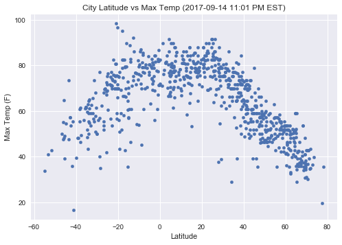
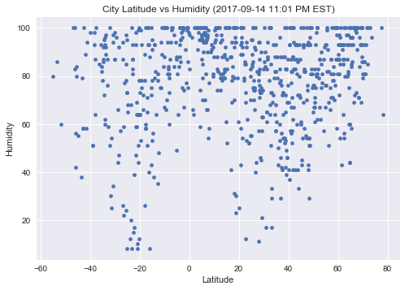
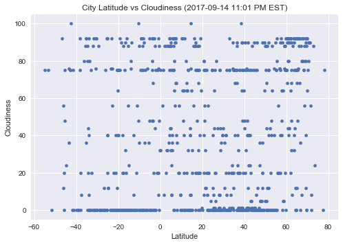
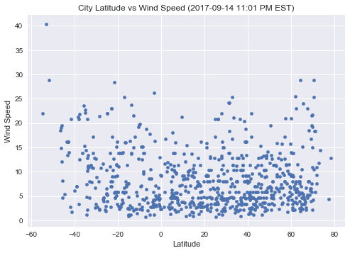

# WeatherPy

The scatter plots depict that near the Equator there is little temperature fluctuation, though there is a dramatic difference in rainfall and humidity. Humidity increases as we approach the equator. Its cloudy at this moment and rainfall is very high in the tropical regions. The wind speed is not much affected by the distance from the equator, it’s almost moderate throughout the globe. In conclusion, an equatorial climate is a type of tropical climate in which there is no dry season. It is usually found at latitudes within five degrees of the equator and tropical rainforest is the natural vegetation.


```python
# Dependencies
import requests as req
import json
import matplotlib.pyplot as plt
import numpy as np
import pandas as pd
import seaborn as sns
from citipy import citipy
import time
```


```python
# Create random numbers for latitudes
latitude = np.random.uniform(low = -90, high = 90,size = 2000)
# latitude

# Create random numbers for longitudes
longitude = np.random.uniform(low = -180, high = 180,size = 2000)
# longitude

# Zip longitude and latidude arrays to get the coordinates
coordinates = list(zip(latitude, longitude))
# coordinates
```

# Generate Cities List


```python
# Create an empty list of world cities and repective countries
WorldCities = []
Countries = []

# Find the nearest city corresponding to the above coordinates
for coordinate_pair in coordinates:
    lat, lon = coordinate_pair
    name = citipy.nearest_city(lat, lon).city_name
    country_code = citipy.nearest_city(lat, lon).country_code
    WorldCities.append(name)
    Countries.append(country_code)
WorldCities_data = pd.DataFrame({"City":WorldCities, "Country":Countries})  

# Drop any duplicate values
WorldCities_data = WorldCities_data.drop_duplicates('City')

# Visualize the data frame
WorldCities_data.head()
```


<div>
<style>
    .dataframe thead tr:only-child th {
        text-align: right;
    }

    .dataframe thead th {
        text-align: left;
    }

    .dataframe tbody tr th {
        vertical-align: top;
    }
</style>
<table border="1" class="dataframe">
  <thead>
    <tr style="text-align: right;">
      <th></th>
      <th>City</th>
      <th>Country</th>
    </tr>
  </thead>
  <tbody>
    <tr>
      <th>0</th>
      <td>zhezkazgan</td>
      <td>kz</td>
    </tr>
    <tr>
      <th>1</th>
      <td>amderma</td>
      <td>ru</td>
    </tr>
    <tr>
      <th>2</th>
      <td>rikitea</td>
      <td>pf</td>
    </tr>
    <tr>
      <th>3</th>
      <td>jamestown</td>
      <td>sh</td>
    </tr>
    <tr>
      <th>4</th>
      <td>geraldton</td>
      <td>ca</td>
    </tr>
  </tbody>
</table>
</div>


```python
# Add columns to the data frame
WorldCities_data["Lat"] = ""
WorldCities_data["Lon"] = ""
WorldCities_data["Date"] = ""
WorldCities_data["Humidity"] = ""
WorldCities_data["Max Temp"] = ""
WorldCities_data["Wind Speed"] = ""
WorldCities_data["Cloudiness"] = ""

# Visualize the data frame
WorldCities_data.head()
```


<div>
<style>
    .dataframe thead tr:only-child th {
        text-align: right;
    }

    .dataframe thead th {
        text-align: left;
    }

    .dataframe tbody tr th {
        vertical-align: top;
    }
</style>
<table border="1" class="dataframe">
  <thead>
    <tr style="text-align: right;">
      <th></th>
      <th>City</th>
      <th>Country</th>
      <th>Lat</th>
      <th>Lon</th>
      <th>Date</th>
      <th>Humidity</th>
      <th>Max Temp</th>
      <th>Wind Speed</th>
      <th>Cloudiness</th>
    </tr>
  </thead>
  <tbody>
    <tr>
      <th>0</th>
      <td>zhezkazgan</td>
      <td>kz</td>
      <td></td>
      <td></td>
      <td></td>
      <td></td>
      <td></td>
      <td></td>
      <td></td>
    </tr>
    <tr>
      <th>1</th>
      <td>amderma</td>
      <td>ru</td>
      <td></td>
      <td></td>
      <td></td>
      <td></td>
      <td></td>
      <td></td>
      <td></td>
    </tr>
    <tr>
      <th>2</th>
      <td>rikitea</td>
      <td>pf</td>
      <td></td>
      <td></td>
      <td></td>
      <td></td>
      <td></td>
      <td></td>
      <td></td>
    </tr>
    <tr>
      <th>3</th>
      <td>jamestown</td>
      <td>sh</td>
      <td></td>
      <td></td>
      <td></td>
      <td></td>
      <td></td>
      <td></td>
      <td></td>
    </tr>
    <tr>
      <th>4</th>
      <td>geraldton</td>
      <td>ca</td>
      <td></td>
      <td></td>
      <td></td>
      <td></td>
      <td></td>
      <td></td>
      <td></td>
    </tr>
  </tbody>
</table>
</div>


# Perform API Calls


```python
# OpenWeatherMap API Key
api_key = "6531fb771bd4c6120244bdacb4b0a890"

# Set the initial row count to zero
row_count = 0

print("**********************")
print("BEGINNING DATA RETRIEVAL")
print("**********************")

# Loop through the cities and perform API Calls
for index, row in WorldCities_data.iterrows():
    target_url = "http://api.openweathermap.org/data/2.5/weather?q=%s&units=IMPERIAL&appid=%s" %(row["City"], api_key)
    response = req.get(target_url).json()
    print("----------------------")
    print("Now retrieving city #%s: %s" % (row_count + 1, WorldCities_data.loc[index]["City"]))
    print(target_url)
    row_count += 1
    
    try:     
        WorldCities_data.set_value(index, "Lat", response["coord"]["lat"])
        WorldCities_data.set_value(index, "Lon", response["coord"]["lon"])
        WorldCities_data.set_value(index, "Date", response["dt"])
        WorldCities_data.set_value(index, "Humidity", response["main"]["humidity"])
        WorldCities_data.set_value(index, "Max Temp", response["main"]["temp_max"])
        WorldCities_data.set_value(index, "Wind Speed", response["wind"]["speed"])
        WorldCities_data.set_value(index, "Cloudiness", response["clouds"]["all"])
           
    except:
        print("Missing details... skip.")
        
    if row_count % 50 == 0:
        print("**********************")
        print("PAUSE FOR 30 SECONDS")
        print("**********************")
        time.sleep(30)
        
print("**********************")
print("DATA RETRIEVAL COMPLETE")
print("**********************")


```

    **********************
    BEGINNING DATA RETRIEVAL
    **********************
    ----------------------
    Now retrieving city #1: zhezkazgan
    http://api.openweathermap.org/data/2.5/weather?q=zhezkazgan&units=IMPERIAL&appid=6531fb771bd4c6120244bdacb4b0a890
    ----------------------
    Now retrieving city #2: amderma
    http://api.openweathermap.org/data/2.5/weather?q=amderma&units=IMPERIAL&appid=6531fb771bd4c6120244bdacb4b0a890
    ----------------------
    Now retrieving city #3: rikitea
    http://api.openweathermap.org/data/2.5/weather?q=rikitea&units=IMPERIAL&appid=6531fb771bd4c6120244bdacb4b0a890
    ----------------------
    Now retrieving city #4: jamestown
    http://api.openweathermap.org/data/2.5/weather?q=jamestown&units=IMPERIAL&appid=6531fb771bd4c6120244bdacb4b0a890
    ----------------------
    Now retrieving city #5: geraldton
    http://api.openweathermap.org/data/2.5/weather?q=geraldton&units=IMPERIAL&appid=6531fb771bd4c6120244bdacb4b0a890
    ----------------------
    Now retrieving city #6: luanda
    http://api.openweathermap.org/data/2.5/weather?q=luanda&units=IMPERIAL&appid=6531fb771bd4c6120244bdacb4b0a890
    ----------------------
    Now retrieving city #7: walvis bay
    http://api.openweathermap.org/data/2.5/weather?q=walvis bay&units=IMPERIAL&appid=6531fb771bd4c6120244bdacb4b0a890
    ----------------------
    Now retrieving city #8: saint-augustin
    http://api.openweathermap.org/data/2.5/weather?q=saint-augustin&units=IMPERIAL&appid=6531fb771bd4c6120244bdacb4b0a890
    ----------------------
    Now retrieving city #9: sao miguel do araguaia
    http://api.openweathermap.org/data/2.5/weather?q=sao miguel do araguaia&units=IMPERIAL&appid=6531fb771bd4c6120244bdacb4b0a890
    ----------------------
    Now retrieving city #10: illoqqortoormiut
    http://api.openweathermap.org/data/2.5/weather?q=illoqqortoormiut&units=IMPERIAL&appid=6531fb771bd4c6120244bdacb4b0a890
    ----------------------
    Now retrieving city #11: arraial do cabo
    http://api.openweathermap.org/data/2.5/weather?q=arraial do cabo&units=IMPERIAL&appid=6531fb771bd4c6120244bdacb4b0a890
    ----------------------
    Now retrieving city #12: provideniya
    http://api.openweathermap.org/data/2.5/weather?q=provideniya&units=IMPERIAL&appid=6531fb771bd4c6120244bdacb4b0a890
    ----------------------
    Now retrieving city #13: ushuaia
    http://api.openweathermap.org/data/2.5/weather?q=ushuaia&units=IMPERIAL&appid=6531fb771bd4c6120244bdacb4b0a890
    ----------------------
    Now retrieving city #14: chenzhou
    http://api.openweathermap.org/data/2.5/weather?q=chenzhou&units=IMPERIAL&appid=6531fb771bd4c6120244bdacb4b0a890
    ----------------------
    Now retrieving city #15: yellowknife
    http://api.openweathermap.org/data/2.5/weather?q=yellowknife&units=IMPERIAL&appid=6531fb771bd4c6120244bdacb4b0a890
    ----------------------
    Now retrieving city #16: vaini
    http://api.openweathermap.org/data/2.5/weather?q=vaini&units=IMPERIAL&appid=6531fb771bd4c6120244bdacb4b0a890
    ----------------------
    Now retrieving city #17: mys shmidta
    http://api.openweathermap.org/data/2.5/weather?q=mys shmidta&units=IMPERIAL&appid=6531fb771bd4c6120244bdacb4b0a890
    ----------------------
    Now retrieving city #18: homer
    http://api.openweathermap.org/data/2.5/weather?q=homer&units=IMPERIAL&appid=6531fb771bd4c6120244bdacb4b0a890
    ----------------------
    Now retrieving city #19: brae
    http://api.openweathermap.org/data/2.5/weather?q=brae&units=IMPERIAL&appid=6531fb771bd4c6120244bdacb4b0a890
    ----------------------
    Now retrieving city #20: lebu
    http://api.openweathermap.org/data/2.5/weather?q=lebu&units=IMPERIAL&appid=6531fb771bd4c6120244bdacb4b0a890
    ----------------------
    Now retrieving city #21: rawannawi
    http://api.openweathermap.org/data/2.5/weather?q=rawannawi&units=IMPERIAL&appid=6531fb771bd4c6120244bdacb4b0a890
    ----------------------
    Now retrieving city #22: zavyalovo
    http://api.openweathermap.org/data/2.5/weather?q=zavyalovo&units=IMPERIAL&appid=6531fb771bd4c6120244bdacb4b0a890
    ----------------------
    Now retrieving city #23: fort nelson
    http://api.openweathermap.org/data/2.5/weather?q=fort nelson&units=IMPERIAL&appid=6531fb771bd4c6120244bdacb4b0a890
    ----------------------
    Now retrieving city #24: saint-pierre
    http://api.openweathermap.org/data/2.5/weather?q=saint-pierre&units=IMPERIAL&appid=6531fb771bd4c6120244bdacb4b0a890
    ----------------------
    Now retrieving city #25: markova
    http://api.openweathermap.org/data/2.5/weather?q=markova&units=IMPERIAL&appid=6531fb771bd4c6120244bdacb4b0a890
    ----------------------
    Now retrieving city #26: cape town
    http://api.openweathermap.org/data/2.5/weather?q=cape town&units=IMPERIAL&appid=6531fb771bd4c6120244bdacb4b0a890
    ----------------------
    Now retrieving city #27: punta arenas
    http://api.openweathermap.org/data/2.5/weather?q=punta arenas&units=IMPERIAL&appid=6531fb771bd4c6120244bdacb4b0a890
    ----------------------
    Now retrieving city #28: hilo
    http://api.openweathermap.org/data/2.5/weather?q=hilo&units=IMPERIAL&appid=6531fb771bd4c6120244bdacb4b0a890
    ----------------------
    Now retrieving city #29: vila franca do campo
    http://api.openweathermap.org/data/2.5/weather?q=vila franca do campo&units=IMPERIAL&appid=6531fb771bd4c6120244bdacb4b0a890
    ----------------------
    Now retrieving city #30: presidencia roque saenz pena
    http://api.openweathermap.org/data/2.5/weather?q=presidencia roque saenz pena&units=IMPERIAL&appid=6531fb771bd4c6120244bdacb4b0a890
    ----------------------
    Now retrieving city #31: salalah
    http://api.openweathermap.org/data/2.5/weather?q=salalah&units=IMPERIAL&appid=6531fb771bd4c6120244bdacb4b0a890
    ----------------------
    Now retrieving city #32: kostolac
    http://api.openweathermap.org/data/2.5/weather?q=kostolac&units=IMPERIAL&appid=6531fb771bd4c6120244bdacb4b0a890
    ----------------------
    Now retrieving city #33: puerto del rosario
    http://api.openweathermap.org/data/2.5/weather?q=puerto del rosario&units=IMPERIAL&appid=6531fb771bd4c6120244bdacb4b0a890
    ----------------------
    Now retrieving city #34: carauari
    http://api.openweathermap.org/data/2.5/weather?q=carauari&units=IMPERIAL&appid=6531fb771bd4c6120244bdacb4b0a890
    ----------------------
    Now retrieving city #35: hermanus
    http://api.openweathermap.org/data/2.5/weather?q=hermanus&units=IMPERIAL&appid=6531fb771bd4c6120244bdacb4b0a890
    ----------------------
    Now retrieving city #36: saint-philippe
    http://api.openweathermap.org/data/2.5/weather?q=saint-philippe&units=IMPERIAL&appid=6531fb771bd4c6120244bdacb4b0a890
    ----------------------
    Now retrieving city #37: bonavista
    http://api.openweathermap.org/data/2.5/weather?q=bonavista&units=IMPERIAL&appid=6531fb771bd4c6120244bdacb4b0a890
    ----------------------
    Now retrieving city #38: khatanga
    http://api.openweathermap.org/data/2.5/weather?q=khatanga&units=IMPERIAL&appid=6531fb771bd4c6120244bdacb4b0a890
    ----------------------
    Now retrieving city #39: busselton
    http://api.openweathermap.org/data/2.5/weather?q=busselton&units=IMPERIAL&appid=6531fb771bd4c6120244bdacb4b0a890
    ----------------------
    Now retrieving city #40: mataura
    http://api.openweathermap.org/data/2.5/weather?q=mataura&units=IMPERIAL&appid=6531fb771bd4c6120244bdacb4b0a890
    ----------------------
    Now retrieving city #41: haines junction
    http://api.openweathermap.org/data/2.5/weather?q=haines junction&units=IMPERIAL&appid=6531fb771bd4c6120244bdacb4b0a890
    ----------------------
    Now retrieving city #42: ostrovnoy
    http://api.openweathermap.org/data/2.5/weather?q=ostrovnoy&units=IMPERIAL&appid=6531fb771bd4c6120244bdacb4b0a890
    ----------------------
    Now retrieving city #43: vaitupu
    http://api.openweathermap.org/data/2.5/weather?q=vaitupu&units=IMPERIAL&appid=6531fb771bd4c6120244bdacb4b0a890
    ----------------------
    Now retrieving city #44: hithadhoo
    http://api.openweathermap.org/data/2.5/weather?q=hithadhoo&units=IMPERIAL&appid=6531fb771bd4c6120244bdacb4b0a890
    ----------------------
    Now retrieving city #45: kavaratti
    http://api.openweathermap.org/data/2.5/weather?q=kavaratti&units=IMPERIAL&appid=6531fb771bd4c6120244bdacb4b0a890
    ----------------------
    Now retrieving city #46: huarmey
    http://api.openweathermap.org/data/2.5/weather?q=huarmey&units=IMPERIAL&appid=6531fb771bd4c6120244bdacb4b0a890
    ----------------------
    Now retrieving city #47: clearwater
    http://api.openweathermap.org/data/2.5/weather?q=clearwater&units=IMPERIAL&appid=6531fb771bd4c6120244bdacb4b0a890
    ----------------------
    Now retrieving city #48: muros
    http://api.openweathermap.org/data/2.5/weather?q=muros&units=IMPERIAL&appid=6531fb771bd4c6120244bdacb4b0a890
    ----------------------
    Now retrieving city #49: sorong
    http://api.openweathermap.org/data/2.5/weather?q=sorong&units=IMPERIAL&appid=6531fb771bd4c6120244bdacb4b0a890
    ----------------------
    Now retrieving city #50: narsaq
    http://api.openweathermap.org/data/2.5/weather?q=narsaq&units=IMPERIAL&appid=6531fb771bd4c6120244bdacb4b0a890
    **********************
    PAUSE FOR 30 SECONDS
    **********************
    ----------------------
    Now retrieving city #51: bengkulu
    http://api.openweathermap.org/data/2.5/weather?q=bengkulu&units=IMPERIAL&appid=6531fb771bd4c6120244bdacb4b0a890
    ----------------------
    Now retrieving city #52: bethel
    http://api.openweathermap.org/data/2.5/weather?q=bethel&units=IMPERIAL&appid=6531fb771bd4c6120244bdacb4b0a890
    ----------------------
    Now retrieving city #53: awbari
    http://api.openweathermap.org/data/2.5/weather?q=awbari&units=IMPERIAL&appid=6531fb771bd4c6120244bdacb4b0a890
    ----------------------
    Now retrieving city #54: sterling
    http://api.openweathermap.org/data/2.5/weather?q=sterling&units=IMPERIAL&appid=6531fb771bd4c6120244bdacb4b0a890
    ----------------------
    Now retrieving city #55: larsnes
    http://api.openweathermap.org/data/2.5/weather?q=larsnes&units=IMPERIAL&appid=6531fb771bd4c6120244bdacb4b0a890
    ----------------------
    Now retrieving city #56: portland
    http://api.openweathermap.org/data/2.5/weather?q=portland&units=IMPERIAL&appid=6531fb771bd4c6120244bdacb4b0a890
    ----------------------
    Now retrieving city #57: ribeira grande
    http://api.openweathermap.org/data/2.5/weather?q=ribeira grande&units=IMPERIAL&appid=6531fb771bd4c6120244bdacb4b0a890
    ----------------------
    Now retrieving city #58: cidreira
    http://api.openweathermap.org/data/2.5/weather?q=cidreira&units=IMPERIAL&appid=6531fb771bd4c6120244bdacb4b0a890
    ----------------------
    Now retrieving city #59: tsihombe
    http://api.openweathermap.org/data/2.5/weather?q=tsihombe&units=IMPERIAL&appid=6531fb771bd4c6120244bdacb4b0a890
    ----------------------
    Now retrieving city #60: faanui
    http://api.openweathermap.org/data/2.5/weather?q=faanui&units=IMPERIAL&appid=6531fb771bd4c6120244bdacb4b0a890
    ----------------------
    Now retrieving city #61: bartica
    http://api.openweathermap.org/data/2.5/weather?q=bartica&units=IMPERIAL&appid=6531fb771bd4c6120244bdacb4b0a890
    ----------------------
    Now retrieving city #62: achisay
    http://api.openweathermap.org/data/2.5/weather?q=achisay&units=IMPERIAL&appid=6531fb771bd4c6120244bdacb4b0a890
    ----------------------
    Now retrieving city #63: inderborskiy
    http://api.openweathermap.org/data/2.5/weather?q=inderborskiy&units=IMPERIAL&appid=6531fb771bd4c6120244bdacb4b0a890
    ----------------------
    Now retrieving city #64: arica
    http://api.openweathermap.org/data/2.5/weather?q=arica&units=IMPERIAL&appid=6531fb771bd4c6120244bdacb4b0a890
    ----------------------
    Now retrieving city #65: carnarvon
    http://api.openweathermap.org/data/2.5/weather?q=carnarvon&units=IMPERIAL&appid=6531fb771bd4c6120244bdacb4b0a890
    ----------------------
    Now retrieving city #66: ponta do sol
    http://api.openweathermap.org/data/2.5/weather?q=ponta do sol&units=IMPERIAL&appid=6531fb771bd4c6120244bdacb4b0a890
    ----------------------
    Now retrieving city #67: kolvereid
    http://api.openweathermap.org/data/2.5/weather?q=kolvereid&units=IMPERIAL&appid=6531fb771bd4c6120244bdacb4b0a890
    ----------------------
    Now retrieving city #68: alofi
    http://api.openweathermap.org/data/2.5/weather?q=alofi&units=IMPERIAL&appid=6531fb771bd4c6120244bdacb4b0a890
    ----------------------
    Now retrieving city #69: dmytrivka
    http://api.openweathermap.org/data/2.5/weather?q=dmytrivka&units=IMPERIAL&appid=6531fb771bd4c6120244bdacb4b0a890
    ----------------------
    Now retrieving city #70: bandiagara
    http://api.openweathermap.org/data/2.5/weather?q=bandiagara&units=IMPERIAL&appid=6531fb771bd4c6120244bdacb4b0a890
    ----------------------
    Now retrieving city #71: torbay
    http://api.openweathermap.org/data/2.5/weather?q=torbay&units=IMPERIAL&appid=6531fb771bd4c6120244bdacb4b0a890
    ----------------------
    Now retrieving city #72: keningau
    http://api.openweathermap.org/data/2.5/weather?q=keningau&units=IMPERIAL&appid=6531fb771bd4c6120244bdacb4b0a890
    ----------------------
    Now retrieving city #73: amapa
    http://api.openweathermap.org/data/2.5/weather?q=amapa&units=IMPERIAL&appid=6531fb771bd4c6120244bdacb4b0a890
    ----------------------
    Now retrieving city #74: vienna
    http://api.openweathermap.org/data/2.5/weather?q=vienna&units=IMPERIAL&appid=6531fb771bd4c6120244bdacb4b0a890
    ----------------------
    Now retrieving city #75: nijar
    http://api.openweathermap.org/data/2.5/weather?q=nijar&units=IMPERIAL&appid=6531fb771bd4c6120244bdacb4b0a890
    ----------------------
    Now retrieving city #76: talnakh
    http://api.openweathermap.org/data/2.5/weather?q=talnakh&units=IMPERIAL&appid=6531fb771bd4c6120244bdacb4b0a890
    ----------------------
    Now retrieving city #77: bandarbeyla
    http://api.openweathermap.org/data/2.5/weather?q=bandarbeyla&units=IMPERIAL&appid=6531fb771bd4c6120244bdacb4b0a890
    ----------------------
    Now retrieving city #78: albany
    http://api.openweathermap.org/data/2.5/weather?q=albany&units=IMPERIAL&appid=6531fb771bd4c6120244bdacb4b0a890
    ----------------------
    Now retrieving city #79: kununurra
    http://api.openweathermap.org/data/2.5/weather?q=kununurra&units=IMPERIAL&appid=6531fb771bd4c6120244bdacb4b0a890
    ----------------------
    Now retrieving city #80: krasnoselkup
    http://api.openweathermap.org/data/2.5/weather?q=krasnoselkup&units=IMPERIAL&appid=6531fb771bd4c6120244bdacb4b0a890
    ----------------------
    Now retrieving city #81: panaba
    http://api.openweathermap.org/data/2.5/weather?q=panaba&units=IMPERIAL&appid=6531fb771bd4c6120244bdacb4b0a890
    ----------------------
    Now retrieving city #82: nikolskoye
    http://api.openweathermap.org/data/2.5/weather?q=nikolskoye&units=IMPERIAL&appid=6531fb771bd4c6120244bdacb4b0a890
    ----------------------
    Now retrieving city #83: fortuna
    http://api.openweathermap.org/data/2.5/weather?q=fortuna&units=IMPERIAL&appid=6531fb771bd4c6120244bdacb4b0a890
    ----------------------
    Now retrieving city #84: belushya guba
    http://api.openweathermap.org/data/2.5/weather?q=belushya guba&units=IMPERIAL&appid=6531fb771bd4c6120244bdacb4b0a890
    ----------------------
    Now retrieving city #85: atuona
    http://api.openweathermap.org/data/2.5/weather?q=atuona&units=IMPERIAL&appid=6531fb771bd4c6120244bdacb4b0a890
    ----------------------
    Now retrieving city #86: butaritari
    http://api.openweathermap.org/data/2.5/weather?q=butaritari&units=IMPERIAL&appid=6531fb771bd4c6120244bdacb4b0a890
    ----------------------
    Now retrieving city #87: port hedland
    http://api.openweathermap.org/data/2.5/weather?q=port hedland&units=IMPERIAL&appid=6531fb771bd4c6120244bdacb4b0a890
    ----------------------
    Now retrieving city #88: lavrentiya
    http://api.openweathermap.org/data/2.5/weather?q=lavrentiya&units=IMPERIAL&appid=6531fb771bd4c6120244bdacb4b0a890
    ----------------------
    Now retrieving city #89: belaya gora
    http://api.openweathermap.org/data/2.5/weather?q=belaya gora&units=IMPERIAL&appid=6531fb771bd4c6120244bdacb4b0a890
    ----------------------
    Now retrieving city #90: lagoa
    http://api.openweathermap.org/data/2.5/weather?q=lagoa&units=IMPERIAL&appid=6531fb771bd4c6120244bdacb4b0a890
    ----------------------
    Now retrieving city #91: taolanaro
    http://api.openweathermap.org/data/2.5/weather?q=taolanaro&units=IMPERIAL&appid=6531fb771bd4c6120244bdacb4b0a890
    ----------------------
    Now retrieving city #92: isangel
    http://api.openweathermap.org/data/2.5/weather?q=isangel&units=IMPERIAL&appid=6531fb771bd4c6120244bdacb4b0a890
    ----------------------
    Now retrieving city #93: islamkot
    http://api.openweathermap.org/data/2.5/weather?q=islamkot&units=IMPERIAL&appid=6531fb771bd4c6120244bdacb4b0a890
    ----------------------
    Now retrieving city #94: cherskiy
    http://api.openweathermap.org/data/2.5/weather?q=cherskiy&units=IMPERIAL&appid=6531fb771bd4c6120244bdacb4b0a890
    ----------------------
    Now retrieving city #95: comodoro rivadavia
    http://api.openweathermap.org/data/2.5/weather?q=comodoro rivadavia&units=IMPERIAL&appid=6531fb771bd4c6120244bdacb4b0a890
    ----------------------
    Now retrieving city #96: hambantota
    http://api.openweathermap.org/data/2.5/weather?q=hambantota&units=IMPERIAL&appid=6531fb771bd4c6120244bdacb4b0a890
    ----------------------
    Now retrieving city #97: jonuta
    http://api.openweathermap.org/data/2.5/weather?q=jonuta&units=IMPERIAL&appid=6531fb771bd4c6120244bdacb4b0a890
    ----------------------
    Now retrieving city #98: sao jose da coroa grande
    http://api.openweathermap.org/data/2.5/weather?q=sao jose da coroa grande&units=IMPERIAL&appid=6531fb771bd4c6120244bdacb4b0a890
    ----------------------
    Now retrieving city #99: longyearbyen
    http://api.openweathermap.org/data/2.5/weather?q=longyearbyen&units=IMPERIAL&appid=6531fb771bd4c6120244bdacb4b0a890
    ----------------------
    Now retrieving city #100: jardim
    http://api.openweathermap.org/data/2.5/weather?q=jardim&units=IMPERIAL&appid=6531fb771bd4c6120244bdacb4b0a890
    **********************
    PAUSE FOR 30 SECONDS
    **********************
    ----------------------
    Now retrieving city #101: monrovia
    http://api.openweathermap.org/data/2.5/weather?q=monrovia&units=IMPERIAL&appid=6531fb771bd4c6120244bdacb4b0a890
    ----------------------
    Now retrieving city #102: nikolsk
    http://api.openweathermap.org/data/2.5/weather?q=nikolsk&units=IMPERIAL&appid=6531fb771bd4c6120244bdacb4b0a890
    ----------------------
    Now retrieving city #103: kunya
    http://api.openweathermap.org/data/2.5/weather?q=kunya&units=IMPERIAL&appid=6531fb771bd4c6120244bdacb4b0a890
    ----------------------
    Now retrieving city #104: severo-kurilsk
    http://api.openweathermap.org/data/2.5/weather?q=severo-kurilsk&units=IMPERIAL&appid=6531fb771bd4c6120244bdacb4b0a890
    ----------------------
    Now retrieving city #105: karasjok
    http://api.openweathermap.org/data/2.5/weather?q=karasjok&units=IMPERIAL&appid=6531fb771bd4c6120244bdacb4b0a890
    ----------------------
    Now retrieving city #106: kosikha
    http://api.openweathermap.org/data/2.5/weather?q=kosikha&units=IMPERIAL&appid=6531fb771bd4c6120244bdacb4b0a890
    ----------------------
    Now retrieving city #107: grand river south east
    http://api.openweathermap.org/data/2.5/weather?q=grand river south east&units=IMPERIAL&appid=6531fb771bd4c6120244bdacb4b0a890
    ----------------------
    Now retrieving city #108: tasiilaq
    http://api.openweathermap.org/data/2.5/weather?q=tasiilaq&units=IMPERIAL&appid=6531fb771bd4c6120244bdacb4b0a890
    ----------------------
    Now retrieving city #109: puerto ayora
    http://api.openweathermap.org/data/2.5/weather?q=puerto ayora&units=IMPERIAL&appid=6531fb771bd4c6120244bdacb4b0a890
    ----------------------
    Now retrieving city #110: lolua
    http://api.openweathermap.org/data/2.5/weather?q=lolua&units=IMPERIAL&appid=6531fb771bd4c6120244bdacb4b0a890
    ----------------------
    Now retrieving city #111: khonuu
    http://api.openweathermap.org/data/2.5/weather?q=khonuu&units=IMPERIAL&appid=6531fb771bd4c6120244bdacb4b0a890
    ----------------------
    Now retrieving city #112: gasa
    http://api.openweathermap.org/data/2.5/weather?q=gasa&units=IMPERIAL&appid=6531fb771bd4c6120244bdacb4b0a890
    ----------------------
    Now retrieving city #113: luderitz
    http://api.openweathermap.org/data/2.5/weather?q=luderitz&units=IMPERIAL&appid=6531fb771bd4c6120244bdacb4b0a890
    ----------------------
    Now retrieving city #114: hobart
    http://api.openweathermap.org/data/2.5/weather?q=hobart&units=IMPERIAL&appid=6531fb771bd4c6120244bdacb4b0a890
    ----------------------
    Now retrieving city #115: tari
    http://api.openweathermap.org/data/2.5/weather?q=tari&units=IMPERIAL&appid=6531fb771bd4c6120244bdacb4b0a890
    ----------------------
    Now retrieving city #116: bambous virieux
    http://api.openweathermap.org/data/2.5/weather?q=bambous virieux&units=IMPERIAL&appid=6531fb771bd4c6120244bdacb4b0a890
    ----------------------
    Now retrieving city #117: juneau
    http://api.openweathermap.org/data/2.5/weather?q=juneau&units=IMPERIAL&appid=6531fb771bd4c6120244bdacb4b0a890
    ----------------------
    Now retrieving city #118: megion
    http://api.openweathermap.org/data/2.5/weather?q=megion&units=IMPERIAL&appid=6531fb771bd4c6120244bdacb4b0a890
    ----------------------
    Now retrieving city #119: pafos
    http://api.openweathermap.org/data/2.5/weather?q=pafos&units=IMPERIAL&appid=6531fb771bd4c6120244bdacb4b0a890
    ----------------------
    Now retrieving city #120: belyy yar
    http://api.openweathermap.org/data/2.5/weather?q=belyy yar&units=IMPERIAL&appid=6531fb771bd4c6120244bdacb4b0a890
    ----------------------
    Now retrieving city #121: barrow
    http://api.openweathermap.org/data/2.5/weather?q=barrow&units=IMPERIAL&appid=6531fb771bd4c6120244bdacb4b0a890
    ----------------------
    Now retrieving city #122: bredasdorp
    http://api.openweathermap.org/data/2.5/weather?q=bredasdorp&units=IMPERIAL&appid=6531fb771bd4c6120244bdacb4b0a890
    ----------------------
    Now retrieving city #123: bubaque
    http://api.openweathermap.org/data/2.5/weather?q=bubaque&units=IMPERIAL&appid=6531fb771bd4c6120244bdacb4b0a890
    ----------------------
    Now retrieving city #124: bondo
    http://api.openweathermap.org/data/2.5/weather?q=bondo&units=IMPERIAL&appid=6531fb771bd4c6120244bdacb4b0a890
    ----------------------
    Now retrieving city #125: east london
    http://api.openweathermap.org/data/2.5/weather?q=east london&units=IMPERIAL&appid=6531fb771bd4c6120244bdacb4b0a890
    ----------------------
    Now retrieving city #126: okakarara
    http://api.openweathermap.org/data/2.5/weather?q=okakarara&units=IMPERIAL&appid=6531fb771bd4c6120244bdacb4b0a890
    ----------------------
    Now retrieving city #127: cabo san lucas
    http://api.openweathermap.org/data/2.5/weather?q=cabo san lucas&units=IMPERIAL&appid=6531fb771bd4c6120244bdacb4b0a890
    ----------------------
    Now retrieving city #128: rafai
    http://api.openweathermap.org/data/2.5/weather?q=rafai&units=IMPERIAL&appid=6531fb771bd4c6120244bdacb4b0a890
    ----------------------
    Now retrieving city #129: grindavik
    http://api.openweathermap.org/data/2.5/weather?q=grindavik&units=IMPERIAL&appid=6531fb771bd4c6120244bdacb4b0a890
    ----------------------
    Now retrieving city #130: shubarshi
    http://api.openweathermap.org/data/2.5/weather?q=shubarshi&units=IMPERIAL&appid=6531fb771bd4c6120244bdacb4b0a890
    ----------------------
    Now retrieving city #131: sundsvall
    http://api.openweathermap.org/data/2.5/weather?q=sundsvall&units=IMPERIAL&appid=6531fb771bd4c6120244bdacb4b0a890
    ----------------------
    Now retrieving city #132: saryshagan
    http://api.openweathermap.org/data/2.5/weather?q=saryshagan&units=IMPERIAL&appid=6531fb771bd4c6120244bdacb4b0a890
    ----------------------
    Now retrieving city #133: yanliang
    http://api.openweathermap.org/data/2.5/weather?q=yanliang&units=IMPERIAL&appid=6531fb771bd4c6120244bdacb4b0a890
    ----------------------
    Now retrieving city #134: abong mbang
    http://api.openweathermap.org/data/2.5/weather?q=abong mbang&units=IMPERIAL&appid=6531fb771bd4c6120244bdacb4b0a890
    ----------------------
    Now retrieving city #135: victoria
    http://api.openweathermap.org/data/2.5/weather?q=victoria&units=IMPERIAL&appid=6531fb771bd4c6120244bdacb4b0a890
    ----------------------
    Now retrieving city #136: ilulissat
    http://api.openweathermap.org/data/2.5/weather?q=ilulissat&units=IMPERIAL&appid=6531fb771bd4c6120244bdacb4b0a890
    ----------------------
    Now retrieving city #137: calabozo
    http://api.openweathermap.org/data/2.5/weather?q=calabozo&units=IMPERIAL&appid=6531fb771bd4c6120244bdacb4b0a890
    ----------------------
    Now retrieving city #138: ukiah
    http://api.openweathermap.org/data/2.5/weather?q=ukiah&units=IMPERIAL&appid=6531fb771bd4c6120244bdacb4b0a890
    ----------------------
    Now retrieving city #139: caravelas
    http://api.openweathermap.org/data/2.5/weather?q=caravelas&units=IMPERIAL&appid=6531fb771bd4c6120244bdacb4b0a890
    ----------------------
    Now retrieving city #140: leningradskiy
    http://api.openweathermap.org/data/2.5/weather?q=leningradskiy&units=IMPERIAL&appid=6531fb771bd4c6120244bdacb4b0a890
    ----------------------
    Now retrieving city #141: margate
    http://api.openweathermap.org/data/2.5/weather?q=margate&units=IMPERIAL&appid=6531fb771bd4c6120244bdacb4b0a890
    ----------------------
    Now retrieving city #142: felidhoo
    http://api.openweathermap.org/data/2.5/weather?q=felidhoo&units=IMPERIAL&appid=6531fb771bd4c6120244bdacb4b0a890
    ----------------------
    Now retrieving city #143: kushmurun
    http://api.openweathermap.org/data/2.5/weather?q=kushmurun&units=IMPERIAL&appid=6531fb771bd4c6120244bdacb4b0a890
    ----------------------
    Now retrieving city #144: thompson
    http://api.openweathermap.org/data/2.5/weather?q=thompson&units=IMPERIAL&appid=6531fb771bd4c6120244bdacb4b0a890
    ----------------------
    Now retrieving city #145: tuktoyaktuk
    http://api.openweathermap.org/data/2.5/weather?q=tuktoyaktuk&units=IMPERIAL&appid=6531fb771bd4c6120244bdacb4b0a890
    ----------------------
    Now retrieving city #146: kuche
    http://api.openweathermap.org/data/2.5/weather?q=kuche&units=IMPERIAL&appid=6531fb771bd4c6120244bdacb4b0a890
    ----------------------
    Now retrieving city #147: palabuhanratu
    http://api.openweathermap.org/data/2.5/weather?q=palabuhanratu&units=IMPERIAL&appid=6531fb771bd4c6120244bdacb4b0a890
    ----------------------
    Now retrieving city #148: lovozero
    http://api.openweathermap.org/data/2.5/weather?q=lovozero&units=IMPERIAL&appid=6531fb771bd4c6120244bdacb4b0a890
    ----------------------
    Now retrieving city #149: la ronge
    http://api.openweathermap.org/data/2.5/weather?q=la ronge&units=IMPERIAL&appid=6531fb771bd4c6120244bdacb4b0a890
    ----------------------
    Now retrieving city #150: iqaluit
    http://api.openweathermap.org/data/2.5/weather?q=iqaluit&units=IMPERIAL&appid=6531fb771bd4c6120244bdacb4b0a890
    **********************
    PAUSE FOR 30 SECONDS
    **********************
    ----------------------
    Now retrieving city #151: baft
    http://api.openweathermap.org/data/2.5/weather?q=baft&units=IMPERIAL&appid=6531fb771bd4c6120244bdacb4b0a890
    ----------------------
    Now retrieving city #152: kirakira
    http://api.openweathermap.org/data/2.5/weather?q=kirakira&units=IMPERIAL&appid=6531fb771bd4c6120244bdacb4b0a890
    ----------------------
    Now retrieving city #153: waddan
    http://api.openweathermap.org/data/2.5/weather?q=waddan&units=IMPERIAL&appid=6531fb771bd4c6120244bdacb4b0a890
    ----------------------
    Now retrieving city #154: savelugu
    http://api.openweathermap.org/data/2.5/weather?q=savelugu&units=IMPERIAL&appid=6531fb771bd4c6120244bdacb4b0a890
    ----------------------
    Now retrieving city #155: upernavik
    http://api.openweathermap.org/data/2.5/weather?q=upernavik&units=IMPERIAL&appid=6531fb771bd4c6120244bdacb4b0a890
    ----------------------
    Now retrieving city #156: coolum beach
    http://api.openweathermap.org/data/2.5/weather?q=coolum beach&units=IMPERIAL&appid=6531fb771bd4c6120244bdacb4b0a890
    ----------------------
    Now retrieving city #157: makakilo city
    http://api.openweathermap.org/data/2.5/weather?q=makakilo city&units=IMPERIAL&appid=6531fb771bd4c6120244bdacb4b0a890
    ----------------------
    Now retrieving city #158: vostok
    http://api.openweathermap.org/data/2.5/weather?q=vostok&units=IMPERIAL&appid=6531fb771bd4c6120244bdacb4b0a890
    ----------------------
    Now retrieving city #159: berlevag
    http://api.openweathermap.org/data/2.5/weather?q=berlevag&units=IMPERIAL&appid=6531fb771bd4c6120244bdacb4b0a890
    ----------------------
    Now retrieving city #160: kapaa
    http://api.openweathermap.org/data/2.5/weather?q=kapaa&units=IMPERIAL&appid=6531fb771bd4c6120244bdacb4b0a890
    ----------------------
    Now retrieving city #161: zaysan
    http://api.openweathermap.org/data/2.5/weather?q=zaysan&units=IMPERIAL&appid=6531fb771bd4c6120244bdacb4b0a890
    ----------------------
    Now retrieving city #162: petropavlovsk-kamchatskiy
    http://api.openweathermap.org/data/2.5/weather?q=petropavlovsk-kamchatskiy&units=IMPERIAL&appid=6531fb771bd4c6120244bdacb4b0a890
    ----------------------
    Now retrieving city #163: vicuna
    http://api.openweathermap.org/data/2.5/weather?q=vicuna&units=IMPERIAL&appid=6531fb771bd4c6120244bdacb4b0a890
    ----------------------
    Now retrieving city #164: vila velha
    http://api.openweathermap.org/data/2.5/weather?q=vila velha&units=IMPERIAL&appid=6531fb771bd4c6120244bdacb4b0a890
    ----------------------
    Now retrieving city #165: mareeba
    http://api.openweathermap.org/data/2.5/weather?q=mareeba&units=IMPERIAL&appid=6531fb771bd4c6120244bdacb4b0a890
    ----------------------
    Now retrieving city #166: tarakan
    http://api.openweathermap.org/data/2.5/weather?q=tarakan&units=IMPERIAL&appid=6531fb771bd4c6120244bdacb4b0a890
    ----------------------
    Now retrieving city #167: rio gallegos
    http://api.openweathermap.org/data/2.5/weather?q=rio gallegos&units=IMPERIAL&appid=6531fb771bd4c6120244bdacb4b0a890
    ----------------------
    Now retrieving city #168: ancud
    http://api.openweathermap.org/data/2.5/weather?q=ancud&units=IMPERIAL&appid=6531fb771bd4c6120244bdacb4b0a890
    ----------------------
    Now retrieving city #169: cape canaveral
    http://api.openweathermap.org/data/2.5/weather?q=cape canaveral&units=IMPERIAL&appid=6531fb771bd4c6120244bdacb4b0a890
    ----------------------
    Now retrieving city #170: samana
    http://api.openweathermap.org/data/2.5/weather?q=samana&units=IMPERIAL&appid=6531fb771bd4c6120244bdacb4b0a890
    ----------------------
    Now retrieving city #171: meulaboh
    http://api.openweathermap.org/data/2.5/weather?q=meulaboh&units=IMPERIAL&appid=6531fb771bd4c6120244bdacb4b0a890
    ----------------------
    Now retrieving city #172: burlington
    http://api.openweathermap.org/data/2.5/weather?q=burlington&units=IMPERIAL&appid=6531fb771bd4c6120244bdacb4b0a890
    ----------------------
    Now retrieving city #173: saint george
    http://api.openweathermap.org/data/2.5/weather?q=saint george&units=IMPERIAL&appid=6531fb771bd4c6120244bdacb4b0a890
    ----------------------
    Now retrieving city #174: znamenskoye
    http://api.openweathermap.org/data/2.5/weather?q=znamenskoye&units=IMPERIAL&appid=6531fb771bd4c6120244bdacb4b0a890
    ----------------------
    Now retrieving city #175: samalaeulu
    http://api.openweathermap.org/data/2.5/weather?q=samalaeulu&units=IMPERIAL&appid=6531fb771bd4c6120244bdacb4b0a890
    ----------------------
    Now retrieving city #176: altay
    http://api.openweathermap.org/data/2.5/weather?q=altay&units=IMPERIAL&appid=6531fb771bd4c6120244bdacb4b0a890
    ----------------------
    Now retrieving city #177: totton
    http://api.openweathermap.org/data/2.5/weather?q=totton&units=IMPERIAL&appid=6531fb771bd4c6120244bdacb4b0a890
    ----------------------
    Now retrieving city #178: tazovskiy
    http://api.openweathermap.org/data/2.5/weather?q=tazovskiy&units=IMPERIAL&appid=6531fb771bd4c6120244bdacb4b0a890
    ----------------------
    Now retrieving city #179: pangnirtung
    http://api.openweathermap.org/data/2.5/weather?q=pangnirtung&units=IMPERIAL&appid=6531fb771bd4c6120244bdacb4b0a890
    ----------------------
    Now retrieving city #180: wajir
    http://api.openweathermap.org/data/2.5/weather?q=wajir&units=IMPERIAL&appid=6531fb771bd4c6120244bdacb4b0a890
    ----------------------
    Now retrieving city #181: coahuayana
    http://api.openweathermap.org/data/2.5/weather?q=coahuayana&units=IMPERIAL&appid=6531fb771bd4c6120244bdacb4b0a890
    ----------------------
    Now retrieving city #182: lorengau
    http://api.openweathermap.org/data/2.5/weather?q=lorengau&units=IMPERIAL&appid=6531fb771bd4c6120244bdacb4b0a890
    ----------------------
    Now retrieving city #183: nemencine
    http://api.openweathermap.org/data/2.5/weather?q=nemencine&units=IMPERIAL&appid=6531fb771bd4c6120244bdacb4b0a890
    ----------------------
    Now retrieving city #184: dzerzhinsk
    http://api.openweathermap.org/data/2.5/weather?q=dzerzhinsk&units=IMPERIAL&appid=6531fb771bd4c6120244bdacb4b0a890
    ----------------------
    Now retrieving city #185: touros
    http://api.openweathermap.org/data/2.5/weather?q=touros&units=IMPERIAL&appid=6531fb771bd4c6120244bdacb4b0a890
    ----------------------
    Now retrieving city #186: tucurui
    http://api.openweathermap.org/data/2.5/weather?q=tucurui&units=IMPERIAL&appid=6531fb771bd4c6120244bdacb4b0a890
    ----------------------
    Now retrieving city #187: barentsburg
    http://api.openweathermap.org/data/2.5/weather?q=barentsburg&units=IMPERIAL&appid=6531fb771bd4c6120244bdacb4b0a890
    ----------------------
    Now retrieving city #188: along
    http://api.openweathermap.org/data/2.5/weather?q=along&units=IMPERIAL&appid=6531fb771bd4c6120244bdacb4b0a890
    ----------------------
    Now retrieving city #189: aransas pass
    http://api.openweathermap.org/data/2.5/weather?q=aransas pass&units=IMPERIAL&appid=6531fb771bd4c6120244bdacb4b0a890
    ----------------------
    Now retrieving city #190: darab
    http://api.openweathermap.org/data/2.5/weather?q=darab&units=IMPERIAL&appid=6531fb771bd4c6120244bdacb4b0a890
    ----------------------
    Now retrieving city #191: houston
    http://api.openweathermap.org/data/2.5/weather?q=houston&units=IMPERIAL&appid=6531fb771bd4c6120244bdacb4b0a890
    ----------------------
    Now retrieving city #192: georgetown
    http://api.openweathermap.org/data/2.5/weather?q=georgetown&units=IMPERIAL&appid=6531fb771bd4c6120244bdacb4b0a890
    ----------------------
    Now retrieving city #193: chokurdakh
    http://api.openweathermap.org/data/2.5/weather?q=chokurdakh&units=IMPERIAL&appid=6531fb771bd4c6120244bdacb4b0a890
    ----------------------
    Now retrieving city #194: fare
    http://api.openweathermap.org/data/2.5/weather?q=fare&units=IMPERIAL&appid=6531fb771bd4c6120244bdacb4b0a890
    ----------------------
    Now retrieving city #195: hervey bay
    http://api.openweathermap.org/data/2.5/weather?q=hervey bay&units=IMPERIAL&appid=6531fb771bd4c6120244bdacb4b0a890
    ----------------------
    Now retrieving city #196: morondava
    http://api.openweathermap.org/data/2.5/weather?q=morondava&units=IMPERIAL&appid=6531fb771bd4c6120244bdacb4b0a890
    ----------------------
    Now retrieving city #197: oum hadjer
    http://api.openweathermap.org/data/2.5/weather?q=oum hadjer&units=IMPERIAL&appid=6531fb771bd4c6120244bdacb4b0a890
    ----------------------
    Now retrieving city #198: izmalkovo
    http://api.openweathermap.org/data/2.5/weather?q=izmalkovo&units=IMPERIAL&appid=6531fb771bd4c6120244bdacb4b0a890
    ----------------------
    Now retrieving city #199: cockburn town
    http://api.openweathermap.org/data/2.5/weather?q=cockburn town&units=IMPERIAL&appid=6531fb771bd4c6120244bdacb4b0a890
    ----------------------
    Now retrieving city #200: nokaneng
    http://api.openweathermap.org/data/2.5/weather?q=nokaneng&units=IMPERIAL&appid=6531fb771bd4c6120244bdacb4b0a890
    **********************
    PAUSE FOR 30 SECONDS
    **********************
    ----------------------
    Now retrieving city #201: hamilton
    http://api.openweathermap.org/data/2.5/weather?q=hamilton&units=IMPERIAL&appid=6531fb771bd4c6120244bdacb4b0a890
    ----------------------
    Now retrieving city #202: bathsheba
    http://api.openweathermap.org/data/2.5/weather?q=bathsheba&units=IMPERIAL&appid=6531fb771bd4c6120244bdacb4b0a890
    ----------------------
    Now retrieving city #203: samarinda
    http://api.openweathermap.org/data/2.5/weather?q=samarinda&units=IMPERIAL&appid=6531fb771bd4c6120244bdacb4b0a890
    ----------------------
    Now retrieving city #204: port elizabeth
    http://api.openweathermap.org/data/2.5/weather?q=port elizabeth&units=IMPERIAL&appid=6531fb771bd4c6120244bdacb4b0a890
    ----------------------
    Now retrieving city #205: avarua
    http://api.openweathermap.org/data/2.5/weather?q=avarua&units=IMPERIAL&appid=6531fb771bd4c6120244bdacb4b0a890
    ----------------------
    Now retrieving city #206: rocha
    http://api.openweathermap.org/data/2.5/weather?q=rocha&units=IMPERIAL&appid=6531fb771bd4c6120244bdacb4b0a890
    ----------------------
    Now retrieving city #207: isla vista
    http://api.openweathermap.org/data/2.5/weather?q=isla vista&units=IMPERIAL&appid=6531fb771bd4c6120244bdacb4b0a890
    ----------------------
    Now retrieving city #208: naze
    http://api.openweathermap.org/data/2.5/weather?q=naze&units=IMPERIAL&appid=6531fb771bd4c6120244bdacb4b0a890
    ----------------------
    Now retrieving city #209: lengshuitan
    http://api.openweathermap.org/data/2.5/weather?q=lengshuitan&units=IMPERIAL&appid=6531fb771bd4c6120244bdacb4b0a890
    ----------------------
    Now retrieving city #210: mayo
    http://api.openweathermap.org/data/2.5/weather?q=mayo&units=IMPERIAL&appid=6531fb771bd4c6120244bdacb4b0a890
    ----------------------
    Now retrieving city #211: quatre cocos
    http://api.openweathermap.org/data/2.5/weather?q=quatre cocos&units=IMPERIAL&appid=6531fb771bd4c6120244bdacb4b0a890
    ----------------------
    Now retrieving city #212: ossora
    http://api.openweathermap.org/data/2.5/weather?q=ossora&units=IMPERIAL&appid=6531fb771bd4c6120244bdacb4b0a890
    ----------------------
    Now retrieving city #213: seoul
    http://api.openweathermap.org/data/2.5/weather?q=seoul&units=IMPERIAL&appid=6531fb771bd4c6120244bdacb4b0a890
    ----------------------
    Now retrieving city #214: saskylakh
    http://api.openweathermap.org/data/2.5/weather?q=saskylakh&units=IMPERIAL&appid=6531fb771bd4c6120244bdacb4b0a890
    ----------------------
    Now retrieving city #215: mehran
    http://api.openweathermap.org/data/2.5/weather?q=mehran&units=IMPERIAL&appid=6531fb771bd4c6120244bdacb4b0a890
    ----------------------
    Now retrieving city #216: arcata
    http://api.openweathermap.org/data/2.5/weather?q=arcata&units=IMPERIAL&appid=6531fb771bd4c6120244bdacb4b0a890
    ----------------------
    Now retrieving city #217: komsomolskiy
    http://api.openweathermap.org/data/2.5/weather?q=komsomolskiy&units=IMPERIAL&appid=6531fb771bd4c6120244bdacb4b0a890
    ----------------------
    Now retrieving city #218: bluff
    http://api.openweathermap.org/data/2.5/weather?q=bluff&units=IMPERIAL&appid=6531fb771bd4c6120244bdacb4b0a890
    ----------------------
    Now retrieving city #219: abu kamal
    http://api.openweathermap.org/data/2.5/weather?q=abu kamal&units=IMPERIAL&appid=6531fb771bd4c6120244bdacb4b0a890
    ----------------------
    Now retrieving city #220: soyo
    http://api.openweathermap.org/data/2.5/weather?q=soyo&units=IMPERIAL&appid=6531fb771bd4c6120244bdacb4b0a890
    ----------------------
    Now retrieving city #221: port alfred
    http://api.openweathermap.org/data/2.5/weather?q=port alfred&units=IMPERIAL&appid=6531fb771bd4c6120244bdacb4b0a890
    ----------------------
    Now retrieving city #222: merauke
    http://api.openweathermap.org/data/2.5/weather?q=merauke&units=IMPERIAL&appid=6531fb771bd4c6120244bdacb4b0a890
    ----------------------
    Now retrieving city #223: tongliao
    http://api.openweathermap.org/data/2.5/weather?q=tongliao&units=IMPERIAL&appid=6531fb771bd4c6120244bdacb4b0a890
    ----------------------
    Now retrieving city #224: port-cartier
    http://api.openweathermap.org/data/2.5/weather?q=port-cartier&units=IMPERIAL&appid=6531fb771bd4c6120244bdacb4b0a890
    ----------------------
    Now retrieving city #225: gushikawa
    http://api.openweathermap.org/data/2.5/weather?q=gushikawa&units=IMPERIAL&appid=6531fb771bd4c6120244bdacb4b0a890
    ----------------------
    Now retrieving city #226: udachnyy
    http://api.openweathermap.org/data/2.5/weather?q=udachnyy&units=IMPERIAL&appid=6531fb771bd4c6120244bdacb4b0a890
    ----------------------
    Now retrieving city #227: satitoa
    http://api.openweathermap.org/data/2.5/weather?q=satitoa&units=IMPERIAL&appid=6531fb771bd4c6120244bdacb4b0a890
    ----------------------
    Now retrieving city #228: pochutla
    http://api.openweathermap.org/data/2.5/weather?q=pochutla&units=IMPERIAL&appid=6531fb771bd4c6120244bdacb4b0a890
    ----------------------
    Now retrieving city #229: airai
    http://api.openweathermap.org/data/2.5/weather?q=airai&units=IMPERIAL&appid=6531fb771bd4c6120244bdacb4b0a890
    ----------------------
    Now retrieving city #230: hami
    http://api.openweathermap.org/data/2.5/weather?q=hami&units=IMPERIAL&appid=6531fb771bd4c6120244bdacb4b0a890
    ----------------------
    Now retrieving city #231: black river
    http://api.openweathermap.org/data/2.5/weather?q=black river&units=IMPERIAL&appid=6531fb771bd4c6120244bdacb4b0a890
    ----------------------
    Now retrieving city #232: chagda
    http://api.openweathermap.org/data/2.5/weather?q=chagda&units=IMPERIAL&appid=6531fb771bd4c6120244bdacb4b0a890
    ----------------------
    Now retrieving city #233: chuy
    http://api.openweathermap.org/data/2.5/weather?q=chuy&units=IMPERIAL&appid=6531fb771bd4c6120244bdacb4b0a890
    ----------------------
    Now retrieving city #234: ouahigouya
    http://api.openweathermap.org/data/2.5/weather?q=ouahigouya&units=IMPERIAL&appid=6531fb771bd4c6120244bdacb4b0a890
    ----------------------
    Now retrieving city #235: port macquarie
    http://api.openweathermap.org/data/2.5/weather?q=port macquarie&units=IMPERIAL&appid=6531fb771bd4c6120244bdacb4b0a890
    ----------------------
    Now retrieving city #236: saldanha
    http://api.openweathermap.org/data/2.5/weather?q=saldanha&units=IMPERIAL&appid=6531fb771bd4c6120244bdacb4b0a890
    ----------------------
    Now retrieving city #237: hualmay
    http://api.openweathermap.org/data/2.5/weather?q=hualmay&units=IMPERIAL&appid=6531fb771bd4c6120244bdacb4b0a890
    ----------------------
    Now retrieving city #238: hobyo
    http://api.openweathermap.org/data/2.5/weather?q=hobyo&units=IMPERIAL&appid=6531fb771bd4c6120244bdacb4b0a890
    ----------------------
    Now retrieving city #239: sarakhs
    http://api.openweathermap.org/data/2.5/weather?q=sarakhs&units=IMPERIAL&appid=6531fb771bd4c6120244bdacb4b0a890
    ----------------------
    Now retrieving city #240: viligili
    http://api.openweathermap.org/data/2.5/weather?q=viligili&units=IMPERIAL&appid=6531fb771bd4c6120244bdacb4b0a890
    ----------------------
    Now retrieving city #241: oktyabrskiy
    http://api.openweathermap.org/data/2.5/weather?q=oktyabrskiy&units=IMPERIAL&appid=6531fb771bd4c6120244bdacb4b0a890
    ----------------------
    Now retrieving city #242: tabou
    http://api.openweathermap.org/data/2.5/weather?q=tabou&units=IMPERIAL&appid=6531fb771bd4c6120244bdacb4b0a890
    ----------------------
    Now retrieving city #243: castro
    http://api.openweathermap.org/data/2.5/weather?q=castro&units=IMPERIAL&appid=6531fb771bd4c6120244bdacb4b0a890
    ----------------------
    Now retrieving city #244: san pedro
    http://api.openweathermap.org/data/2.5/weather?q=san pedro&units=IMPERIAL&appid=6531fb771bd4c6120244bdacb4b0a890
    ----------------------
    Now retrieving city #245: dunedin
    http://api.openweathermap.org/data/2.5/weather?q=dunedin&units=IMPERIAL&appid=6531fb771bd4c6120244bdacb4b0a890
    ----------------------
    Now retrieving city #246: sao filipe
    http://api.openweathermap.org/data/2.5/weather?q=sao filipe&units=IMPERIAL&appid=6531fb771bd4c6120244bdacb4b0a890
    ----------------------
    Now retrieving city #247: asau
    http://api.openweathermap.org/data/2.5/weather?q=asau&units=IMPERIAL&appid=6531fb771bd4c6120244bdacb4b0a890
    ----------------------
    Now retrieving city #248: orange
    http://api.openweathermap.org/data/2.5/weather?q=orange&units=IMPERIAL&appid=6531fb771bd4c6120244bdacb4b0a890
    ----------------------
    Now retrieving city #249: new norfolk
    http://api.openweathermap.org/data/2.5/weather?q=new norfolk&units=IMPERIAL&appid=6531fb771bd4c6120244bdacb4b0a890
    ----------------------
    Now retrieving city #250: tuatapere
    http://api.openweathermap.org/data/2.5/weather?q=tuatapere&units=IMPERIAL&appid=6531fb771bd4c6120244bdacb4b0a890
    **********************
    PAUSE FOR 30 SECONDS
    **********************
    ----------------------
    Now retrieving city #251: guerrero negro
    http://api.openweathermap.org/data/2.5/weather?q=guerrero negro&units=IMPERIAL&appid=6531fb771bd4c6120244bdacb4b0a890
    ----------------------
    Now retrieving city #252: ust-kuyga
    http://api.openweathermap.org/data/2.5/weather?q=ust-kuyga&units=IMPERIAL&appid=6531fb771bd4c6120244bdacb4b0a890
    ----------------------
    Now retrieving city #253: la romana
    http://api.openweathermap.org/data/2.5/weather?q=la romana&units=IMPERIAL&appid=6531fb771bd4c6120244bdacb4b0a890
    ----------------------
    Now retrieving city #254: dikson
    http://api.openweathermap.org/data/2.5/weather?q=dikson&units=IMPERIAL&appid=6531fb771bd4c6120244bdacb4b0a890
    ----------------------
    Now retrieving city #255: rawson
    http://api.openweathermap.org/data/2.5/weather?q=rawson&units=IMPERIAL&appid=6531fb771bd4c6120244bdacb4b0a890
    ----------------------
    Now retrieving city #256: villa carlos paz
    http://api.openweathermap.org/data/2.5/weather?q=villa carlos paz&units=IMPERIAL&appid=6531fb771bd4c6120244bdacb4b0a890
    ----------------------
    Now retrieving city #257: mahebourg
    http://api.openweathermap.org/data/2.5/weather?q=mahebourg&units=IMPERIAL&appid=6531fb771bd4c6120244bdacb4b0a890
    ----------------------
    Now retrieving city #258: trairi
    http://api.openweathermap.org/data/2.5/weather?q=trairi&units=IMPERIAL&appid=6531fb771bd4c6120244bdacb4b0a890
    ----------------------
    Now retrieving city #259: itarema
    http://api.openweathermap.org/data/2.5/weather?q=itarema&units=IMPERIAL&appid=6531fb771bd4c6120244bdacb4b0a890
    ----------------------
    Now retrieving city #260: aykhal
    http://api.openweathermap.org/data/2.5/weather?q=aykhal&units=IMPERIAL&appid=6531fb771bd4c6120244bdacb4b0a890
    ----------------------
    Now retrieving city #261: la paz
    http://api.openweathermap.org/data/2.5/weather?q=la paz&units=IMPERIAL&appid=6531fb771bd4c6120244bdacb4b0a890
    ----------------------
    Now retrieving city #262: marzuq
    http://api.openweathermap.org/data/2.5/weather?q=marzuq&units=IMPERIAL&appid=6531fb771bd4c6120244bdacb4b0a890
    ----------------------
    Now retrieving city #263: sur
    http://api.openweathermap.org/data/2.5/weather?q=sur&units=IMPERIAL&appid=6531fb771bd4c6120244bdacb4b0a890
    ----------------------
    Now retrieving city #264: harlingen
    http://api.openweathermap.org/data/2.5/weather?q=harlingen&units=IMPERIAL&appid=6531fb771bd4c6120244bdacb4b0a890
    ----------------------
    Now retrieving city #265: sentyabrskiy
    http://api.openweathermap.org/data/2.5/weather?q=sentyabrskiy&units=IMPERIAL&appid=6531fb771bd4c6120244bdacb4b0a890
    ----------------------
    Now retrieving city #266: coihaique
    http://api.openweathermap.org/data/2.5/weather?q=coihaique&units=IMPERIAL&appid=6531fb771bd4c6120244bdacb4b0a890
    ----------------------
    Now retrieving city #267: huangchuan
    http://api.openweathermap.org/data/2.5/weather?q=huangchuan&units=IMPERIAL&appid=6531fb771bd4c6120244bdacb4b0a890
    ----------------------
    Now retrieving city #268: oranjestad
    http://api.openweathermap.org/data/2.5/weather?q=oranjestad&units=IMPERIAL&appid=6531fb771bd4c6120244bdacb4b0a890
    ----------------------
    Now retrieving city #269: sinnamary
    http://api.openweathermap.org/data/2.5/weather?q=sinnamary&units=IMPERIAL&appid=6531fb771bd4c6120244bdacb4b0a890
    ----------------------
    Now retrieving city #270: lasa
    http://api.openweathermap.org/data/2.5/weather?q=lasa&units=IMPERIAL&appid=6531fb771bd4c6120244bdacb4b0a890
    ----------------------
    Now retrieving city #271: sao joao da barra
    http://api.openweathermap.org/data/2.5/weather?q=sao joao da barra&units=IMPERIAL&appid=6531fb771bd4c6120244bdacb4b0a890
    ----------------------
    Now retrieving city #272: broome
    http://api.openweathermap.org/data/2.5/weather?q=broome&units=IMPERIAL&appid=6531fb771bd4c6120244bdacb4b0a890
    ----------------------
    Now retrieving city #273: genhe
    http://api.openweathermap.org/data/2.5/weather?q=genhe&units=IMPERIAL&appid=6531fb771bd4c6120244bdacb4b0a890
    ----------------------
    Now retrieving city #274: korla
    http://api.openweathermap.org/data/2.5/weather?q=korla&units=IMPERIAL&appid=6531fb771bd4c6120244bdacb4b0a890
    ----------------------
    Now retrieving city #275: fayaoue
    http://api.openweathermap.org/data/2.5/weather?q=fayaoue&units=IMPERIAL&appid=6531fb771bd4c6120244bdacb4b0a890
    ----------------------
    Now retrieving city #276: nueva concepcion
    http://api.openweathermap.org/data/2.5/weather?q=nueva concepcion&units=IMPERIAL&appid=6531fb771bd4c6120244bdacb4b0a890
    ----------------------
    Now retrieving city #277: catarroja
    http://api.openweathermap.org/data/2.5/weather?q=catarroja&units=IMPERIAL&appid=6531fb771bd4c6120244bdacb4b0a890
    ----------------------
    Now retrieving city #278: vila do maio
    http://api.openweathermap.org/data/2.5/weather?q=vila do maio&units=IMPERIAL&appid=6531fb771bd4c6120244bdacb4b0a890
    ----------------------
    Now retrieving city #279: miri
    http://api.openweathermap.org/data/2.5/weather?q=miri&units=IMPERIAL&appid=6531fb771bd4c6120244bdacb4b0a890
    ----------------------
    Now retrieving city #280: esperance
    http://api.openweathermap.org/data/2.5/weather?q=esperance&units=IMPERIAL&appid=6531fb771bd4c6120244bdacb4b0a890
    ----------------------
    Now retrieving city #281: norman wells
    http://api.openweathermap.org/data/2.5/weather?q=norman wells&units=IMPERIAL&appid=6531fb771bd4c6120244bdacb4b0a890
    ----------------------
    Now retrieving city #282: mount isa
    http://api.openweathermap.org/data/2.5/weather?q=mount isa&units=IMPERIAL&appid=6531fb771bd4c6120244bdacb4b0a890
    ----------------------
    Now retrieving city #283: pacific grove
    http://api.openweathermap.org/data/2.5/weather?q=pacific grove&units=IMPERIAL&appid=6531fb771bd4c6120244bdacb4b0a890
    ----------------------
    Now retrieving city #284: norsup
    http://api.openweathermap.org/data/2.5/weather?q=norsup&units=IMPERIAL&appid=6531fb771bd4c6120244bdacb4b0a890
    ----------------------
    Now retrieving city #285: urumqi
    http://api.openweathermap.org/data/2.5/weather?q=urumqi&units=IMPERIAL&appid=6531fb771bd4c6120244bdacb4b0a890
    ----------------------
    Now retrieving city #286: bertoua
    http://api.openweathermap.org/data/2.5/weather?q=bertoua&units=IMPERIAL&appid=6531fb771bd4c6120244bdacb4b0a890
    ----------------------
    Now retrieving city #287: celestun
    http://api.openweathermap.org/data/2.5/weather?q=celestun&units=IMPERIAL&appid=6531fb771bd4c6120244bdacb4b0a890
    ----------------------
    Now retrieving city #288: warqla
    http://api.openweathermap.org/data/2.5/weather?q=warqla&units=IMPERIAL&appid=6531fb771bd4c6120244bdacb4b0a890
    ----------------------
    Now retrieving city #289: orcopampa
    http://api.openweathermap.org/data/2.5/weather?q=orcopampa&units=IMPERIAL&appid=6531fb771bd4c6120244bdacb4b0a890
    ----------------------
    Now retrieving city #290: tura
    http://api.openweathermap.org/data/2.5/weather?q=tura&units=IMPERIAL&appid=6531fb771bd4c6120244bdacb4b0a890
    ----------------------
    Now retrieving city #291: kahului
    http://api.openweathermap.org/data/2.5/weather?q=kahului&units=IMPERIAL&appid=6531fb771bd4c6120244bdacb4b0a890
    ----------------------
    Now retrieving city #292: qaanaaq
    http://api.openweathermap.org/data/2.5/weather?q=qaanaaq&units=IMPERIAL&appid=6531fb771bd4c6120244bdacb4b0a890
    ----------------------
    Now retrieving city #293: nizwa
    http://api.openweathermap.org/data/2.5/weather?q=nizwa&units=IMPERIAL&appid=6531fb771bd4c6120244bdacb4b0a890
    ----------------------
    Now retrieving city #294: clyde river
    http://api.openweathermap.org/data/2.5/weather?q=clyde river&units=IMPERIAL&appid=6531fb771bd4c6120244bdacb4b0a890
    ----------------------
    Now retrieving city #295: alice springs
    http://api.openweathermap.org/data/2.5/weather?q=alice springs&units=IMPERIAL&appid=6531fb771bd4c6120244bdacb4b0a890
    ----------------------
    Now retrieving city #296: ambon
    http://api.openweathermap.org/data/2.5/weather?q=ambon&units=IMPERIAL&appid=6531fb771bd4c6120244bdacb4b0a890
    ----------------------
    Now retrieving city #297: ust-ilimsk
    http://api.openweathermap.org/data/2.5/weather?q=ust-ilimsk&units=IMPERIAL&appid=6531fb771bd4c6120244bdacb4b0a890
    ----------------------
    Now retrieving city #298: namatanai
    http://api.openweathermap.org/data/2.5/weather?q=namatanai&units=IMPERIAL&appid=6531fb771bd4c6120244bdacb4b0a890
    ----------------------
    Now retrieving city #299: ina
    http://api.openweathermap.org/data/2.5/weather?q=ina&units=IMPERIAL&appid=6531fb771bd4c6120244bdacb4b0a890
    ----------------------
    Now retrieving city #300: umm durman
    http://api.openweathermap.org/data/2.5/weather?q=umm durman&units=IMPERIAL&appid=6531fb771bd4c6120244bdacb4b0a890
    **********************
    PAUSE FOR 30 SECONDS
    **********************
    ----------------------
    Now retrieving city #301: adrar
    http://api.openweathermap.org/data/2.5/weather?q=adrar&units=IMPERIAL&appid=6531fb771bd4c6120244bdacb4b0a890
    ----------------------
    Now retrieving city #302: hirara
    http://api.openweathermap.org/data/2.5/weather?q=hirara&units=IMPERIAL&appid=6531fb771bd4c6120244bdacb4b0a890
    ----------------------
    Now retrieving city #303: leshukonskoye
    http://api.openweathermap.org/data/2.5/weather?q=leshukonskoye&units=IMPERIAL&appid=6531fb771bd4c6120244bdacb4b0a890
    ----------------------
    Now retrieving city #304: tautira
    http://api.openweathermap.org/data/2.5/weather?q=tautira&units=IMPERIAL&appid=6531fb771bd4c6120244bdacb4b0a890
    ----------------------
    Now retrieving city #305: lompoc
    http://api.openweathermap.org/data/2.5/weather?q=lompoc&units=IMPERIAL&appid=6531fb771bd4c6120244bdacb4b0a890
    ----------------------
    Now retrieving city #306: pleven
    http://api.openweathermap.org/data/2.5/weather?q=pleven&units=IMPERIAL&appid=6531fb771bd4c6120244bdacb4b0a890
    ----------------------
    Now retrieving city #307: durango
    http://api.openweathermap.org/data/2.5/weather?q=durango&units=IMPERIAL&appid=6531fb771bd4c6120244bdacb4b0a890
    ----------------------
    Now retrieving city #308: kloulklubed
    http://api.openweathermap.org/data/2.5/weather?q=kloulklubed&units=IMPERIAL&appid=6531fb771bd4c6120244bdacb4b0a890
    ----------------------
    Now retrieving city #309: galgani
    http://api.openweathermap.org/data/2.5/weather?q=galgani&units=IMPERIAL&appid=6531fb771bd4c6120244bdacb4b0a890
    ----------------------
    Now retrieving city #310: jomalig
    http://api.openweathermap.org/data/2.5/weather?q=jomalig&units=IMPERIAL&appid=6531fb771bd4c6120244bdacb4b0a890
    ----------------------
    Now retrieving city #311: palmer
    http://api.openweathermap.org/data/2.5/weather?q=palmer&units=IMPERIAL&appid=6531fb771bd4c6120244bdacb4b0a890
    ----------------------
    Now retrieving city #312: kerteh
    http://api.openweathermap.org/data/2.5/weather?q=kerteh&units=IMPERIAL&appid=6531fb771bd4c6120244bdacb4b0a890
    ----------------------
    Now retrieving city #313: lewistown
    http://api.openweathermap.org/data/2.5/weather?q=lewistown&units=IMPERIAL&appid=6531fb771bd4c6120244bdacb4b0a890
    ----------------------
    Now retrieving city #314: brooks
    http://api.openweathermap.org/data/2.5/weather?q=brooks&units=IMPERIAL&appid=6531fb771bd4c6120244bdacb4b0a890
    ----------------------
    Now retrieving city #315: moranbah
    http://api.openweathermap.org/data/2.5/weather?q=moranbah&units=IMPERIAL&appid=6531fb771bd4c6120244bdacb4b0a890
    ----------------------
    Now retrieving city #316: san juan
    http://api.openweathermap.org/data/2.5/weather?q=san juan&units=IMPERIAL&appid=6531fb771bd4c6120244bdacb4b0a890
    ----------------------
    Now retrieving city #317: namibe
    http://api.openweathermap.org/data/2.5/weather?q=namibe&units=IMPERIAL&appid=6531fb771bd4c6120244bdacb4b0a890
    ----------------------
    Now retrieving city #318: sitka
    http://api.openweathermap.org/data/2.5/weather?q=sitka&units=IMPERIAL&appid=6531fb771bd4c6120244bdacb4b0a890
    ----------------------
    Now retrieving city #319: teseney
    http://api.openweathermap.org/data/2.5/weather?q=teseney&units=IMPERIAL&appid=6531fb771bd4c6120244bdacb4b0a890
    ----------------------
    Now retrieving city #320: nome
    http://api.openweathermap.org/data/2.5/weather?q=nome&units=IMPERIAL&appid=6531fb771bd4c6120244bdacb4b0a890
    ----------------------
    Now retrieving city #321: zhangye
    http://api.openweathermap.org/data/2.5/weather?q=zhangye&units=IMPERIAL&appid=6531fb771bd4c6120244bdacb4b0a890
    ----------------------
    Now retrieving city #322: amboasary
    http://api.openweathermap.org/data/2.5/weather?q=amboasary&units=IMPERIAL&appid=6531fb771bd4c6120244bdacb4b0a890
    ----------------------
    Now retrieving city #323: chapais
    http://api.openweathermap.org/data/2.5/weather?q=chapais&units=IMPERIAL&appid=6531fb771bd4c6120244bdacb4b0a890
    ----------------------
    Now retrieving city #324: jalu
    http://api.openweathermap.org/data/2.5/weather?q=jalu&units=IMPERIAL&appid=6531fb771bd4c6120244bdacb4b0a890
    ----------------------
    Now retrieving city #325: san cristobal
    http://api.openweathermap.org/data/2.5/weather?q=san cristobal&units=IMPERIAL&appid=6531fb771bd4c6120244bdacb4b0a890
    ----------------------
    Now retrieving city #326: beloha
    http://api.openweathermap.org/data/2.5/weather?q=beloha&units=IMPERIAL&appid=6531fb771bd4c6120244bdacb4b0a890
    ----------------------
    Now retrieving city #327: sola
    http://api.openweathermap.org/data/2.5/weather?q=sola&units=IMPERIAL&appid=6531fb771bd4c6120244bdacb4b0a890
    ----------------------
    Now retrieving city #328: laguna
    http://api.openweathermap.org/data/2.5/weather?q=laguna&units=IMPERIAL&appid=6531fb771bd4c6120244bdacb4b0a890
    ----------------------
    Now retrieving city #329: mombetsu
    http://api.openweathermap.org/data/2.5/weather?q=mombetsu&units=IMPERIAL&appid=6531fb771bd4c6120244bdacb4b0a890
    ----------------------
    Now retrieving city #330: araouane
    http://api.openweathermap.org/data/2.5/weather?q=araouane&units=IMPERIAL&appid=6531fb771bd4c6120244bdacb4b0a890
    ----------------------
    Now retrieving city #331: klaksvik
    http://api.openweathermap.org/data/2.5/weather?q=klaksvik&units=IMPERIAL&appid=6531fb771bd4c6120244bdacb4b0a890
    ----------------------
    Now retrieving city #332: qaqortoq
    http://api.openweathermap.org/data/2.5/weather?q=qaqortoq&units=IMPERIAL&appid=6531fb771bd4c6120244bdacb4b0a890
    ----------------------
    Now retrieving city #333: van
    http://api.openweathermap.org/data/2.5/weather?q=van&units=IMPERIAL&appid=6531fb771bd4c6120244bdacb4b0a890
    ----------------------
    Now retrieving city #334: zaragoza
    http://api.openweathermap.org/data/2.5/weather?q=zaragoza&units=IMPERIAL&appid=6531fb771bd4c6120244bdacb4b0a890
    ----------------------
    Now retrieving city #335: vanimo
    http://api.openweathermap.org/data/2.5/weather?q=vanimo&units=IMPERIAL&appid=6531fb771bd4c6120244bdacb4b0a890
    ----------------------
    Now retrieving city #336: rio grande
    http://api.openweathermap.org/data/2.5/weather?q=rio grande&units=IMPERIAL&appid=6531fb771bd4c6120244bdacb4b0a890
    ----------------------
    Now retrieving city #337: nanortalik
    http://api.openweathermap.org/data/2.5/weather?q=nanortalik&units=IMPERIAL&appid=6531fb771bd4c6120244bdacb4b0a890
    ----------------------
    Now retrieving city #338: princeton
    http://api.openweathermap.org/data/2.5/weather?q=princeton&units=IMPERIAL&appid=6531fb771bd4c6120244bdacb4b0a890
    ----------------------
    Now retrieving city #339: mahina
    http://api.openweathermap.org/data/2.5/weather?q=mahina&units=IMPERIAL&appid=6531fb771bd4c6120244bdacb4b0a890
    ----------------------
    Now retrieving city #340: santa cruz
    http://api.openweathermap.org/data/2.5/weather?q=santa cruz&units=IMPERIAL&appid=6531fb771bd4c6120244bdacb4b0a890
    ----------------------
    Now retrieving city #341: port blair
    http://api.openweathermap.org/data/2.5/weather?q=port blair&units=IMPERIAL&appid=6531fb771bd4c6120244bdacb4b0a890
    ----------------------
    Now retrieving city #342: san javier
    http://api.openweathermap.org/data/2.5/weather?q=san javier&units=IMPERIAL&appid=6531fb771bd4c6120244bdacb4b0a890
    ----------------------
    Now retrieving city #343: haradok
    http://api.openweathermap.org/data/2.5/weather?q=haradok&units=IMPERIAL&appid=6531fb771bd4c6120244bdacb4b0a890
    ----------------------
    Now retrieving city #344: opuwo
    http://api.openweathermap.org/data/2.5/weather?q=opuwo&units=IMPERIAL&appid=6531fb771bd4c6120244bdacb4b0a890
    ----------------------
    Now retrieving city #345: tindivanam
    http://api.openweathermap.org/data/2.5/weather?q=tindivanam&units=IMPERIAL&appid=6531fb771bd4c6120244bdacb4b0a890
    ----------------------
    Now retrieving city #346: attawapiskat
    http://api.openweathermap.org/data/2.5/weather?q=attawapiskat&units=IMPERIAL&appid=6531fb771bd4c6120244bdacb4b0a890
    ----------------------
    Now retrieving city #347: yatou
    http://api.openweathermap.org/data/2.5/weather?q=yatou&units=IMPERIAL&appid=6531fb771bd4c6120244bdacb4b0a890
    ----------------------
    Now retrieving city #348: ponta delgada
    http://api.openweathermap.org/data/2.5/weather?q=ponta delgada&units=IMPERIAL&appid=6531fb771bd4c6120244bdacb4b0a890
    ----------------------
    Now retrieving city #349: tselinnoye
    http://api.openweathermap.org/data/2.5/weather?q=tselinnoye&units=IMPERIAL&appid=6531fb771bd4c6120244bdacb4b0a890
    ----------------------
    Now retrieving city #350: tilichiki
    http://api.openweathermap.org/data/2.5/weather?q=tilichiki&units=IMPERIAL&appid=6531fb771bd4c6120244bdacb4b0a890
    **********************
    PAUSE FOR 30 SECONDS
    **********************
    ----------------------
    Now retrieving city #351: bargal
    http://api.openweathermap.org/data/2.5/weather?q=bargal&units=IMPERIAL&appid=6531fb771bd4c6120244bdacb4b0a890
    ----------------------
    Now retrieving city #352: danshui
    http://api.openweathermap.org/data/2.5/weather?q=danshui&units=IMPERIAL&appid=6531fb771bd4c6120244bdacb4b0a890
    ----------------------
    Now retrieving city #353: lysyanka
    http://api.openweathermap.org/data/2.5/weather?q=lysyanka&units=IMPERIAL&appid=6531fb771bd4c6120244bdacb4b0a890
    ----------------------
    Now retrieving city #354: hays
    http://api.openweathermap.org/data/2.5/weather?q=hays&units=IMPERIAL&appid=6531fb771bd4c6120244bdacb4b0a890
    ----------------------
    Now retrieving city #355: bilma
    http://api.openweathermap.org/data/2.5/weather?q=bilma&units=IMPERIAL&appid=6531fb771bd4c6120244bdacb4b0a890
    ----------------------
    Now retrieving city #356: telde
    http://api.openweathermap.org/data/2.5/weather?q=telde&units=IMPERIAL&appid=6531fb771bd4c6120244bdacb4b0a890
    ----------------------
    Now retrieving city #357: vilhena
    http://api.openweathermap.org/data/2.5/weather?q=vilhena&units=IMPERIAL&appid=6531fb771bd4c6120244bdacb4b0a890
    ----------------------
    Now retrieving city #358: kodiak
    http://api.openweathermap.org/data/2.5/weather?q=kodiak&units=IMPERIAL&appid=6531fb771bd4c6120244bdacb4b0a890
    ----------------------
    Now retrieving city #359: mehamn
    http://api.openweathermap.org/data/2.5/weather?q=mehamn&units=IMPERIAL&appid=6531fb771bd4c6120244bdacb4b0a890
    ----------------------
    Now retrieving city #360: cumaribo
    http://api.openweathermap.org/data/2.5/weather?q=cumaribo&units=IMPERIAL&appid=6531fb771bd4c6120244bdacb4b0a890
    ----------------------
    Now retrieving city #361: roma
    http://api.openweathermap.org/data/2.5/weather?q=roma&units=IMPERIAL&appid=6531fb771bd4c6120244bdacb4b0a890
    ----------------------
    Now retrieving city #362: ugoofaaru
    http://api.openweathermap.org/data/2.5/weather?q=ugoofaaru&units=IMPERIAL&appid=6531fb771bd4c6120244bdacb4b0a890
    ----------------------
    Now retrieving city #363: ust-kamchatsk
    http://api.openweathermap.org/data/2.5/weather?q=ust-kamchatsk&units=IMPERIAL&appid=6531fb771bd4c6120244bdacb4b0a890
    ----------------------
    Now retrieving city #364: sevnica
    http://api.openweathermap.org/data/2.5/weather?q=sevnica&units=IMPERIAL&appid=6531fb771bd4c6120244bdacb4b0a890
    ----------------------
    Now retrieving city #365: grand gaube
    http://api.openweathermap.org/data/2.5/weather?q=grand gaube&units=IMPERIAL&appid=6531fb771bd4c6120244bdacb4b0a890
    ----------------------
    Now retrieving city #366: iguaba grande
    http://api.openweathermap.org/data/2.5/weather?q=iguaba grande&units=IMPERIAL&appid=6531fb771bd4c6120244bdacb4b0a890
    ----------------------
    Now retrieving city #367: ndende
    http://api.openweathermap.org/data/2.5/weather?q=ndende&units=IMPERIAL&appid=6531fb771bd4c6120244bdacb4b0a890
    ----------------------
    Now retrieving city #368: kabare
    http://api.openweathermap.org/data/2.5/weather?q=kabare&units=IMPERIAL&appid=6531fb771bd4c6120244bdacb4b0a890
    ----------------------
    Now retrieving city #369: gobabis
    http://api.openweathermap.org/data/2.5/weather?q=gobabis&units=IMPERIAL&appid=6531fb771bd4c6120244bdacb4b0a890
    ----------------------
    Now retrieving city #370: kavieng
    http://api.openweathermap.org/data/2.5/weather?q=kavieng&units=IMPERIAL&appid=6531fb771bd4c6120244bdacb4b0a890
    ----------------------
    Now retrieving city #371: teya
    http://api.openweathermap.org/data/2.5/weather?q=teya&units=IMPERIAL&appid=6531fb771bd4c6120244bdacb4b0a890
    ----------------------
    Now retrieving city #372: jishou
    http://api.openweathermap.org/data/2.5/weather?q=jishou&units=IMPERIAL&appid=6531fb771bd4c6120244bdacb4b0a890
    ----------------------
    Now retrieving city #373: leiyang
    http://api.openweathermap.org/data/2.5/weather?q=leiyang&units=IMPERIAL&appid=6531fb771bd4c6120244bdacb4b0a890
    ----------------------
    Now retrieving city #374: hofn
    http://api.openweathermap.org/data/2.5/weather?q=hofn&units=IMPERIAL&appid=6531fb771bd4c6120244bdacb4b0a890
    ----------------------
    Now retrieving city #375: mongu
    http://api.openweathermap.org/data/2.5/weather?q=mongu&units=IMPERIAL&appid=6531fb771bd4c6120244bdacb4b0a890
    ----------------------
    Now retrieving city #376: alyangula
    http://api.openweathermap.org/data/2.5/weather?q=alyangula&units=IMPERIAL&appid=6531fb771bd4c6120244bdacb4b0a890
    ----------------------
    Now retrieving city #377: samusu
    http://api.openweathermap.org/data/2.5/weather?q=samusu&units=IMPERIAL&appid=6531fb771bd4c6120244bdacb4b0a890
    ----------------------
    Now retrieving city #378: general roca
    http://api.openweathermap.org/data/2.5/weather?q=general roca&units=IMPERIAL&appid=6531fb771bd4c6120244bdacb4b0a890
    ----------------------
    Now retrieving city #379: mocambique
    http://api.openweathermap.org/data/2.5/weather?q=mocambique&units=IMPERIAL&appid=6531fb771bd4c6120244bdacb4b0a890
    ----------------------
    Now retrieving city #380: ixtapa
    http://api.openweathermap.org/data/2.5/weather?q=ixtapa&units=IMPERIAL&appid=6531fb771bd4c6120244bdacb4b0a890
    ----------------------
    Now retrieving city #381: mar del plata
    http://api.openweathermap.org/data/2.5/weather?q=mar del plata&units=IMPERIAL&appid=6531fb771bd4c6120244bdacb4b0a890
    ----------------------
    Now retrieving city #382: neuquen
    http://api.openweathermap.org/data/2.5/weather?q=neuquen&units=IMPERIAL&appid=6531fb771bd4c6120244bdacb4b0a890
    ----------------------
    Now retrieving city #383: garissa
    http://api.openweathermap.org/data/2.5/weather?q=garissa&units=IMPERIAL&appid=6531fb771bd4c6120244bdacb4b0a890
    ----------------------
    Now retrieving city #384: boundiali
    http://api.openweathermap.org/data/2.5/weather?q=boundiali&units=IMPERIAL&appid=6531fb771bd4c6120244bdacb4b0a890
    ----------------------
    Now retrieving city #385: kaura namoda
    http://api.openweathermap.org/data/2.5/weather?q=kaura namoda&units=IMPERIAL&appid=6531fb771bd4c6120244bdacb4b0a890
    ----------------------
    Now retrieving city #386: flers
    http://api.openweathermap.org/data/2.5/weather?q=flers&units=IMPERIAL&appid=6531fb771bd4c6120244bdacb4b0a890
    ----------------------
    Now retrieving city #387: coxim
    http://api.openweathermap.org/data/2.5/weather?q=coxim&units=IMPERIAL&appid=6531fb771bd4c6120244bdacb4b0a890
    ----------------------
    Now retrieving city #388: acapulco
    http://api.openweathermap.org/data/2.5/weather?q=acapulco&units=IMPERIAL&appid=6531fb771bd4c6120244bdacb4b0a890
    ----------------------
    Now retrieving city #389: yumen
    http://api.openweathermap.org/data/2.5/weather?q=yumen&units=IMPERIAL&appid=6531fb771bd4c6120244bdacb4b0a890
    ----------------------
    Now retrieving city #390: banda aceh
    http://api.openweathermap.org/data/2.5/weather?q=banda aceh&units=IMPERIAL&appid=6531fb771bd4c6120244bdacb4b0a890
    ----------------------
    Now retrieving city #391: ustupo
    http://api.openweathermap.org/data/2.5/weather?q=ustupo&units=IMPERIAL&appid=6531fb771bd4c6120244bdacb4b0a890
    ----------------------
    Now retrieving city #392: grande prairie
    http://api.openweathermap.org/data/2.5/weather?q=grande prairie&units=IMPERIAL&appid=6531fb771bd4c6120244bdacb4b0a890
    ----------------------
    Now retrieving city #393: liusha
    http://api.openweathermap.org/data/2.5/weather?q=liusha&units=IMPERIAL&appid=6531fb771bd4c6120244bdacb4b0a890
    ----------------------
    Now retrieving city #394: phuthaditjhaba
    http://api.openweathermap.org/data/2.5/weather?q=phuthaditjhaba&units=IMPERIAL&appid=6531fb771bd4c6120244bdacb4b0a890
    ----------------------
    Now retrieving city #395: codrington
    http://api.openweathermap.org/data/2.5/weather?q=codrington&units=IMPERIAL&appid=6531fb771bd4c6120244bdacb4b0a890
    ----------------------
    Now retrieving city #396: orica
    http://api.openweathermap.org/data/2.5/weather?q=orica&units=IMPERIAL&appid=6531fb771bd4c6120244bdacb4b0a890
    ----------------------
    Now retrieving city #397: dingle
    http://api.openweathermap.org/data/2.5/weather?q=dingle&units=IMPERIAL&appid=6531fb771bd4c6120244bdacb4b0a890
    ----------------------
    Now retrieving city #398: marsh harbour
    http://api.openweathermap.org/data/2.5/weather?q=marsh harbour&units=IMPERIAL&appid=6531fb771bd4c6120244bdacb4b0a890
    ----------------------
    Now retrieving city #399: olafsvik
    http://api.openweathermap.org/data/2.5/weather?q=olafsvik&units=IMPERIAL&appid=6531fb771bd4c6120244bdacb4b0a890
    ----------------------
    Now retrieving city #400: zemio
    http://api.openweathermap.org/data/2.5/weather?q=zemio&units=IMPERIAL&appid=6531fb771bd4c6120244bdacb4b0a890
    **********************
    PAUSE FOR 30 SECONDS
    **********************
    ----------------------
    Now retrieving city #401: armacao dos buzios
    http://api.openweathermap.org/data/2.5/weather?q=armacao dos buzios&units=IMPERIAL&appid=6531fb771bd4c6120244bdacb4b0a890
    ----------------------
    Now retrieving city #402: mandalgovi
    http://api.openweathermap.org/data/2.5/weather?q=mandalgovi&units=IMPERIAL&appid=6531fb771bd4c6120244bdacb4b0a890
    ----------------------
    Now retrieving city #403: saint anthony
    http://api.openweathermap.org/data/2.5/weather?q=saint anthony&units=IMPERIAL&appid=6531fb771bd4c6120244bdacb4b0a890
    ----------------------
    Now retrieving city #404: talaya
    http://api.openweathermap.org/data/2.5/weather?q=talaya&units=IMPERIAL&appid=6531fb771bd4c6120244bdacb4b0a890
    ----------------------
    Now retrieving city #405: mineiros
    http://api.openweathermap.org/data/2.5/weather?q=mineiros&units=IMPERIAL&appid=6531fb771bd4c6120244bdacb4b0a890
    ----------------------
    Now retrieving city #406: halalo
    http://api.openweathermap.org/data/2.5/weather?q=halalo&units=IMPERIAL&appid=6531fb771bd4c6120244bdacb4b0a890
    ----------------------
    Now retrieving city #407: annau
    http://api.openweathermap.org/data/2.5/weather?q=annau&units=IMPERIAL&appid=6531fb771bd4c6120244bdacb4b0a890
    ----------------------
    Now retrieving city #408: lazaro cardenas
    http://api.openweathermap.org/data/2.5/weather?q=lazaro cardenas&units=IMPERIAL&appid=6531fb771bd4c6120244bdacb4b0a890
    ----------------------
    Now retrieving city #409: luziania
    http://api.openweathermap.org/data/2.5/weather?q=luziania&units=IMPERIAL&appid=6531fb771bd4c6120244bdacb4b0a890
    ----------------------
    Now retrieving city #410: nhulunbuy
    http://api.openweathermap.org/data/2.5/weather?q=nhulunbuy&units=IMPERIAL&appid=6531fb771bd4c6120244bdacb4b0a890
    ----------------------
    Now retrieving city #411: zlotow
    http://api.openweathermap.org/data/2.5/weather?q=zlotow&units=IMPERIAL&appid=6531fb771bd4c6120244bdacb4b0a890
    ----------------------
    Now retrieving city #412: sistranda
    http://api.openweathermap.org/data/2.5/weather?q=sistranda&units=IMPERIAL&appid=6531fb771bd4c6120244bdacb4b0a890
    ----------------------
    Now retrieving city #413: dien bien
    http://api.openweathermap.org/data/2.5/weather?q=dien bien&units=IMPERIAL&appid=6531fb771bd4c6120244bdacb4b0a890
    ----------------------
    Now retrieving city #414: cap malheureux
    http://api.openweathermap.org/data/2.5/weather?q=cap malheureux&units=IMPERIAL&appid=6531fb771bd4c6120244bdacb4b0a890
    ----------------------
    Now retrieving city #415: cancun
    http://api.openweathermap.org/data/2.5/weather?q=cancun&units=IMPERIAL&appid=6531fb771bd4c6120244bdacb4b0a890
    ----------------------
    Now retrieving city #416: matara
    http://api.openweathermap.org/data/2.5/weather?q=matara&units=IMPERIAL&appid=6531fb771bd4c6120244bdacb4b0a890
    ----------------------
    Now retrieving city #417: sisimiut
    http://api.openweathermap.org/data/2.5/weather?q=sisimiut&units=IMPERIAL&appid=6531fb771bd4c6120244bdacb4b0a890
    ----------------------
    Now retrieving city #418: kruisfontein
    http://api.openweathermap.org/data/2.5/weather?q=kruisfontein&units=IMPERIAL&appid=6531fb771bd4c6120244bdacb4b0a890
    ----------------------
    Now retrieving city #419: sukumo
    http://api.openweathermap.org/data/2.5/weather?q=sukumo&units=IMPERIAL&appid=6531fb771bd4c6120244bdacb4b0a890
    ----------------------
    Now retrieving city #420: mahasamund
    http://api.openweathermap.org/data/2.5/weather?q=mahasamund&units=IMPERIAL&appid=6531fb771bd4c6120244bdacb4b0a890
    ----------------------
    Now retrieving city #421: arbuzynka
    http://api.openweathermap.org/data/2.5/weather?q=arbuzynka&units=IMPERIAL&appid=6531fb771bd4c6120244bdacb4b0a890
    ----------------------
    Now retrieving city #422: atambua
    http://api.openweathermap.org/data/2.5/weather?q=atambua&units=IMPERIAL&appid=6531fb771bd4c6120244bdacb4b0a890
    ----------------------
    Now retrieving city #423: san patricio
    http://api.openweathermap.org/data/2.5/weather?q=san patricio&units=IMPERIAL&appid=6531fb771bd4c6120244bdacb4b0a890
    ----------------------
    Now retrieving city #424: chumikan
    http://api.openweathermap.org/data/2.5/weather?q=chumikan&units=IMPERIAL&appid=6531fb771bd4c6120244bdacb4b0a890
    ----------------------
    Now retrieving city #425: roswell
    http://api.openweathermap.org/data/2.5/weather?q=roswell&units=IMPERIAL&appid=6531fb771bd4c6120244bdacb4b0a890
    ----------------------
    Now retrieving city #426: jiuquan
    http://api.openweathermap.org/data/2.5/weather?q=jiuquan&units=IMPERIAL&appid=6531fb771bd4c6120244bdacb4b0a890
    ----------------------
    Now retrieving city #427: alexandria
    http://api.openweathermap.org/data/2.5/weather?q=alexandria&units=IMPERIAL&appid=6531fb771bd4c6120244bdacb4b0a890
    ----------------------
    Now retrieving city #428: coari
    http://api.openweathermap.org/data/2.5/weather?q=coari&units=IMPERIAL&appid=6531fb771bd4c6120244bdacb4b0a890
    ----------------------
    Now retrieving city #429: baculin
    http://api.openweathermap.org/data/2.5/weather?q=baculin&units=IMPERIAL&appid=6531fb771bd4c6120244bdacb4b0a890
    ----------------------
    Now retrieving city #430: beyneu
    http://api.openweathermap.org/data/2.5/weather?q=beyneu&units=IMPERIAL&appid=6531fb771bd4c6120244bdacb4b0a890
    ----------------------
    Now retrieving city #431: launceston
    http://api.openweathermap.org/data/2.5/weather?q=launceston&units=IMPERIAL&appid=6531fb771bd4c6120244bdacb4b0a890
    ----------------------
    Now retrieving city #432: novo aripuana
    http://api.openweathermap.org/data/2.5/weather?q=novo aripuana&units=IMPERIAL&appid=6531fb771bd4c6120244bdacb4b0a890
    ----------------------
    Now retrieving city #433: tessalit
    http://api.openweathermap.org/data/2.5/weather?q=tessalit&units=IMPERIAL&appid=6531fb771bd4c6120244bdacb4b0a890
    ----------------------
    Now retrieving city #434: kaitangata
    http://api.openweathermap.org/data/2.5/weather?q=kaitangata&units=IMPERIAL&appid=6531fb771bd4c6120244bdacb4b0a890
    ----------------------
    Now retrieving city #435: takoradi
    http://api.openweathermap.org/data/2.5/weather?q=takoradi&units=IMPERIAL&appid=6531fb771bd4c6120244bdacb4b0a890
    ----------------------
    Now retrieving city #436: cayenne
    http://api.openweathermap.org/data/2.5/weather?q=cayenne&units=IMPERIAL&appid=6531fb771bd4c6120244bdacb4b0a890
    ----------------------
    Now retrieving city #437: yulara
    http://api.openweathermap.org/data/2.5/weather?q=yulara&units=IMPERIAL&appid=6531fb771bd4c6120244bdacb4b0a890
    ----------------------
    Now retrieving city #438: mitsamiouli
    http://api.openweathermap.org/data/2.5/weather?q=mitsamiouli&units=IMPERIAL&appid=6531fb771bd4c6120244bdacb4b0a890
    ----------------------
    Now retrieving city #439: nguiu
    http://api.openweathermap.org/data/2.5/weather?q=nguiu&units=IMPERIAL&appid=6531fb771bd4c6120244bdacb4b0a890
    ----------------------
    Now retrieving city #440: yanam
    http://api.openweathermap.org/data/2.5/weather?q=yanam&units=IMPERIAL&appid=6531fb771bd4c6120244bdacb4b0a890
    ----------------------
    Now retrieving city #441: aberdeen
    http://api.openweathermap.org/data/2.5/weather?q=aberdeen&units=IMPERIAL&appid=6531fb771bd4c6120244bdacb4b0a890
    ----------------------
    Now retrieving city #442: barbar
    http://api.openweathermap.org/data/2.5/weather?q=barbar&units=IMPERIAL&appid=6531fb771bd4c6120244bdacb4b0a890
    ----------------------
    Now retrieving city #443: broken hill
    http://api.openweathermap.org/data/2.5/weather?q=broken hill&units=IMPERIAL&appid=6531fb771bd4c6120244bdacb4b0a890
    ----------------------
    Now retrieving city #444: tiksi
    http://api.openweathermap.org/data/2.5/weather?q=tiksi&units=IMPERIAL&appid=6531fb771bd4c6120244bdacb4b0a890
    ----------------------
    Now retrieving city #445: dali
    http://api.openweathermap.org/data/2.5/weather?q=dali&units=IMPERIAL&appid=6531fb771bd4c6120244bdacb4b0a890
    ----------------------
    Now retrieving city #446: buala
    http://api.openweathermap.org/data/2.5/weather?q=buala&units=IMPERIAL&appid=6531fb771bd4c6120244bdacb4b0a890
    ----------------------
    Now retrieving city #447: porto novo
    http://api.openweathermap.org/data/2.5/weather?q=porto novo&units=IMPERIAL&appid=6531fb771bd4c6120244bdacb4b0a890
    ----------------------
    Now retrieving city #448: katsuura
    http://api.openweathermap.org/data/2.5/weather?q=katsuura&units=IMPERIAL&appid=6531fb771bd4c6120244bdacb4b0a890
    ----------------------
    Now retrieving city #449: tarudant
    http://api.openweathermap.org/data/2.5/weather?q=tarudant&units=IMPERIAL&appid=6531fb771bd4c6120244bdacb4b0a890
    ----------------------
    Now retrieving city #450: ngunguru
    http://api.openweathermap.org/data/2.5/weather?q=ngunguru&units=IMPERIAL&appid=6531fb771bd4c6120244bdacb4b0a890
    **********************
    PAUSE FOR 30 SECONDS
    **********************
    ----------------------
    Now retrieving city #451: kysyl-syr
    http://api.openweathermap.org/data/2.5/weather?q=kysyl-syr&units=IMPERIAL&appid=6531fb771bd4c6120244bdacb4b0a890
    ----------------------
    Now retrieving city #452: tabiauea
    http://api.openweathermap.org/data/2.5/weather?q=tabiauea&units=IMPERIAL&appid=6531fb771bd4c6120244bdacb4b0a890
    ----------------------
    Now retrieving city #453: jacareacanga
    http://api.openweathermap.org/data/2.5/weather?q=jacareacanga&units=IMPERIAL&appid=6531fb771bd4c6120244bdacb4b0a890
    ----------------------
    Now retrieving city #454: vardo
    http://api.openweathermap.org/data/2.5/weather?q=vardo&units=IMPERIAL&appid=6531fb771bd4c6120244bdacb4b0a890
    ----------------------
    Now retrieving city #455: jesus carranza
    http://api.openweathermap.org/data/2.5/weather?q=jesus carranza&units=IMPERIAL&appid=6531fb771bd4c6120244bdacb4b0a890
    ----------------------
    Now retrieving city #456: pontes e lacerda
    http://api.openweathermap.org/data/2.5/weather?q=pontes e lacerda&units=IMPERIAL&appid=6531fb771bd4c6120244bdacb4b0a890
    ----------------------
    Now retrieving city #457: kegayli
    http://api.openweathermap.org/data/2.5/weather?q=kegayli&units=IMPERIAL&appid=6531fb771bd4c6120244bdacb4b0a890
    ----------------------
    Now retrieving city #458: berdigestyakh
    http://api.openweathermap.org/data/2.5/weather?q=berdigestyakh&units=IMPERIAL&appid=6531fb771bd4c6120244bdacb4b0a890
    ----------------------
    Now retrieving city #459: nioro
    http://api.openweathermap.org/data/2.5/weather?q=nioro&units=IMPERIAL&appid=6531fb771bd4c6120244bdacb4b0a890
    ----------------------
    Now retrieving city #460: hasaki
    http://api.openweathermap.org/data/2.5/weather?q=hasaki&units=IMPERIAL&appid=6531fb771bd4c6120244bdacb4b0a890
    ----------------------
    Now retrieving city #461: contamana
    http://api.openweathermap.org/data/2.5/weather?q=contamana&units=IMPERIAL&appid=6531fb771bd4c6120244bdacb4b0a890
    ----------------------
    Now retrieving city #462: lodja
    http://api.openweathermap.org/data/2.5/weather?q=lodja&units=IMPERIAL&appid=6531fb771bd4c6120244bdacb4b0a890
    ----------------------
    Now retrieving city #463: dongsheng
    http://api.openweathermap.org/data/2.5/weather?q=dongsheng&units=IMPERIAL&appid=6531fb771bd4c6120244bdacb4b0a890
    ----------------------
    Now retrieving city #464: meyungs
    http://api.openweathermap.org/data/2.5/weather?q=meyungs&units=IMPERIAL&appid=6531fb771bd4c6120244bdacb4b0a890
    ----------------------
    Now retrieving city #465: uddevalla
    http://api.openweathermap.org/data/2.5/weather?q=uddevalla&units=IMPERIAL&appid=6531fb771bd4c6120244bdacb4b0a890
    ----------------------
    Now retrieving city #466: carballo
    http://api.openweathermap.org/data/2.5/weather?q=carballo&units=IMPERIAL&appid=6531fb771bd4c6120244bdacb4b0a890
    ----------------------
    Now retrieving city #467: tumannyy
    http://api.openweathermap.org/data/2.5/weather?q=tumannyy&units=IMPERIAL&appid=6531fb771bd4c6120244bdacb4b0a890
    ----------------------
    Now retrieving city #468: monte alegre
    http://api.openweathermap.org/data/2.5/weather?q=monte alegre&units=IMPERIAL&appid=6531fb771bd4c6120244bdacb4b0a890
    ----------------------
    Now retrieving city #469: mogadishu
    http://api.openweathermap.org/data/2.5/weather?q=mogadishu&units=IMPERIAL&appid=6531fb771bd4c6120244bdacb4b0a890
    ----------------------
    Now retrieving city #470: srednekolymsk
    http://api.openweathermap.org/data/2.5/weather?q=srednekolymsk&units=IMPERIAL&appid=6531fb771bd4c6120244bdacb4b0a890
    ----------------------
    Now retrieving city #471: swan hill
    http://api.openweathermap.org/data/2.5/weather?q=swan hill&units=IMPERIAL&appid=6531fb771bd4c6120244bdacb4b0a890
    ----------------------
    Now retrieving city #472: padang
    http://api.openweathermap.org/data/2.5/weather?q=padang&units=IMPERIAL&appid=6531fb771bd4c6120244bdacb4b0a890
    ----------------------
    Now retrieving city #473: wattegama
    http://api.openweathermap.org/data/2.5/weather?q=wattegama&units=IMPERIAL&appid=6531fb771bd4c6120244bdacb4b0a890
    ----------------------
    Now retrieving city #474: faro
    http://api.openweathermap.org/data/2.5/weather?q=faro&units=IMPERIAL&appid=6531fb771bd4c6120244bdacb4b0a890
    ----------------------
    Now retrieving city #475: daru
    http://api.openweathermap.org/data/2.5/weather?q=daru&units=IMPERIAL&appid=6531fb771bd4c6120244bdacb4b0a890
    ----------------------
    Now retrieving city #476: suntar
    http://api.openweathermap.org/data/2.5/weather?q=suntar&units=IMPERIAL&appid=6531fb771bd4c6120244bdacb4b0a890
    ----------------------
    Now retrieving city #477: aklavik
    http://api.openweathermap.org/data/2.5/weather?q=aklavik&units=IMPERIAL&appid=6531fb771bd4c6120244bdacb4b0a890
    ----------------------
    Now retrieving city #478: manthani
    http://api.openweathermap.org/data/2.5/weather?q=manthani&units=IMPERIAL&appid=6531fb771bd4c6120244bdacb4b0a890
    ----------------------
    Now retrieving city #479: astipalaia
    http://api.openweathermap.org/data/2.5/weather?q=astipalaia&units=IMPERIAL&appid=6531fb771bd4c6120244bdacb4b0a890
    ----------------------
    Now retrieving city #480: rosetta
    http://api.openweathermap.org/data/2.5/weather?q=rosetta&units=IMPERIAL&appid=6531fb771bd4c6120244bdacb4b0a890
    ----------------------
    Now retrieving city #481: kota belud
    http://api.openweathermap.org/data/2.5/weather?q=kota belud&units=IMPERIAL&appid=6531fb771bd4c6120244bdacb4b0a890
    ----------------------
    Now retrieving city #482: vao
    http://api.openweathermap.org/data/2.5/weather?q=vao&units=IMPERIAL&appid=6531fb771bd4c6120244bdacb4b0a890
    ----------------------
    Now retrieving city #483: coquimbo
    http://api.openweathermap.org/data/2.5/weather?q=coquimbo&units=IMPERIAL&appid=6531fb771bd4c6120244bdacb4b0a890
    ----------------------
    Now retrieving city #484: ayorou
    http://api.openweathermap.org/data/2.5/weather?q=ayorou&units=IMPERIAL&appid=6531fb771bd4c6120244bdacb4b0a890
    ----------------------
    Now retrieving city #485: benghazi
    http://api.openweathermap.org/data/2.5/weather?q=benghazi&units=IMPERIAL&appid=6531fb771bd4c6120244bdacb4b0a890
    ----------------------
    Now retrieving city #486: tarabuco
    http://api.openweathermap.org/data/2.5/weather?q=tarabuco&units=IMPERIAL&appid=6531fb771bd4c6120244bdacb4b0a890
    ----------------------
    Now retrieving city #487: tateyama
    http://api.openweathermap.org/data/2.5/weather?q=tateyama&units=IMPERIAL&appid=6531fb771bd4c6120244bdacb4b0a890
    ----------------------
    Now retrieving city #488: labuhan
    http://api.openweathermap.org/data/2.5/weather?q=labuhan&units=IMPERIAL&appid=6531fb771bd4c6120244bdacb4b0a890
    ----------------------
    Now retrieving city #489: egvekinot
    http://api.openweathermap.org/data/2.5/weather?q=egvekinot&units=IMPERIAL&appid=6531fb771bd4c6120244bdacb4b0a890
    ----------------------
    Now retrieving city #490: alta floresta
    http://api.openweathermap.org/data/2.5/weather?q=alta floresta&units=IMPERIAL&appid=6531fb771bd4c6120244bdacb4b0a890
    ----------------------
    Now retrieving city #491: kosa
    http://api.openweathermap.org/data/2.5/weather?q=kosa&units=IMPERIAL&appid=6531fb771bd4c6120244bdacb4b0a890
    ----------------------
    Now retrieving city #492: keetmanshoop
    http://api.openweathermap.org/data/2.5/weather?q=keetmanshoop&units=IMPERIAL&appid=6531fb771bd4c6120244bdacb4b0a890
    ----------------------
    Now retrieving city #493: chegdomyn
    http://api.openweathermap.org/data/2.5/weather?q=chegdomyn&units=IMPERIAL&appid=6531fb771bd4c6120244bdacb4b0a890
    ----------------------
    Now retrieving city #494: basoko
    http://api.openweathermap.org/data/2.5/weather?q=basoko&units=IMPERIAL&appid=6531fb771bd4c6120244bdacb4b0a890
    ----------------------
    Now retrieving city #495: nichinan
    http://api.openweathermap.org/data/2.5/weather?q=nichinan&units=IMPERIAL&appid=6531fb771bd4c6120244bdacb4b0a890
    ----------------------
    Now retrieving city #496: salinas
    http://api.openweathermap.org/data/2.5/weather?q=salinas&units=IMPERIAL&appid=6531fb771bd4c6120244bdacb4b0a890
    ----------------------
    Now retrieving city #497: pangai
    http://api.openweathermap.org/data/2.5/weather?q=pangai&units=IMPERIAL&appid=6531fb771bd4c6120244bdacb4b0a890
    ----------------------
    Now retrieving city #498: porto santo
    http://api.openweathermap.org/data/2.5/weather?q=porto santo&units=IMPERIAL&appid=6531fb771bd4c6120244bdacb4b0a890
    ----------------------
    Now retrieving city #499: chicama
    http://api.openweathermap.org/data/2.5/weather?q=chicama&units=IMPERIAL&appid=6531fb771bd4c6120244bdacb4b0a890
    ----------------------
    Now retrieving city #500: davidson
    http://api.openweathermap.org/data/2.5/weather?q=davidson&units=IMPERIAL&appid=6531fb771bd4c6120244bdacb4b0a890
    **********************
    PAUSE FOR 30 SECONDS
    **********************
    ----------------------
    Now retrieving city #501: pevek
    http://api.openweathermap.org/data/2.5/weather?q=pevek&units=IMPERIAL&appid=6531fb771bd4c6120244bdacb4b0a890
    ----------------------
    Now retrieving city #502: port augusta
    http://api.openweathermap.org/data/2.5/weather?q=port augusta&units=IMPERIAL&appid=6531fb771bd4c6120244bdacb4b0a890
    ----------------------
    Now retrieving city #503: bairiki
    http://api.openweathermap.org/data/2.5/weather?q=bairiki&units=IMPERIAL&appid=6531fb771bd4c6120244bdacb4b0a890
    ----------------------
    Now retrieving city #504: mantua
    http://api.openweathermap.org/data/2.5/weather?q=mantua&units=IMPERIAL&appid=6531fb771bd4c6120244bdacb4b0a890
    ----------------------
    Now retrieving city #505: kanigoro
    http://api.openweathermap.org/data/2.5/weather?q=kanigoro&units=IMPERIAL&appid=6531fb771bd4c6120244bdacb4b0a890
    ----------------------
    Now retrieving city #506: elk plain
    http://api.openweathermap.org/data/2.5/weather?q=elk plain&units=IMPERIAL&appid=6531fb771bd4c6120244bdacb4b0a890
    ----------------------
    Now retrieving city #507: fairbanks
    http://api.openweathermap.org/data/2.5/weather?q=fairbanks&units=IMPERIAL&appid=6531fb771bd4c6120244bdacb4b0a890
    ----------------------
    Now retrieving city #508: eskisehir
    http://api.openweathermap.org/data/2.5/weather?q=eskisehir&units=IMPERIAL&appid=6531fb771bd4c6120244bdacb4b0a890
    ----------------------
    Now retrieving city #509: teknaf
    http://api.openweathermap.org/data/2.5/weather?q=teknaf&units=IMPERIAL&appid=6531fb771bd4c6120244bdacb4b0a890
    ----------------------
    Now retrieving city #510: montgomery
    http://api.openweathermap.org/data/2.5/weather?q=montgomery&units=IMPERIAL&appid=6531fb771bd4c6120244bdacb4b0a890
    ----------------------
    Now retrieving city #511: nsanje
    http://api.openweathermap.org/data/2.5/weather?q=nsanje&units=IMPERIAL&appid=6531fb771bd4c6120244bdacb4b0a890
    ----------------------
    Now retrieving city #512: bang saphan
    http://api.openweathermap.org/data/2.5/weather?q=bang saphan&units=IMPERIAL&appid=6531fb771bd4c6120244bdacb4b0a890
    ----------------------
    Now retrieving city #513: camacha
    http://api.openweathermap.org/data/2.5/weather?q=camacha&units=IMPERIAL&appid=6531fb771bd4c6120244bdacb4b0a890
    ----------------------
    Now retrieving city #514: nambucca heads
    http://api.openweathermap.org/data/2.5/weather?q=nambucca heads&units=IMPERIAL&appid=6531fb771bd4c6120244bdacb4b0a890
    ----------------------
    Now retrieving city #515: taltal
    http://api.openweathermap.org/data/2.5/weather?q=taltal&units=IMPERIAL&appid=6531fb771bd4c6120244bdacb4b0a890
    ----------------------
    Now retrieving city #516: hounde
    http://api.openweathermap.org/data/2.5/weather?q=hounde&units=IMPERIAL&appid=6531fb771bd4c6120244bdacb4b0a890
    ----------------------
    Now retrieving city #517: play cu
    http://api.openweathermap.org/data/2.5/weather?q=play cu&units=IMPERIAL&appid=6531fb771bd4c6120244bdacb4b0a890
    ----------------------
    Now retrieving city #518: otawara
    http://api.openweathermap.org/data/2.5/weather?q=otawara&units=IMPERIAL&appid=6531fb771bd4c6120244bdacb4b0a890
    ----------------------
    Now retrieving city #519: college
    http://api.openweathermap.org/data/2.5/weather?q=college&units=IMPERIAL&appid=6531fb771bd4c6120244bdacb4b0a890
    ----------------------
    Now retrieving city #520: riberalta
    http://api.openweathermap.org/data/2.5/weather?q=riberalta&units=IMPERIAL&appid=6531fb771bd4c6120244bdacb4b0a890
    ----------------------
    Now retrieving city #521: kulhudhuffushi
    http://api.openweathermap.org/data/2.5/weather?q=kulhudhuffushi&units=IMPERIAL&appid=6531fb771bd4c6120244bdacb4b0a890
    ----------------------
    Now retrieving city #522: baghdad
    http://api.openweathermap.org/data/2.5/weather?q=baghdad&units=IMPERIAL&appid=6531fb771bd4c6120244bdacb4b0a890
    ----------------------
    Now retrieving city #523: sangar
    http://api.openweathermap.org/data/2.5/weather?q=sangar&units=IMPERIAL&appid=6531fb771bd4c6120244bdacb4b0a890
    ----------------------
    Now retrieving city #524: beringovskiy
    http://api.openweathermap.org/data/2.5/weather?q=beringovskiy&units=IMPERIAL&appid=6531fb771bd4c6120244bdacb4b0a890
    ----------------------
    Now retrieving city #525: yebaishou
    http://api.openweathermap.org/data/2.5/weather?q=yebaishou&units=IMPERIAL&appid=6531fb771bd4c6120244bdacb4b0a890
    ----------------------
    Now retrieving city #526: leh
    http://api.openweathermap.org/data/2.5/weather?q=leh&units=IMPERIAL&appid=6531fb771bd4c6120244bdacb4b0a890
    ----------------------
    Now retrieving city #527: bairnsdale
    http://api.openweathermap.org/data/2.5/weather?q=bairnsdale&units=IMPERIAL&appid=6531fb771bd4c6120244bdacb4b0a890
    ----------------------
    Now retrieving city #528: nishihara
    http://api.openweathermap.org/data/2.5/weather?q=nishihara&units=IMPERIAL&appid=6531fb771bd4c6120244bdacb4b0a890
    ----------------------
    Now retrieving city #529: kenai
    http://api.openweathermap.org/data/2.5/weather?q=kenai&units=IMPERIAL&appid=6531fb771bd4c6120244bdacb4b0a890
    ----------------------
    Now retrieving city #530: kaifeng
    http://api.openweathermap.org/data/2.5/weather?q=kaifeng&units=IMPERIAL&appid=6531fb771bd4c6120244bdacb4b0a890
    ----------------------
    Now retrieving city #531: akyab
    http://api.openweathermap.org/data/2.5/weather?q=akyab&units=IMPERIAL&appid=6531fb771bd4c6120244bdacb4b0a890
    ----------------------
    Now retrieving city #532: ondorhaan
    http://api.openweathermap.org/data/2.5/weather?q=ondorhaan&units=IMPERIAL&appid=6531fb771bd4c6120244bdacb4b0a890
    ----------------------
    Now retrieving city #533: qasigiannguit
    http://api.openweathermap.org/data/2.5/weather?q=qasigiannguit&units=IMPERIAL&appid=6531fb771bd4c6120244bdacb4b0a890
    ----------------------
    Now retrieving city #534: tabuk
    http://api.openweathermap.org/data/2.5/weather?q=tabuk&units=IMPERIAL&appid=6531fb771bd4c6120244bdacb4b0a890
    ----------------------
    Now retrieving city #535: muzhi
    http://api.openweathermap.org/data/2.5/weather?q=muzhi&units=IMPERIAL&appid=6531fb771bd4c6120244bdacb4b0a890
    ----------------------
    Now retrieving city #536: kalmunai
    http://api.openweathermap.org/data/2.5/weather?q=kalmunai&units=IMPERIAL&appid=6531fb771bd4c6120244bdacb4b0a890
    ----------------------
    Now retrieving city #537: tirumullaivasal
    http://api.openweathermap.org/data/2.5/weather?q=tirumullaivasal&units=IMPERIAL&appid=6531fb771bd4c6120244bdacb4b0a890
    ----------------------
    Now retrieving city #538: doha
    http://api.openweathermap.org/data/2.5/weather?q=doha&units=IMPERIAL&appid=6531fb771bd4c6120244bdacb4b0a890
    ----------------------
    Now retrieving city #539: piacabucu
    http://api.openweathermap.org/data/2.5/weather?q=piacabucu&units=IMPERIAL&appid=6531fb771bd4c6120244bdacb4b0a890
    ----------------------
    Now retrieving city #540: dabat
    http://api.openweathermap.org/data/2.5/weather?q=dabat&units=IMPERIAL&appid=6531fb771bd4c6120244bdacb4b0a890
    ----------------------
    Now retrieving city #541: tamworth
    http://api.openweathermap.org/data/2.5/weather?q=tamworth&units=IMPERIAL&appid=6531fb771bd4c6120244bdacb4b0a890
    ----------------------
    Now retrieving city #542: port moresby
    http://api.openweathermap.org/data/2.5/weather?q=port moresby&units=IMPERIAL&appid=6531fb771bd4c6120244bdacb4b0a890
    ----------------------
    Now retrieving city #543: mentok
    http://api.openweathermap.org/data/2.5/weather?q=mentok&units=IMPERIAL&appid=6531fb771bd4c6120244bdacb4b0a890
    ----------------------
    Now retrieving city #544: artyk
    http://api.openweathermap.org/data/2.5/weather?q=artyk&units=IMPERIAL&appid=6531fb771bd4c6120244bdacb4b0a890
    ----------------------
    Now retrieving city #545: umzimvubu
    http://api.openweathermap.org/data/2.5/weather?q=umzimvubu&units=IMPERIAL&appid=6531fb771bd4c6120244bdacb4b0a890
    ----------------------
    Now retrieving city #546: zhigansk
    http://api.openweathermap.org/data/2.5/weather?q=zhigansk&units=IMPERIAL&appid=6531fb771bd4c6120244bdacb4b0a890
    ----------------------
    Now retrieving city #547: paragominas
    http://api.openweathermap.org/data/2.5/weather?q=paragominas&units=IMPERIAL&appid=6531fb771bd4c6120244bdacb4b0a890
    ----------------------
    Now retrieving city #548: lahaina
    http://api.openweathermap.org/data/2.5/weather?q=lahaina&units=IMPERIAL&appid=6531fb771bd4c6120244bdacb4b0a890
    ----------------------
    Now retrieving city #549: cockburn harbour
    http://api.openweathermap.org/data/2.5/weather?q=cockburn harbour&units=IMPERIAL&appid=6531fb771bd4c6120244bdacb4b0a890
    ----------------------
    Now retrieving city #550: pisco
    http://api.openweathermap.org/data/2.5/weather?q=pisco&units=IMPERIAL&appid=6531fb771bd4c6120244bdacb4b0a890
    **********************
    PAUSE FOR 30 SECONDS
    **********************
    ----------------------
    Now retrieving city #551: sorvag
    http://api.openweathermap.org/data/2.5/weather?q=sorvag&units=IMPERIAL&appid=6531fb771bd4c6120244bdacb4b0a890
    ----------------------
    Now retrieving city #552: sabha
    http://api.openweathermap.org/data/2.5/weather?q=sabha&units=IMPERIAL&appid=6531fb771bd4c6120244bdacb4b0a890
    ----------------------
    Now retrieving city #553: valer
    http://api.openweathermap.org/data/2.5/weather?q=valer&units=IMPERIAL&appid=6531fb771bd4c6120244bdacb4b0a890
    ----------------------
    Now retrieving city #554: dukat
    http://api.openweathermap.org/data/2.5/weather?q=dukat&units=IMPERIAL&appid=6531fb771bd4c6120244bdacb4b0a890
    ----------------------
    Now retrieving city #555: zhangjiakou
    http://api.openweathermap.org/data/2.5/weather?q=zhangjiakou&units=IMPERIAL&appid=6531fb771bd4c6120244bdacb4b0a890
    ----------------------
    Now retrieving city #556: souillac
    http://api.openweathermap.org/data/2.5/weather?q=souillac&units=IMPERIAL&appid=6531fb771bd4c6120244bdacb4b0a890
    ----------------------
    Now retrieving city #557: yashkul
    http://api.openweathermap.org/data/2.5/weather?q=yashkul&units=IMPERIAL&appid=6531fb771bd4c6120244bdacb4b0a890
    ----------------------
    Now retrieving city #558: veraval
    http://api.openweathermap.org/data/2.5/weather?q=veraval&units=IMPERIAL&appid=6531fb771bd4c6120244bdacb4b0a890
    ----------------------
    Now retrieving city #559: kimbe
    http://api.openweathermap.org/data/2.5/weather?q=kimbe&units=IMPERIAL&appid=6531fb771bd4c6120244bdacb4b0a890
    ----------------------
    Now retrieving city #560: gurupa
    http://api.openweathermap.org/data/2.5/weather?q=gurupa&units=IMPERIAL&appid=6531fb771bd4c6120244bdacb4b0a890
    ----------------------
    Now retrieving city #561: bauchi
    http://api.openweathermap.org/data/2.5/weather?q=bauchi&units=IMPERIAL&appid=6531fb771bd4c6120244bdacb4b0a890
    ----------------------
    Now retrieving city #562: igurusi
    http://api.openweathermap.org/data/2.5/weather?q=igurusi&units=IMPERIAL&appid=6531fb771bd4c6120244bdacb4b0a890
    ----------------------
    Now retrieving city #563: port hardy
    http://api.openweathermap.org/data/2.5/weather?q=port hardy&units=IMPERIAL&appid=6531fb771bd4c6120244bdacb4b0a890
    ----------------------
    Now retrieving city #564: nizhneyansk
    http://api.openweathermap.org/data/2.5/weather?q=nizhneyansk&units=IMPERIAL&appid=6531fb771bd4c6120244bdacb4b0a890
    ----------------------
    Now retrieving city #565: sindand
    http://api.openweathermap.org/data/2.5/weather?q=sindand&units=IMPERIAL&appid=6531fb771bd4c6120244bdacb4b0a890
    ----------------------
    Now retrieving city #566: marv dasht
    http://api.openweathermap.org/data/2.5/weather?q=marv dasht&units=IMPERIAL&appid=6531fb771bd4c6120244bdacb4b0a890
    ----------------------
    Now retrieving city #567: iskateley
    http://api.openweathermap.org/data/2.5/weather?q=iskateley&units=IMPERIAL&appid=6531fb771bd4c6120244bdacb4b0a890
    ----------------------
    Now retrieving city #568: ibra
    http://api.openweathermap.org/data/2.5/weather?q=ibra&units=IMPERIAL&appid=6531fb771bd4c6120244bdacb4b0a890
    ----------------------
    Now retrieving city #569: guanica
    http://api.openweathermap.org/data/2.5/weather?q=guanica&units=IMPERIAL&appid=6531fb771bd4c6120244bdacb4b0a890
    ----------------------
    Now retrieving city #570: athens
    http://api.openweathermap.org/data/2.5/weather?q=athens&units=IMPERIAL&appid=6531fb771bd4c6120244bdacb4b0a890
    ----------------------
    Now retrieving city #571: santiago del estero
    http://api.openweathermap.org/data/2.5/weather?q=santiago del estero&units=IMPERIAL&appid=6531fb771bd4c6120244bdacb4b0a890
    ----------------------
    Now retrieving city #572: huntsville
    http://api.openweathermap.org/data/2.5/weather?q=huntsville&units=IMPERIAL&appid=6531fb771bd4c6120244bdacb4b0a890
    ----------------------
    Now retrieving city #573: pinawa
    http://api.openweathermap.org/data/2.5/weather?q=pinawa&units=IMPERIAL&appid=6531fb771bd4c6120244bdacb4b0a890
    ----------------------
    Now retrieving city #574: emba
    http://api.openweathermap.org/data/2.5/weather?q=emba&units=IMPERIAL&appid=6531fb771bd4c6120244bdacb4b0a890
    ----------------------
    Now retrieving city #575: padong
    http://api.openweathermap.org/data/2.5/weather?q=padong&units=IMPERIAL&appid=6531fb771bd4c6120244bdacb4b0a890
    ----------------------
    Now retrieving city #576: kamaishi
    http://api.openweathermap.org/data/2.5/weather?q=kamaishi&units=IMPERIAL&appid=6531fb771bd4c6120244bdacb4b0a890
    ----------------------
    Now retrieving city #577: taoudenni
    http://api.openweathermap.org/data/2.5/weather?q=taoudenni&units=IMPERIAL&appid=6531fb771bd4c6120244bdacb4b0a890
    ----------------------
    Now retrieving city #578: te anau
    http://api.openweathermap.org/data/2.5/weather?q=te anau&units=IMPERIAL&appid=6531fb771bd4c6120244bdacb4b0a890
    ----------------------
    Now retrieving city #579: encruzilhada do sul
    http://api.openweathermap.org/data/2.5/weather?q=encruzilhada do sul&units=IMPERIAL&appid=6531fb771bd4c6120244bdacb4b0a890
    ----------------------
    Now retrieving city #580: tukrah
    http://api.openweathermap.org/data/2.5/weather?q=tukrah&units=IMPERIAL&appid=6531fb771bd4c6120244bdacb4b0a890
    ----------------------
    Now retrieving city #581: pleasanton
    http://api.openweathermap.org/data/2.5/weather?q=pleasanton&units=IMPERIAL&appid=6531fb771bd4c6120244bdacb4b0a890
    ----------------------
    Now retrieving city #582: cuza voda
    http://api.openweathermap.org/data/2.5/weather?q=cuza voda&units=IMPERIAL&appid=6531fb771bd4c6120244bdacb4b0a890
    ----------------------
    Now retrieving city #583: iglino
    http://api.openweathermap.org/data/2.5/weather?q=iglino&units=IMPERIAL&appid=6531fb771bd4c6120244bdacb4b0a890
    ----------------------
    Now retrieving city #584: alta
    http://api.openweathermap.org/data/2.5/weather?q=alta&units=IMPERIAL&appid=6531fb771bd4c6120244bdacb4b0a890
    ----------------------
    Now retrieving city #585: jurm
    http://api.openweathermap.org/data/2.5/weather?q=jurm&units=IMPERIAL&appid=6531fb771bd4c6120244bdacb4b0a890
    ----------------------
    Now retrieving city #586: colares
    http://api.openweathermap.org/data/2.5/weather?q=colares&units=IMPERIAL&appid=6531fb771bd4c6120244bdacb4b0a890
    ----------------------
    Now retrieving city #587: yeppoon
    http://api.openweathermap.org/data/2.5/weather?q=yeppoon&units=IMPERIAL&appid=6531fb771bd4c6120244bdacb4b0a890
    ----------------------
    Now retrieving city #588: darnah
    http://api.openweathermap.org/data/2.5/weather?q=darnah&units=IMPERIAL&appid=6531fb771bd4c6120244bdacb4b0a890
    ----------------------
    Now retrieving city #589: sala consilina
    http://api.openweathermap.org/data/2.5/weather?q=sala consilina&units=IMPERIAL&appid=6531fb771bd4c6120244bdacb4b0a890
    ----------------------
    Now retrieving city #590: stilfontein
    http://api.openweathermap.org/data/2.5/weather?q=stilfontein&units=IMPERIAL&appid=6531fb771bd4c6120244bdacb4b0a890
    ----------------------
    Now retrieving city #591: amalapuram
    http://api.openweathermap.org/data/2.5/weather?q=amalapuram&units=IMPERIAL&appid=6531fb771bd4c6120244bdacb4b0a890
    ----------------------
    Now retrieving city #592: ubala
    http://api.openweathermap.org/data/2.5/weather?q=ubala&units=IMPERIAL&appid=6531fb771bd4c6120244bdacb4b0a890
    ----------------------
    Now retrieving city #593: vallenar
    http://api.openweathermap.org/data/2.5/weather?q=vallenar&units=IMPERIAL&appid=6531fb771bd4c6120244bdacb4b0a890
    ----------------------
    Now retrieving city #594: linxia
    http://api.openweathermap.org/data/2.5/weather?q=linxia&units=IMPERIAL&appid=6531fb771bd4c6120244bdacb4b0a890
    ----------------------
    Now retrieving city #595: tarko-sale
    http://api.openweathermap.org/data/2.5/weather?q=tarko-sale&units=IMPERIAL&appid=6531fb771bd4c6120244bdacb4b0a890
    ----------------------
    Now retrieving city #596: abha
    http://api.openweathermap.org/data/2.5/weather?q=abha&units=IMPERIAL&appid=6531fb771bd4c6120244bdacb4b0a890
    ----------------------
    Now retrieving city #597: koslan
    http://api.openweathermap.org/data/2.5/weather?q=koslan&units=IMPERIAL&appid=6531fb771bd4c6120244bdacb4b0a890
    ----------------------
    Now retrieving city #598: valdivia
    http://api.openweathermap.org/data/2.5/weather?q=valdivia&units=IMPERIAL&appid=6531fb771bd4c6120244bdacb4b0a890
    ----------------------
    Now retrieving city #599: paraiso
    http://api.openweathermap.org/data/2.5/weather?q=paraiso&units=IMPERIAL&appid=6531fb771bd4c6120244bdacb4b0a890
    ----------------------
    Now retrieving city #600: iracoubo
    http://api.openweathermap.org/data/2.5/weather?q=iracoubo&units=IMPERIAL&appid=6531fb771bd4c6120244bdacb4b0a890
    **********************
    PAUSE FOR 30 SECONDS
    **********************
    ----------------------
    Now retrieving city #601: severnyy
    http://api.openweathermap.org/data/2.5/weather?q=severnyy&units=IMPERIAL&appid=6531fb771bd4c6120244bdacb4b0a890
    ----------------------
    Now retrieving city #602: aras
    http://api.openweathermap.org/data/2.5/weather?q=aras&units=IMPERIAL&appid=6531fb771bd4c6120244bdacb4b0a890
    ----------------------
    Now retrieving city #603: aksu
    http://api.openweathermap.org/data/2.5/weather?q=aksu&units=IMPERIAL&appid=6531fb771bd4c6120244bdacb4b0a890
    ----------------------
    Now retrieving city #604: ambulu
    http://api.openweathermap.org/data/2.5/weather?q=ambulu&units=IMPERIAL&appid=6531fb771bd4c6120244bdacb4b0a890
    ----------------------
    Now retrieving city #605: sheridan
    http://api.openweathermap.org/data/2.5/weather?q=sheridan&units=IMPERIAL&appid=6531fb771bd4c6120244bdacb4b0a890
    ----------------------
    Now retrieving city #606: inuvik
    http://api.openweathermap.org/data/2.5/weather?q=inuvik&units=IMPERIAL&appid=6531fb771bd4c6120244bdacb4b0a890
    ----------------------
    Now retrieving city #607: kyra
    http://api.openweathermap.org/data/2.5/weather?q=kyra&units=IMPERIAL&appid=6531fb771bd4c6120244bdacb4b0a890
    ----------------------
    Now retrieving city #608: cabedelo
    http://api.openweathermap.org/data/2.5/weather?q=cabedelo&units=IMPERIAL&appid=6531fb771bd4c6120244bdacb4b0a890
    ----------------------
    Now retrieving city #609: high level
    http://api.openweathermap.org/data/2.5/weather?q=high level&units=IMPERIAL&appid=6531fb771bd4c6120244bdacb4b0a890
    ----------------------
    Now retrieving city #610: idanre
    http://api.openweathermap.org/data/2.5/weather?q=idanre&units=IMPERIAL&appid=6531fb771bd4c6120244bdacb4b0a890
    ----------------------
    Now retrieving city #611: port lincoln
    http://api.openweathermap.org/data/2.5/weather?q=port lincoln&units=IMPERIAL&appid=6531fb771bd4c6120244bdacb4b0a890
    ----------------------
    Now retrieving city #612: emerald
    http://api.openweathermap.org/data/2.5/weather?q=emerald&units=IMPERIAL&appid=6531fb771bd4c6120244bdacb4b0a890
    ----------------------
    Now retrieving city #613: naftah
    http://api.openweathermap.org/data/2.5/weather?q=naftah&units=IMPERIAL&appid=6531fb771bd4c6120244bdacb4b0a890
    ----------------------
    Now retrieving city #614: uthal
    http://api.openweathermap.org/data/2.5/weather?q=uthal&units=IMPERIAL&appid=6531fb771bd4c6120244bdacb4b0a890
    ----------------------
    Now retrieving city #615: bria
    http://api.openweathermap.org/data/2.5/weather?q=bria&units=IMPERIAL&appid=6531fb771bd4c6120244bdacb4b0a890
    ----------------------
    Now retrieving city #616: tulln
    http://api.openweathermap.org/data/2.5/weather?q=tulln&units=IMPERIAL&appid=6531fb771bd4c6120244bdacb4b0a890
    ----------------------
    Now retrieving city #617: kingussie
    http://api.openweathermap.org/data/2.5/weather?q=kingussie&units=IMPERIAL&appid=6531fb771bd4c6120244bdacb4b0a890
    ----------------------
    Now retrieving city #618: faya
    http://api.openweathermap.org/data/2.5/weather?q=faya&units=IMPERIAL&appid=6531fb771bd4c6120244bdacb4b0a890
    ----------------------
    Now retrieving city #619: rehoboth
    http://api.openweathermap.org/data/2.5/weather?q=rehoboth&units=IMPERIAL&appid=6531fb771bd4c6120244bdacb4b0a890
    ----------------------
    Now retrieving city #620: tias
    http://api.openweathermap.org/data/2.5/weather?q=tias&units=IMPERIAL&appid=6531fb771bd4c6120244bdacb4b0a890
    ----------------------
    Now retrieving city #621: thoubal
    http://api.openweathermap.org/data/2.5/weather?q=thoubal&units=IMPERIAL&appid=6531fb771bd4c6120244bdacb4b0a890
    ----------------------
    Now retrieving city #622: rolim de moura
    http://api.openweathermap.org/data/2.5/weather?q=rolim de moura&units=IMPERIAL&appid=6531fb771bd4c6120244bdacb4b0a890
    ----------------------
    Now retrieving city #623: louisbourg
    http://api.openweathermap.org/data/2.5/weather?q=louisbourg&units=IMPERIAL&appid=6531fb771bd4c6120244bdacb4b0a890
    ----------------------
    Now retrieving city #624: oussouye
    http://api.openweathermap.org/data/2.5/weather?q=oussouye&units=IMPERIAL&appid=6531fb771bd4c6120244bdacb4b0a890
    ----------------------
    Now retrieving city #625: douglas
    http://api.openweathermap.org/data/2.5/weather?q=douglas&units=IMPERIAL&appid=6531fb771bd4c6120244bdacb4b0a890
    ----------------------
    Now retrieving city #626: melnik
    http://api.openweathermap.org/data/2.5/weather?q=melnik&units=IMPERIAL&appid=6531fb771bd4c6120244bdacb4b0a890
    ----------------------
    Now retrieving city #627: izhma
    http://api.openweathermap.org/data/2.5/weather?q=izhma&units=IMPERIAL&appid=6531fb771bd4c6120244bdacb4b0a890
    ----------------------
    Now retrieving city #628: meadville
    http://api.openweathermap.org/data/2.5/weather?q=meadville&units=IMPERIAL&appid=6531fb771bd4c6120244bdacb4b0a890
    ----------------------
    Now retrieving city #629: sayyan
    http://api.openweathermap.org/data/2.5/weather?q=sayyan&units=IMPERIAL&appid=6531fb771bd4c6120244bdacb4b0a890
    ----------------------
    Now retrieving city #630: omsukchan
    http://api.openweathermap.org/data/2.5/weather?q=omsukchan&units=IMPERIAL&appid=6531fb771bd4c6120244bdacb4b0a890
    ----------------------
    Now retrieving city #631: palana
    http://api.openweathermap.org/data/2.5/weather?q=palana&units=IMPERIAL&appid=6531fb771bd4c6120244bdacb4b0a890
    ----------------------
    Now retrieving city #632: baykit
    http://api.openweathermap.org/data/2.5/weather?q=baykit&units=IMPERIAL&appid=6531fb771bd4c6120244bdacb4b0a890
    ----------------------
    Now retrieving city #633: santander
    http://api.openweathermap.org/data/2.5/weather?q=santander&units=IMPERIAL&appid=6531fb771bd4c6120244bdacb4b0a890
    ----------------------
    Now retrieving city #634: dandong
    http://api.openweathermap.org/data/2.5/weather?q=dandong&units=IMPERIAL&appid=6531fb771bd4c6120244bdacb4b0a890
    ----------------------
    Now retrieving city #635: san quintin
    http://api.openweathermap.org/data/2.5/weather?q=san quintin&units=IMPERIAL&appid=6531fb771bd4c6120244bdacb4b0a890
    ----------------------
    Now retrieving city #636: meadow lake
    http://api.openweathermap.org/data/2.5/weather?q=meadow lake&units=IMPERIAL&appid=6531fb771bd4c6120244bdacb4b0a890
    ----------------------
    Now retrieving city #637: kutum
    http://api.openweathermap.org/data/2.5/weather?q=kutum&units=IMPERIAL&appid=6531fb771bd4c6120244bdacb4b0a890
    ----------------------
    Now retrieving city #638: alpena
    http://api.openweathermap.org/data/2.5/weather?q=alpena&units=IMPERIAL&appid=6531fb771bd4c6120244bdacb4b0a890
    ----------------------
    Now retrieving city #639: ndago
    http://api.openweathermap.org/data/2.5/weather?q=ndago&units=IMPERIAL&appid=6531fb771bd4c6120244bdacb4b0a890
    ----------------------
    Now retrieving city #640: galiwinku
    http://api.openweathermap.org/data/2.5/weather?q=galiwinku&units=IMPERIAL&appid=6531fb771bd4c6120244bdacb4b0a890
    ----------------------
    Now retrieving city #641: karaul
    http://api.openweathermap.org/data/2.5/weather?q=karaul&units=IMPERIAL&appid=6531fb771bd4c6120244bdacb4b0a890
    ----------------------
    Now retrieving city #642: bay roberts
    http://api.openweathermap.org/data/2.5/weather?q=bay roberts&units=IMPERIAL&appid=6531fb771bd4c6120244bdacb4b0a890
    ----------------------
    Now retrieving city #643: mbandaka
    http://api.openweathermap.org/data/2.5/weather?q=mbandaka&units=IMPERIAL&appid=6531fb771bd4c6120244bdacb4b0a890
    ----------------------
    Now retrieving city #644: yaan
    http://api.openweathermap.org/data/2.5/weather?q=yaan&units=IMPERIAL&appid=6531fb771bd4c6120244bdacb4b0a890
    ----------------------
    Now retrieving city #645: magadan
    http://api.openweathermap.org/data/2.5/weather?q=magadan&units=IMPERIAL&appid=6531fb771bd4c6120244bdacb4b0a890
    ----------------------
    Now retrieving city #646: pulandian
    http://api.openweathermap.org/data/2.5/weather?q=pulandian&units=IMPERIAL&appid=6531fb771bd4c6120244bdacb4b0a890
    ----------------------
    Now retrieving city #647: anloga
    http://api.openweathermap.org/data/2.5/weather?q=anloga&units=IMPERIAL&appid=6531fb771bd4c6120244bdacb4b0a890
    ----------------------
    Now retrieving city #648: ahipara
    http://api.openweathermap.org/data/2.5/weather?q=ahipara&units=IMPERIAL&appid=6531fb771bd4c6120244bdacb4b0a890
    ----------------------
    Now retrieving city #649: kudahuvadhoo
    http://api.openweathermap.org/data/2.5/weather?q=kudahuvadhoo&units=IMPERIAL&appid=6531fb771bd4c6120244bdacb4b0a890
    ----------------------
    Now retrieving city #650: jasper
    http://api.openweathermap.org/data/2.5/weather?q=jasper&units=IMPERIAL&appid=6531fb771bd4c6120244bdacb4b0a890
    **********************
    PAUSE FOR 30 SECONDS
    **********************
    ----------------------
    Now retrieving city #651: pimenta bueno
    http://api.openweathermap.org/data/2.5/weather?q=pimenta bueno&units=IMPERIAL&appid=6531fb771bd4c6120244bdacb4b0a890
    ----------------------
    Now retrieving city #652: wanaka
    http://api.openweathermap.org/data/2.5/weather?q=wanaka&units=IMPERIAL&appid=6531fb771bd4c6120244bdacb4b0a890
    ----------------------
    Now retrieving city #653: banikoara
    http://api.openweathermap.org/data/2.5/weather?q=banikoara&units=IMPERIAL&appid=6531fb771bd4c6120244bdacb4b0a890
    ----------------------
    Now retrieving city #654: wazzan
    http://api.openweathermap.org/data/2.5/weather?q=wazzan&units=IMPERIAL&appid=6531fb771bd4c6120244bdacb4b0a890
    ----------------------
    Now retrieving city #655: ust-nera
    http://api.openweathermap.org/data/2.5/weather?q=ust-nera&units=IMPERIAL&appid=6531fb771bd4c6120244bdacb4b0a890
    ----------------------
    Now retrieving city #656: los llanos de aridane
    http://api.openweathermap.org/data/2.5/weather?q=los llanos de aridane&units=IMPERIAL&appid=6531fb771bd4c6120244bdacb4b0a890
    ----------------------
    Now retrieving city #657: saleaula
    http://api.openweathermap.org/data/2.5/weather?q=saleaula&units=IMPERIAL&appid=6531fb771bd4c6120244bdacb4b0a890
    ----------------------
    Now retrieving city #658: nogliki
    http://api.openweathermap.org/data/2.5/weather?q=nogliki&units=IMPERIAL&appid=6531fb771bd4c6120244bdacb4b0a890
    ----------------------
    Now retrieving city #659: lubango
    http://api.openweathermap.org/data/2.5/weather?q=lubango&units=IMPERIAL&appid=6531fb771bd4c6120244bdacb4b0a890
    ----------------------
    Now retrieving city #660: okhotsk
    http://api.openweathermap.org/data/2.5/weather?q=okhotsk&units=IMPERIAL&appid=6531fb771bd4c6120244bdacb4b0a890
    ----------------------
    Now retrieving city #661: asfi
    http://api.openweathermap.org/data/2.5/weather?q=asfi&units=IMPERIAL&appid=6531fb771bd4c6120244bdacb4b0a890
    ----------------------
    Now retrieving city #662: solsvik
    http://api.openweathermap.org/data/2.5/weather?q=solsvik&units=IMPERIAL&appid=6531fb771bd4c6120244bdacb4b0a890
    ----------------------
    Now retrieving city #663: macusani
    http://api.openweathermap.org/data/2.5/weather?q=macusani&units=IMPERIAL&appid=6531fb771bd4c6120244bdacb4b0a890
    ----------------------
    Now retrieving city #664: soavinandriana
    http://api.openweathermap.org/data/2.5/weather?q=soavinandriana&units=IMPERIAL&appid=6531fb771bd4c6120244bdacb4b0a890
    ----------------------
    Now retrieving city #665: lockport
    http://api.openweathermap.org/data/2.5/weather?q=lockport&units=IMPERIAL&appid=6531fb771bd4c6120244bdacb4b0a890
    ----------------------
    Now retrieving city #666: jinan
    http://api.openweathermap.org/data/2.5/weather?q=jinan&units=IMPERIAL&appid=6531fb771bd4c6120244bdacb4b0a890
    ----------------------
    Now retrieving city #667: bend
    http://api.openweathermap.org/data/2.5/weather?q=bend&units=IMPERIAL&appid=6531fb771bd4c6120244bdacb4b0a890
    ----------------------
    Now retrieving city #668: road town
    http://api.openweathermap.org/data/2.5/weather?q=road town&units=IMPERIAL&appid=6531fb771bd4c6120244bdacb4b0a890
    ----------------------
    Now retrieving city #669: paamiut
    http://api.openweathermap.org/data/2.5/weather?q=paamiut&units=IMPERIAL&appid=6531fb771bd4c6120244bdacb4b0a890
    ----------------------
    Now retrieving city #670: chardara
    http://api.openweathermap.org/data/2.5/weather?q=chardara&units=IMPERIAL&appid=6531fb771bd4c6120244bdacb4b0a890
    ----------------------
    Now retrieving city #671: rosario oeste
    http://api.openweathermap.org/data/2.5/weather?q=rosario oeste&units=IMPERIAL&appid=6531fb771bd4c6120244bdacb4b0a890
    ----------------------
    Now retrieving city #672: susangerd
    http://api.openweathermap.org/data/2.5/weather?q=susangerd&units=IMPERIAL&appid=6531fb771bd4c6120244bdacb4b0a890
    ----------------------
    Now retrieving city #673: uramita
    http://api.openweathermap.org/data/2.5/weather?q=uramita&units=IMPERIAL&appid=6531fb771bd4c6120244bdacb4b0a890
    ----------------------
    Now retrieving city #674: noumea
    http://api.openweathermap.org/data/2.5/weather?q=noumea&units=IMPERIAL&appid=6531fb771bd4c6120244bdacb4b0a890
    ----------------------
    Now retrieving city #675: kapurthala
    http://api.openweathermap.org/data/2.5/weather?q=kapurthala&units=IMPERIAL&appid=6531fb771bd4c6120244bdacb4b0a890
    ----------------------
    Now retrieving city #676: north platte
    http://api.openweathermap.org/data/2.5/weather?q=north platte&units=IMPERIAL&appid=6531fb771bd4c6120244bdacb4b0a890
    ----------------------
    Now retrieving city #677: camacari
    http://api.openweathermap.org/data/2.5/weather?q=camacari&units=IMPERIAL&appid=6531fb771bd4c6120244bdacb4b0a890
    ----------------------
    Now retrieving city #678: mixtequilla
    http://api.openweathermap.org/data/2.5/weather?q=mixtequilla&units=IMPERIAL&appid=6531fb771bd4c6120244bdacb4b0a890
    ----------------------
    Now retrieving city #679: yilan
    http://api.openweathermap.org/data/2.5/weather?q=yilan&units=IMPERIAL&appid=6531fb771bd4c6120244bdacb4b0a890
    ----------------------
    Now retrieving city #680: malwan
    http://api.openweathermap.org/data/2.5/weather?q=malwan&units=IMPERIAL&appid=6531fb771bd4c6120244bdacb4b0a890
    ----------------------
    Now retrieving city #681: newport
    http://api.openweathermap.org/data/2.5/weather?q=newport&units=IMPERIAL&appid=6531fb771bd4c6120244bdacb4b0a890
    ----------------------
    Now retrieving city #682: puerto escondido
    http://api.openweathermap.org/data/2.5/weather?q=puerto escondido&units=IMPERIAL&appid=6531fb771bd4c6120244bdacb4b0a890
    ----------------------
    Now retrieving city #683: tallahassee
    http://api.openweathermap.org/data/2.5/weather?q=tallahassee&units=IMPERIAL&appid=6531fb771bd4c6120244bdacb4b0a890
    ----------------------
    Now retrieving city #684: birao
    http://api.openweathermap.org/data/2.5/weather?q=birao&units=IMPERIAL&appid=6531fb771bd4c6120244bdacb4b0a890
    ----------------------
    Now retrieving city #685: north bend
    http://api.openweathermap.org/data/2.5/weather?q=north bend&units=IMPERIAL&appid=6531fb771bd4c6120244bdacb4b0a890
    ----------------------
    Now retrieving city #686: marovoay
    http://api.openweathermap.org/data/2.5/weather?q=marovoay&units=IMPERIAL&appid=6531fb771bd4c6120244bdacb4b0a890
    ----------------------
    Now retrieving city #687: olinda
    http://api.openweathermap.org/data/2.5/weather?q=olinda&units=IMPERIAL&appid=6531fb771bd4c6120244bdacb4b0a890
    ----------------------
    Now retrieving city #688: bambanglipuro
    http://api.openweathermap.org/data/2.5/weather?q=bambanglipuro&units=IMPERIAL&appid=6531fb771bd4c6120244bdacb4b0a890
    ----------------------
    Now retrieving city #689: kalakamati
    http://api.openweathermap.org/data/2.5/weather?q=kalakamati&units=IMPERIAL&appid=6531fb771bd4c6120244bdacb4b0a890
    ----------------------
    Now retrieving city #690: wewak
    http://api.openweathermap.org/data/2.5/weather?q=wewak&units=IMPERIAL&appid=6531fb771bd4c6120244bdacb4b0a890
    ----------------------
    Now retrieving city #691: poronaysk
    http://api.openweathermap.org/data/2.5/weather?q=poronaysk&units=IMPERIAL&appid=6531fb771bd4c6120244bdacb4b0a890
    ----------------------
    Now retrieving city #692: deputatskiy
    http://api.openweathermap.org/data/2.5/weather?q=deputatskiy&units=IMPERIAL&appid=6531fb771bd4c6120244bdacb4b0a890
    ----------------------
    Now retrieving city #693: myitkyina
    http://api.openweathermap.org/data/2.5/weather?q=myitkyina&units=IMPERIAL&appid=6531fb771bd4c6120244bdacb4b0a890
    ----------------------
    Now retrieving city #694: maneadero
    http://api.openweathermap.org/data/2.5/weather?q=maneadero&units=IMPERIAL&appid=6531fb771bd4c6120244bdacb4b0a890
    ----------------------
    Now retrieving city #695: magistralnyy
    http://api.openweathermap.org/data/2.5/weather?q=magistralnyy&units=IMPERIAL&appid=6531fb771bd4c6120244bdacb4b0a890
    ----------------------
    Now retrieving city #696: onega
    http://api.openweathermap.org/data/2.5/weather?q=onega&units=IMPERIAL&appid=6531fb771bd4c6120244bdacb4b0a890
    ----------------------
    Now retrieving city #697: manokwari
    http://api.openweathermap.org/data/2.5/weather?q=manokwari&units=IMPERIAL&appid=6531fb771bd4c6120244bdacb4b0a890
    ----------------------
    Now retrieving city #698: nuuk
    http://api.openweathermap.org/data/2.5/weather?q=nuuk&units=IMPERIAL&appid=6531fb771bd4c6120244bdacb4b0a890
    ----------------------
    Now retrieving city #699: polignano a mare
    http://api.openweathermap.org/data/2.5/weather?q=polignano a mare&units=IMPERIAL&appid=6531fb771bd4c6120244bdacb4b0a890
    ----------------------
    Now retrieving city #700: boende
    http://api.openweathermap.org/data/2.5/weather?q=boende&units=IMPERIAL&appid=6531fb771bd4c6120244bdacb4b0a890
    **********************
    PAUSE FOR 30 SECONDS
    **********************
    ----------------------
    Now retrieving city #701: cap-aux-meules
    http://api.openweathermap.org/data/2.5/weather?q=cap-aux-meules&units=IMPERIAL&appid=6531fb771bd4c6120244bdacb4b0a890
    ----------------------
    Now retrieving city #702: marawi
    http://api.openweathermap.org/data/2.5/weather?q=marawi&units=IMPERIAL&appid=6531fb771bd4c6120244bdacb4b0a890
    ----------------------
    Now retrieving city #703: robertsport
    http://api.openweathermap.org/data/2.5/weather?q=robertsport&units=IMPERIAL&appid=6531fb771bd4c6120244bdacb4b0a890
    ----------------------
    Now retrieving city #704: kuching
    http://api.openweathermap.org/data/2.5/weather?q=kuching&units=IMPERIAL&appid=6531fb771bd4c6120244bdacb4b0a890
    ----------------------
    Now retrieving city #705: duz
    http://api.openweathermap.org/data/2.5/weather?q=duz&units=IMPERIAL&appid=6531fb771bd4c6120244bdacb4b0a890
    ----------------------
    Now retrieving city #706: novaya bryan
    http://api.openweathermap.org/data/2.5/weather?q=novaya bryan&units=IMPERIAL&appid=6531fb771bd4c6120244bdacb4b0a890
    ----------------------
    Now retrieving city #707: zabol
    http://api.openweathermap.org/data/2.5/weather?q=zabol&units=IMPERIAL&appid=6531fb771bd4c6120244bdacb4b0a890
    ----------------------
    Now retrieving city #708: kattivakkam
    http://api.openweathermap.org/data/2.5/weather?q=kattivakkam&units=IMPERIAL&appid=6531fb771bd4c6120244bdacb4b0a890
    ----------------------
    Now retrieving city #709: calawag
    http://api.openweathermap.org/data/2.5/weather?q=calawag&units=IMPERIAL&appid=6531fb771bd4c6120244bdacb4b0a890
    ----------------------
    Now retrieving city #710: maridi
    http://api.openweathermap.org/data/2.5/weather?q=maridi&units=IMPERIAL&appid=6531fb771bd4c6120244bdacb4b0a890
    ----------------------
    Now retrieving city #711: seydi
    http://api.openweathermap.org/data/2.5/weather?q=seydi&units=IMPERIAL&appid=6531fb771bd4c6120244bdacb4b0a890
    ----------------------
    Now retrieving city #712: ankola
    http://api.openweathermap.org/data/2.5/weather?q=ankola&units=IMPERIAL&appid=6531fb771bd4c6120244bdacb4b0a890
    ----------------------
    Now retrieving city #713: chisindia
    http://api.openweathermap.org/data/2.5/weather?q=chisindia&units=IMPERIAL&appid=6531fb771bd4c6120244bdacb4b0a890
    ----------------------
    Now retrieving city #714: shiyan
    http://api.openweathermap.org/data/2.5/weather?q=shiyan&units=IMPERIAL&appid=6531fb771bd4c6120244bdacb4b0a890
    ----------------------
    Now retrieving city #715: brigham city
    http://api.openweathermap.org/data/2.5/weather?q=brigham city&units=IMPERIAL&appid=6531fb771bd4c6120244bdacb4b0a890
    ----------------------
    Now retrieving city #716: tombouctou
    http://api.openweathermap.org/data/2.5/weather?q=tombouctou&units=IMPERIAL&appid=6531fb771bd4c6120244bdacb4b0a890
    ----------------------
    Now retrieving city #717: gravelbourg
    http://api.openweathermap.org/data/2.5/weather?q=gravelbourg&units=IMPERIAL&appid=6531fb771bd4c6120244bdacb4b0a890
    ----------------------
    Now retrieving city #718: nabire
    http://api.openweathermap.org/data/2.5/weather?q=nabire&units=IMPERIAL&appid=6531fb771bd4c6120244bdacb4b0a890
    ----------------------
    Now retrieving city #719: nathdwara
    http://api.openweathermap.org/data/2.5/weather?q=nathdwara&units=IMPERIAL&appid=6531fb771bd4c6120244bdacb4b0a890
    ----------------------
    Now retrieving city #720: aswan
    http://api.openweathermap.org/data/2.5/weather?q=aswan&units=IMPERIAL&appid=6531fb771bd4c6120244bdacb4b0a890
    ----------------------
    Now retrieving city #721: yar-sale
    http://api.openweathermap.org/data/2.5/weather?q=yar-sale&units=IMPERIAL&appid=6531fb771bd4c6120244bdacb4b0a890
    ----------------------
    Now retrieving city #722: maryborough
    http://api.openweathermap.org/data/2.5/weather?q=maryborough&units=IMPERIAL&appid=6531fb771bd4c6120244bdacb4b0a890
    ----------------------
    Now retrieving city #723: coruripe
    http://api.openweathermap.org/data/2.5/weather?q=coruripe&units=IMPERIAL&appid=6531fb771bd4c6120244bdacb4b0a890
    ----------------------
    Now retrieving city #724: mujiayingzi
    http://api.openweathermap.org/data/2.5/weather?q=mujiayingzi&units=IMPERIAL&appid=6531fb771bd4c6120244bdacb4b0a890
    ----------------------
    Now retrieving city #725: bereda
    http://api.openweathermap.org/data/2.5/weather?q=bereda&units=IMPERIAL&appid=6531fb771bd4c6120244bdacb4b0a890
    ----------------------
    Now retrieving city #726: greymouth
    http://api.openweathermap.org/data/2.5/weather?q=greymouth&units=IMPERIAL&appid=6531fb771bd4c6120244bdacb4b0a890
    ----------------------
    Now retrieving city #727: kurumkan
    http://api.openweathermap.org/data/2.5/weather?q=kurumkan&units=IMPERIAL&appid=6531fb771bd4c6120244bdacb4b0a890
    ----------------------
    Now retrieving city #728: port keats
    http://api.openweathermap.org/data/2.5/weather?q=port keats&units=IMPERIAL&appid=6531fb771bd4c6120244bdacb4b0a890
    ----------------------
    Now retrieving city #729: kaeo
    http://api.openweathermap.org/data/2.5/weather?q=kaeo&units=IMPERIAL&appid=6531fb771bd4c6120244bdacb4b0a890
    ----------------------
    Now retrieving city #730: mus
    http://api.openweathermap.org/data/2.5/weather?q=mus&units=IMPERIAL&appid=6531fb771bd4c6120244bdacb4b0a890
    ----------------------
    Now retrieving city #731: mildura
    http://api.openweathermap.org/data/2.5/weather?q=mildura&units=IMPERIAL&appid=6531fb771bd4c6120244bdacb4b0a890
    ----------------------
    Now retrieving city #732: oranjemund
    http://api.openweathermap.org/data/2.5/weather?q=oranjemund&units=IMPERIAL&appid=6531fb771bd4c6120244bdacb4b0a890
    ----------------------
    Now retrieving city #733: goderich
    http://api.openweathermap.org/data/2.5/weather?q=goderich&units=IMPERIAL&appid=6531fb771bd4c6120244bdacb4b0a890
    ----------------------
    Now retrieving city #734: poya
    http://api.openweathermap.org/data/2.5/weather?q=poya&units=IMPERIAL&appid=6531fb771bd4c6120244bdacb4b0a890
    ----------------------
    Now retrieving city #735: ondjiva
    http://api.openweathermap.org/data/2.5/weather?q=ondjiva&units=IMPERIAL&appid=6531fb771bd4c6120244bdacb4b0a890
    ----------------------
    Now retrieving city #736: christchurch
    http://api.openweathermap.org/data/2.5/weather?q=christchurch&units=IMPERIAL&appid=6531fb771bd4c6120244bdacb4b0a890
    ----------------------
    Now retrieving city #737: macau
    http://api.openweathermap.org/data/2.5/weather?q=macau&units=IMPERIAL&appid=6531fb771bd4c6120244bdacb4b0a890
    ----------------------
    Now retrieving city #738: antalaha
    http://api.openweathermap.org/data/2.5/weather?q=antalaha&units=IMPERIAL&appid=6531fb771bd4c6120244bdacb4b0a890
    ----------------------
    Now retrieving city #739: portree
    http://api.openweathermap.org/data/2.5/weather?q=portree&units=IMPERIAL&appid=6531fb771bd4c6120244bdacb4b0a890
    ----------------------
    Now retrieving city #740: igarka
    http://api.openweathermap.org/data/2.5/weather?q=igarka&units=IMPERIAL&appid=6531fb771bd4c6120244bdacb4b0a890
    ----------------------
    Now retrieving city #741: moundou
    http://api.openweathermap.org/data/2.5/weather?q=moundou&units=IMPERIAL&appid=6531fb771bd4c6120244bdacb4b0a890
    ----------------------
    Now retrieving city #742: quixada
    http://api.openweathermap.org/data/2.5/weather?q=quixada&units=IMPERIAL&appid=6531fb771bd4c6120244bdacb4b0a890
    ----------------------
    Now retrieving city #743: pedernales
    http://api.openweathermap.org/data/2.5/weather?q=pedernales&units=IMPERIAL&appid=6531fb771bd4c6120244bdacb4b0a890
    ----------------------
    Now retrieving city #744: solnechnyy
    http://api.openweathermap.org/data/2.5/weather?q=solnechnyy&units=IMPERIAL&appid=6531fb771bd4c6120244bdacb4b0a890
    ----------------------
    Now retrieving city #745: khandyga
    http://api.openweathermap.org/data/2.5/weather?q=khandyga&units=IMPERIAL&appid=6531fb771bd4c6120244bdacb4b0a890
    ----------------------
    Now retrieving city #746: massaguet
    http://api.openweathermap.org/data/2.5/weather?q=massaguet&units=IMPERIAL&appid=6531fb771bd4c6120244bdacb4b0a890
    ----------------------
    Now retrieving city #747: qandala
    http://api.openweathermap.org/data/2.5/weather?q=qandala&units=IMPERIAL&appid=6531fb771bd4c6120244bdacb4b0a890
    ----------------------
    Now retrieving city #748: klishkivtsi
    http://api.openweathermap.org/data/2.5/weather?q=klishkivtsi&units=IMPERIAL&appid=6531fb771bd4c6120244bdacb4b0a890
    ----------------------
    Now retrieving city #749: kindersley
    http://api.openweathermap.org/data/2.5/weather?q=kindersley&units=IMPERIAL&appid=6531fb771bd4c6120244bdacb4b0a890
    ----------------------
    Now retrieving city #750: skalistyy
    http://api.openweathermap.org/data/2.5/weather?q=skalistyy&units=IMPERIAL&appid=6531fb771bd4c6120244bdacb4b0a890
    **********************
    PAUSE FOR 30 SECONDS
    **********************
    ----------------------
    Now retrieving city #751: hvammstangi
    http://api.openweathermap.org/data/2.5/weather?q=hvammstangi&units=IMPERIAL&appid=6531fb771bd4c6120244bdacb4b0a890
    ----------------------
    Now retrieving city #752: xining
    http://api.openweathermap.org/data/2.5/weather?q=xining&units=IMPERIAL&appid=6531fb771bd4c6120244bdacb4b0a890
    ----------------------
    Now retrieving city #753: nara
    http://api.openweathermap.org/data/2.5/weather?q=nara&units=IMPERIAL&appid=6531fb771bd4c6120244bdacb4b0a890
    ----------------------
    Now retrieving city #754: kauhajoki
    http://api.openweathermap.org/data/2.5/weather?q=kauhajoki&units=IMPERIAL&appid=6531fb771bd4c6120244bdacb4b0a890
    ----------------------
    Now retrieving city #755: kvareli
    http://api.openweathermap.org/data/2.5/weather?q=kvareli&units=IMPERIAL&appid=6531fb771bd4c6120244bdacb4b0a890
    ----------------------
    Now retrieving city #756: storslett
    http://api.openweathermap.org/data/2.5/weather?q=storslett&units=IMPERIAL&appid=6531fb771bd4c6120244bdacb4b0a890
    ----------------------
    Now retrieving city #757: clifton springs
    http://api.openweathermap.org/data/2.5/weather?q=clifton springs&units=IMPERIAL&appid=6531fb771bd4c6120244bdacb4b0a890
    ----------------------
    Now retrieving city #758: san carlos de bariloche
    http://api.openweathermap.org/data/2.5/weather?q=san carlos de bariloche&units=IMPERIAL&appid=6531fb771bd4c6120244bdacb4b0a890
    ----------------------
    Now retrieving city #759: bonthe
    http://api.openweathermap.org/data/2.5/weather?q=bonthe&units=IMPERIAL&appid=6531fb771bd4c6120244bdacb4b0a890
    ----------------------
    Now retrieving city #760: bantou
    http://api.openweathermap.org/data/2.5/weather?q=bantou&units=IMPERIAL&appid=6531fb771bd4c6120244bdacb4b0a890
    ----------------------
    Now retrieving city #761: ust-kut
    http://api.openweathermap.org/data/2.5/weather?q=ust-kut&units=IMPERIAL&appid=6531fb771bd4c6120244bdacb4b0a890
    ----------------------
    Now retrieving city #762: dover
    http://api.openweathermap.org/data/2.5/weather?q=dover&units=IMPERIAL&appid=6531fb771bd4c6120244bdacb4b0a890
    ----------------------
    Now retrieving city #763: anaconda
    http://api.openweathermap.org/data/2.5/weather?q=anaconda&units=IMPERIAL&appid=6531fb771bd4c6120244bdacb4b0a890
    ----------------------
    Now retrieving city #764: kyabram
    http://api.openweathermap.org/data/2.5/weather?q=kyabram&units=IMPERIAL&appid=6531fb771bd4c6120244bdacb4b0a890
    ----------------------
    Now retrieving city #765: roebourne
    http://api.openweathermap.org/data/2.5/weather?q=roebourne&units=IMPERIAL&appid=6531fb771bd4c6120244bdacb4b0a890
    ----------------------
    Now retrieving city #766: oxford
    http://api.openweathermap.org/data/2.5/weather?q=oxford&units=IMPERIAL&appid=6531fb771bd4c6120244bdacb4b0a890
    ----------------------
    Now retrieving city #767: zephyrhills
    http://api.openweathermap.org/data/2.5/weather?q=zephyrhills&units=IMPERIAL&appid=6531fb771bd4c6120244bdacb4b0a890
    ----------------------
    Now retrieving city #768: hovd
    http://api.openweathermap.org/data/2.5/weather?q=hovd&units=IMPERIAL&appid=6531fb771bd4c6120244bdacb4b0a890
    **********************
    DATA RETRIEVAL COMPLETE
    **********************
    


```python
# Display the WorldCities data frame
WorldCities_data.head()
```


<div>
<style>
    .dataframe thead tr:only-child th {
        text-align: right;
    }

    .dataframe thead th {
        text-align: left;
    }

    .dataframe tbody tr th {
        vertical-align: top;
    }
</style>
<table border="1" class="dataframe">
  <thead>
    <tr style="text-align: right;">
      <th></th>
      <th>City</th>
      <th>Country</th>
      <th>Lat</th>
      <th>Lon</th>
      <th>Date</th>
      <th>Humidity</th>
      <th>Max Temp</th>
      <th>Wind Speed</th>
      <th>Cloudiness</th>
    </tr>
  </thead>
  <tbody>
    <tr>
      <th>0</th>
      <td>zhezkazgan</td>
      <td>kz</td>
      <td>47.78</td>
      <td>67.77</td>
      <td>1505446328</td>
      <td>76</td>
      <td>49.91</td>
      <td>3.6</td>
      <td>0</td>
    </tr>
    <tr>
      <th>1</th>
      <td>amderma</td>
      <td>ru</td>
      <td>69.75</td>
      <td>61.65</td>
      <td>1505446329</td>
      <td>88</td>
      <td>35.33</td>
      <td>10.98</td>
      <td>0</td>
    </tr>
    <tr>
      <th>2</th>
      <td>rikitea</td>
      <td>pf</td>
      <td>-23.12</td>
      <td>-134.97</td>
      <td>1505446329</td>
      <td>100</td>
      <td>71.24</td>
      <td>7.96</td>
      <td>92</td>
    </tr>
    <tr>
      <th>3</th>
      <td>jamestown</td>
      <td>sh</td>
      <td>42.1</td>
      <td>-79.24</td>
      <td>1505444160</td>
      <td>100</td>
      <td>60.8</td>
      <td>4.7</td>
      <td>1</td>
    </tr>
    <tr>
      <th>4</th>
      <td>geraldton</td>
      <td>ca</td>
      <td>-28.77</td>
      <td>114.6</td>
      <td>1505444400</td>
      <td>44</td>
      <td>77</td>
      <td>8.05</td>
      <td>0</td>
    </tr>
  </tbody>
</table>
</div>


```python
# Drop all values that contain null values
WorldCities_data = WorldCities_data.dropna()

# Convert Timestamp to DateTime for Pandas DataFrame
WorldCities_data['Date'] = pd.to_datetime(WorldCities_data['Date'], unit='s')

# Display the WorldCities data frame
WorldCities_data.head()
```


<div>
<style>
    .dataframe thead tr:only-child th {
        text-align: right;
    }

    .dataframe thead th {
        text-align: left;
    }

    .dataframe tbody tr th {
        vertical-align: top;
    }
</style>
<table border="1" class="dataframe">
  <thead>
    <tr style="text-align: right;">
      <th></th>
      <th>City</th>
      <th>Country</th>
      <th>Lat</th>
      <th>Lon</th>
      <th>Date</th>
      <th>Humidity</th>
      <th>Max Temp</th>
      <th>Wind Speed</th>
      <th>Cloudiness</th>
    </tr>
  </thead>
  <tbody>
    <tr>
      <th>0</th>
      <td>zhezkazgan</td>
      <td>kz</td>
      <td>47.78</td>
      <td>67.77</td>
      <td>2017-09-15 03:32:08</td>
      <td>76</td>
      <td>49.91</td>
      <td>3.6</td>
      <td>0</td>
    </tr>
    <tr>
      <th>1</th>
      <td>amderma</td>
      <td>ru</td>
      <td>69.75</td>
      <td>61.65</td>
      <td>2017-09-15 03:32:09</td>
      <td>88</td>
      <td>35.33</td>
      <td>10.98</td>
      <td>0</td>
    </tr>
    <tr>
      <th>2</th>
      <td>rikitea</td>
      <td>pf</td>
      <td>-23.12</td>
      <td>-134.97</td>
      <td>2017-09-15 03:32:09</td>
      <td>100</td>
      <td>71.24</td>
      <td>7.96</td>
      <td>92</td>
    </tr>
    <tr>
      <th>3</th>
      <td>jamestown</td>
      <td>sh</td>
      <td>42.1</td>
      <td>-79.24</td>
      <td>2017-09-15 02:56:00</td>
      <td>100</td>
      <td>60.8</td>
      <td>4.7</td>
      <td>1</td>
    </tr>
    <tr>
      <th>4</th>
      <td>geraldton</td>
      <td>ca</td>
      <td>-28.77</td>
      <td>114.6</td>
      <td>2017-09-15 03:00:00</td>
      <td>44</td>
      <td>77</td>
      <td>8.05</td>
      <td>0</td>
    </tr>
  </tbody>
</table>
</div>


```python
# Check number of cities in the data frame
WorldCities_data.count()
```


    City          768
    Country       768
    Lat           768
    Lon           768
    Date          768
    Humidity      768
    Max Temp      768
    Wind Speed    768
    Cloudiness    768
    dtype: int64


```python
# Export to csv
WorldCities_data.to_csv("WorldCities_data.csv", index=False)
```

# Latitude vs Temperature Plot


```python
# Create scatter plot - Latitude vs Temperature
WorldCities_data.plot.scatter(["Lat"], ["Max Temp"], marker ='o', facecolors ="b", alpha = 1)

# Chart title
plt.title("City Latitude vs Max Temp (2017-09-14 11:30 PM EST)")
# x label
plt.xlabel("Latitude")
# y label
plt.ylabel("Max Temp (F)")

# Save an image of the chart and print to screen
plt.savefig("City Latitude vs Max Temp.png")
plt.show()
```





# Latitude vs Humidity Plot


```python
# Create scatter plot - Latitude vs Humidity
WorldCities_data.plot.scatter(["Lat"], ["Humidity"], marker ='o', facecolors ="b", alpha = 1)

# Chart title
plt.title("City Latitude vs Humidity (2017-09-14 11:30 PM EST)")
# x label
plt.xlabel("Latitude")
# y label
plt.ylabel("Humidity")

# Save an image of the chart and print to screen
plt.savefig("City Latitude vs Humidity.png")
plt.show()
```





# Latitude vs Cloudiness Plot¶


```python
# Create scatter plot - Latitude vs Cloudiness
WorldCities_data.plot.scatter(["Lat"], ["Cloudiness"], marker ='o', facecolors ="b", alpha = 1)

# Chart title
plt.title("City Latitude vs Cloudiness (2017-09-14 11:30 PM EST)")
# x label
plt.xlabel("Latitude")
# y label
plt.ylabel("Cloudiness")

# Save an image of the chart and print to screen
plt.savefig("City Latitude vs Cloudiness.png")
plt.show()
```





# Latitude vs Wind Speed Plot¶


```python
# Create scatter plot - Latitude vs Humidity
WorldCities_data.plot.scatter(["Lat"], ["Wind Speed"], marker ='o', facecolors ="b", alpha = 1)

# Chart title
plt.title("City Latitude vs Wind Speed (2017-09-14 11:30 PM EST)")
# x label
plt.xlabel("Latitude")
# y label
plt.ylabel("Wind Speed")

# Save an image of the chart and print to screen
plt.savefig("City Latitude vs Wind Speed.png")
plt.show()
```




